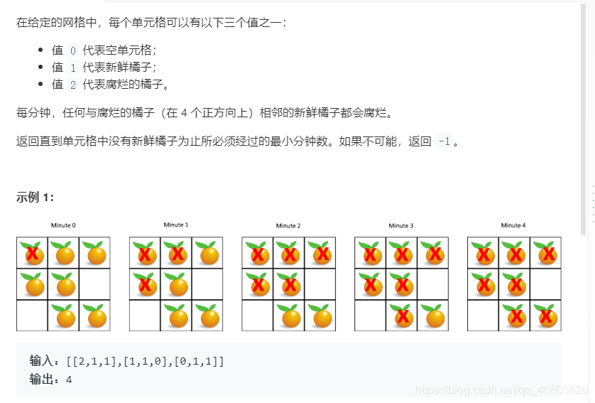

力扣
https://leetcode-cn.com/problems/rotting-oranges/



```java
class Node {
    int x;
    int y;

    public Node(int x, int y) {
        this.x = x;
        this.y = y;
    }
}

class Solution {

    public int orangesRotting(int[][] grid) {

        int x = 0;
        int y = 0;
        int len = 0;
        int m = 0;
        int r = grid.length;
        int c = grid[0].length;

        Queue<Node> q = new LinkedList();
        for (int i = 0; i < r; i++) {
            for (int j = 0; j < c; j++) {
                if (grid[i][j] == 2) {
                    q.offer(new Node(i, j));
                }
            }
        }


        int fx[][] = new int[][]{{-1, 0}, {0, -1}, {1, 0}, {0, 1}};

        while (!q.isEmpty()) {

            int size = q.size();
            boolean chongfu = true;
            for (int j = 0; j < size; j++) {
                Node node = q.poll();
                for (int i = 0; i < 4; i++) {
                    int x1 = node.x + fx[i][0];
                    int y1 = node.y + fx[i][1];
                    if (x1 >= 0 && x1 < r && y1 >= 0 && y1 < c && grid[x1][y1] == 1) {
                        chongfu = false;
                        grid[x1][y1] = 2;
                        len--;
                        q.offer(new Node(x1, y1));
                    }
                }
            }
            if (!chongfu) {
                m++;
            }
        }

        for (int i = 0; i < r; i++) {
            for (int j = 0; j < c; j++) {
                if (grid[i][j] == 1) return -1;
            }
        }
        return m;
    }
}

```

