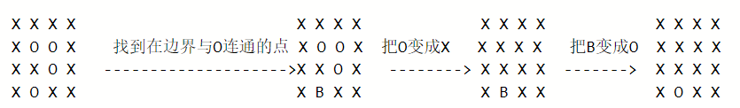

# 题目介绍

> 来自——[130. 被围绕的区域 - 力扣（LeetCode）](https://leetcode-cn.com/problems/surrounded-regions/)

给定一个二维的矩阵，包含 'X' 和 'O'（字母 O）。

找到所有被 'X' 围绕的区域，并将这些区域里所有的 'O' 用 'X' 填充。

示例:

> X X X X
> X O O X
> X X O X
> X O X X

运行你的函数后，矩阵变为：

> X X X X
> X X X X
> X X X X
> X O X X

解释:

被围绕的区间不会存在于边界上，换句话说，任何边界上的 'O' 都不会被填充为 'X'。 任何不在边界上，或不与边界上的 'O' 相连的 'O' 最终都会被填充为 'X'。如果两个元素在水平或垂直方向相邻，则称它们是“相连”的。

> 来源：力扣（LeetCode）
> 链接：https://leetcode-cn.com/problems/surrounded-regions
> 著作权归领扣网络所有。商业转载请联系官方授权，非商业转载请注明出处。

# 解题思路  **Flood fill 算法** (淹没算法)

1. 水淹四周，就是先将矩阵的四个边的O以及相连的O都变成X
2. 将水淹过的矩阵，再次进行BFS，得到需要的矩阵

> 输入
>
> [["X","O","X","O","X","O"],["O","X","O","X","O","X"],["X","O","X","O","X","O"],["O","X","O","X","O","X"]] 
>
> 输出
>
> [["X","O","X","O","X","O"],["O","X","X","X","X","X"],["X","X","X","X","X","O"],["O","X","O","X","O","X"]]

# 参考代码

```java
import java.util.LinkedList;
import java.util.Queue;

class Solution {

    int step[][] = {{0, 1}, {0, -1}, {1, 0}, {-1, 0}};
    int fp[][];
    int n = 0, m = 0;
    char temp[][];

    class Node {
        int x;
        int y;

        Node(int x, int y) {
            this.x = x;
            this.y = y;
        }
    }

    public void solve(char[][] board) {
        if(board.length==0){
            return;
        }

        n = board.length;
        m = board[0].length;
        temp = new char[n][m];

        fp = new int[n][m];
        for (int i = 0; i < n; i++) {
            for (int j = 0; j < m; j++) {
                temp[i][j] = board[i][j];
            }
        }
        for (int i = 0; i < n; i++) {
            if (temp[i][0] == 'O') {
                bfs(temp, i, 0);
            }
        }
        for (int i = 0; i < n; i++) {
            if (temp[i][m-1] == 'O') {
                bfs(temp, i, m-1);
            }
        }
        for (int i = 0; i < m; i++) {
            if (temp[0][i] == 'O') {
                bfs(temp, 0, i);
            }
        }
        for (int i = 0; i < m; i++) {
            if (temp[n-1][i] == 'O') {
                bfs(temp, n-1, i);
            }
        }
        
        for (int k = 0; k < n; k++) {
            for (int l = 0; l < m; l++) {
                if (fp[k][l] == 1) {
                    temp[k][l] = 'X';
                }
            }
            System.out.println(Arrays.toString(temp[k]));
        }
        
        fp = new int[n][m];
        for (int i = 0; i < n; i++) {
            for (int j = 0; j < m; j++) {
                if (temp[i][j] == 'O') {
                    bfs(temp, i, j);
                }
            }
        }
        for (int k = 0; k < n; k++) {
            for (int l = 0; l < m; l++) {
                if (fp[k][l] == 1) {
                    board[k][l] = 'X';
                }
            }
        }
    }

    private void bfs(char[][] board, int i, int j) {

        Queue<Node> q = new LinkedList<>();
        q.offer(new Node(i, j));
        fp[i][j] = 1;
        while (!q.isEmpty()) {
            Node node = q.poll();
            for (int k = 0; k < 4; k++) {
                int xx = node.x + step[k][0];
                int yy = node.y + step[k][1];
                if (xx < 0 || yy < 0 || xx >= n || yy >= m || board[xx][yy] == 'X' || fp[xx][yy] == 1) {
                    continue;
                }
                fp[xx][yy] = 1;
                q.offer(new Node(xx, yy));
            }
        }

    }
}
```


# 最佳解法



## bfs

```java
class Solution {
    int[][] dirs = {{1, 0}, {-1, 0}, {0, 1}, {0, -1}};
    private static class Point {
        int x, y;

        Point(int x, int y) {
            this.x = x;
            this.y = y;
        }
    }

    public void solve(char[][] board) {
        if (board == null || board.length == 0 || 
            board[0] == null || board[0].length == 0) return;
        int row = board.length;
        int col = board[0].length;
        for (int j = 0; j < col; j++) {
            // 第一行
            if (board[0][j] == 'O') bfs(0, j, board, row, col);
            // 最后一行
            if (board[row - 1][j] == 'O') bfs(row - 1, j, board, row, col);
        }

        for (int i = 0; i < row; i++) {
            // 第一列
            if (board[i][0] == 'O') bfs(i, 0, board, row, col);
            // 最后一列
            if (board[i][col - 1] == 'O') bfs(i, col - 1, board, row, col);
        }

        // 转变
        for (int i = 0; i < row; i++) {
            for (int j = 0; j < col; j++) {
                if (board[i][j] == 'O') board[i][j] = 'X';
                if (board[i][j] == 'B') board[i][j] = 'O';
            }
        }

    }

    private void bfs(int i, int j, char[][] board, int row, int col) {
        Deque<Point> queue = new LinkedList<>();
        queue.offer(new Point(i, j));
        while (!queue.isEmpty()) {
            Point tmp = queue.poll();
            if (tmp.x >= 0 && tmp.x < row && tmp.y >= 0 && 
                tmp.y < col && board[tmp.x][tmp.y] == 'O') {
                board[tmp.x][tmp.y] = 'B';
                for (int[] dir : dirs) queue.offer(new Point(tmp.x + dir[0], tmp.y + dir[1]));
            }
        }
    }
}


```

## dfs

```
class Solution {
    int[][] dirs = {{1, 0}, {-1, 0}, {0, 1}, {0, -1}};

    public void solve(char[][] board) {
        if (board == null || board.length == 0 || board[0] == null || board[0].length == 0) return;
        int row = board.length;
        int col = board[0].length;
        for (int j = 0; j < col; j++) {
            // 第一行
            if (board[0][j] == 'O') dfs(0, j, board, row, col);
            // 最后一行
            if (board[row - 1][j] == 'O') dfs(row - 1, j, board, row, col);
        }

        for (int i = 0; i < row; i++) {
            // 第一列
            if (board[i][0] == 'O') dfs(i, 0, board, row, col);
            // 最后一列
            if (board[i][col - 1] == 'O') dfs(i, col - 1, board, row, col);
        }

        // 转变
        for (int i = 0; i < row; i++) {
            for (int j = 0; j < col; j++) {
                if (board[i][j] == 'O') board[i][j] = 'X';
                if (board[i][j] == 'B') board[i][j] = 'O';
            }
        }

    }

    private void dfs(int i, int j, char[][] board, int row, int col) {
        board[i][j] = 'B';
        for (int[] dir : dirs) {
            int tmp_i = dir[0] + i;
            int tmp_j = dir[1] + j;
            if (tmp_i < 0 || tmp_i >= row || tmp_j < 0 || tmp_j >= col || board[tmp_i][tmp_j] != 'O') continue;
            dfs(tmp_i, tmp_j, board, row, col);
        }
    }
}


```

