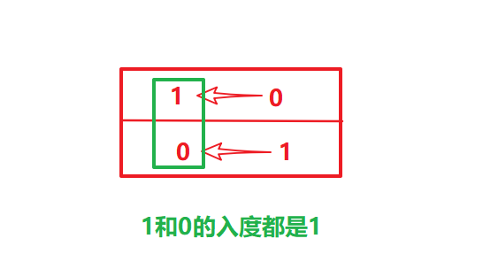

# 代码BFS——借助入度表

*   统计课程安排图中每个节点的入度，生成 **入度表** `indegrees`。
*   借助一个队列 `queue`，将所有入度为 00 0 的节点入队。
*   当 `queue` 非空时，依次将队首节点出队，在课程安排图中删除此节点 `pre`：
    *   并不是真正从邻接表中删除此节点 `pre`，而是将此节点对应所有邻接节点 `cur` 的入度 −1\-1 −1 ，即 `indegrees[cur] -= 1`。
    *   当入度 −1\-1 −1 后邻接节点 `cur` 的入度为 00 0 ，说明 `cur` 所有的前驱节点已经被 “删除”，此时将 `cur` 入队。
*   在每次 `pre` 出队时，执行 `numCourses--`；
    *   若整个课程安排图是有向无环图（即可以安排），则所有节点一定都入队并出队过，即完成拓扑排序。换个角度说，若课程安排图中存在环，一定有节点的入度始终不为 00 0 。
    *   因此，拓扑排序出队次数等于课程个数，返回 `numCourses == 0` 判断课程是否可以成功安排。

> 参考——[课程表（拓扑排序：入度表BFS法 / DFS法，清晰图解） - 课程表 - 力扣（LeetCode）](https://leetcode-cn.com/problems/course-schedule/solution/course-schedule-tuo-bu-pai-xu-bfsdfsliang-chong-fa/)

```java
import java.util.Arrays;
import java.util.LinkedList;
import java.util.Queue;

class Solution {
    public boolean canFinish(int numCourses, int[][] prerequisites) {
        int inDegree[] = new int[numCourses];//创建入度表
        for (int i = 0; i < numCourses; i++) {
            inDegree[prerequisites[i][0]]++;//计算
        }
        System.out.println(Arrays.toString(inDegree));
        Queue<Integer> q = new LinkedList<>();
        for (int i = 0; i < numCourses; i++) {
            if (inDegree[i] == 0) {
                q.offer(i);
            }
        }
        while (!q.isEmpty()) {
            Integer pre = q.poll();//入度为0的点
            numCourses--;
            for (int[] req : prerequisites) {
                if (req[1] != pre) continue; //寻找出度相同的点
                if (--inDegree[req[0]] == 0) {
                    q.add(req[0]);
                }
            }

        }
        //拓扑排序出队次数等于课程个数，返回 numCourses == 0 判断课程是否可以成功安排。
        return numCourses == 0;
    }

    public static void main(String[] args) {
        int a[][] = new int[][]{{1, 2}, {1, 4}, {2, 3}, {2, 4}, {3, 5}, {4, 5}};
        int b[][] = new int[][]{{1, 0}};
        int c[][] = new int[][]{{1, 0}, {0, 1}};
        new Solution().canFinish(5, c);
    }
}
```

# 代码DFS

