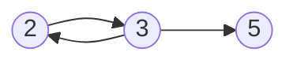
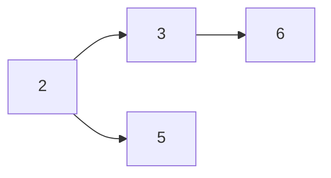

# 弗洛伊德（Floyd）算法求图的最短路径


## 弗洛伊德基本思想


弗洛伊德算法作为求最短路径的经典算法，其算法实现相比迪杰斯特拉等算法是非常优雅的，可读性和理解都非常好。

> 基本思想：
> 弗洛伊德算法定义了两个二维矩阵：
>
> 1.  **矩阵D记录顶点间的最小路径**
>  例如D\[0\]\[3\]= 10，说明顶点0 到 3 的最短路径为10；
> 2.  **矩阵P记录顶点间最小路径中的中转点**
>  例如P\[0\]\[3\]= 1 说明，0 到 3的最短路径轨迹为：0 -> 1 \-> 3。
>
> 它通过3重循环，k为中转点，v为起点，w为终点，循环比较D\[v\]\[w\] 和 D\[v\]\[k\] + D\[k\]\[w\] 最小值，如果D\[v\]\[k\] + D\[k\]\[w\] 为更小值，则把D\[v\]\[k\] + D\[k\]\[w\] 覆盖保存在D\[v\]\[w\]中。

  

## 核心思路

### 路径矩阵

通过一个图的权值矩阵求出它的每两点间的最短路径矩阵。

从图的带权邻接矩阵`A=[a(i,j)] n×n`开始，递归地进行n次更新，

即由矩阵D(0)=A，按一个公式，构造出矩阵D(1)；

又用同样地公式由D(1)构造出D(2)；……；

最后又用同样的公式由D(n-1)构造出矩阵D(n)。

矩阵D(n)的i行j列元素便是i号顶点到j号顶点的最短路径长度，称D(n)为图的距离矩阵，同时还可引入一个后继节点矩阵path来记录两点间的最短路径。

采用松弛技术（松弛操作），对在i和j之间的所有其他点进行一次松弛。所以时间复杂度为O(n^3);

### 状态转移方程

其**状态转移方程**如下： map[i,j]:=min{map[i,k]+map[k,j],map[i,j]}；

map[i,j]表示i到j的最短距离，K是穷举 i,j 的断点，map[n,n]初值应该为0，或者按照题目意思来做。

当然，如果这条路没有通的话，还必须特殊处理，比如没有map[i,k]这条路。 

## 算法过程

1，从任意一条单边路径开始。所有两点之间的距离是边的权，如果两点之间没有边相连，则权为无穷大。

2，对于每一对顶点 u 和 v，看看是否存在一个顶点 w 使得从 u 到 w 再到 v 比已知的路径更短。如果是更新它。

把图用邻接矩阵G表示出来，如果从Vi到Vj有路可达，则`G[i][j]`=d，d表示该路的长度；否则`G[i][j]`=无穷大。定义一个矩阵D用来记录所插入点的信息，`D[i][j]`表示从Vi到Vj需要经过的点，初始化`D[i][j]`=j。把各个顶点插入图中，比较插点后的距离与原来的距离，`G[i][j] = min( G[i][j], G[i][k]+G[k][j] )`，如果`G[i][j]`的值变小，则`D[i][j]`=k。在G中包含有两点之间最短道路的信息，而在D中则包含了最短通路径的信息。

比如，要寻找从V5到V1的路径。根据D，假如D(5,1)=3则说明从V5到V1经过V3，路径为{V5,V3,V1}，如果D(5,3)=3，说明V5与V3直接相连，如果D(3,1)=1，说明V3与V1直接相连。 [4] 

## 时间复杂度与空间复杂度

[时间复杂度](https://baike.baidu.com/item/时间复杂度):O(n^3)；

[空间复杂度](https://baike.baidu.com/item/空间复杂度):O(n^2)

## 优缺点分析

Floyd算法适用于APSP(All Pairs Shortest Paths，多源最短路径)，是一种动态规划算法，稠密图效果最佳，边权可正可负。此算法简单有效，由于三重循环结构紧凑，对于稠密图，效率要高于执行|V|次Dijkstra算法，也要高于执行|V|次SPFA算法。

优点：容易理解，可以算出任意两个节点之间的最短距离，代码编写简单。

缺点：时间复杂度比较高，不适合计算大量数据。

## 算法描述

a)　初始化：D[u,v]=A[u,v]

b)　

For k:=1 to n **(1<=k<=n)**

For i:=1 to n

For j:=1 to n

If D[i,j]>D[i,k]+D[k,j] Then

D[i,j]:=D[i,k]+D[k,j];

P[i,j] = D[i,k];

c)　算法结束：D即为所有点对的最短路径矩阵

## 代码实现

```java
package floyd;

import java.util.Scanner;
/*
7
0 12 1000 1000 1000 16 14
12 0 10 1000 1000 7 1000
1000 10 0 3 5 6 1000
1000 1000 3 0 4 1000 1000
1000 1000 5 4 0 2 8
16 7 6 1000 2 0 9
14 1000 1000 1000 8 9 0
*/
public class Floyd {
    public static void main(String[] args) {
        int v;
        int MAXN = 10;
        int pathmatirx[][] = new int[MAXN][MAXN];//记录对应点的最小路径的前驱点，例如p(1,3) = 2 说明顶点1到顶点3的最小路径要经过2
        int shortPath[][] = new int[MAXN][MAXN];//记录顶点间的最小路径值
        Scanner sc = new Scanner(System.in);
        v = sc.nextInt();
        int matirx[][] = new int[v][v];
        for (int i = 0; i < v; i++) {
            for (int j = 0; j < v; j++) {
                matirx[i][j] = sc.nextInt();
            }
        }
        System.out.println("\n初始化的矩阵\n");
        for (int i = 0; i < v; i++) {
            for (int j = 0; j < v; j++) {
                System.out.printf("%d ", matirx[i][j]);
            }
            System.out.println();
        }
        short_path_floyd(matirx, pathmatirx, shortPath);
    }

    private static void short_path_floyd(int matrix[][], int[][] P, int[][] D) {
        int vexnum = matrix[0].length;
        //初始化floyd算法的两个矩阵
        for (int i = 0; i < vexnum; i++) {
            for (int j = 0; j < vexnum; j++) {
                D[i][j] = matrix[i][j];
                P[i][j] = j;
            }
        }
        /**
         * 核心代码
         */

        //i为中间点
        for (int i = 0; i < vexnum; i++) {
            //j为起点
            for (int j = 0; j < vexnum; j++) {
                //k为终点
                for (int k = 0; k < vexnum; k++) {
                    if (D[j][k] > (D[j][i] + D[i][k])) {
                        D[j][k] = D[j][i] + D[i][k];
                        P[j][k] = P[j][i];
                    }
                }
            }
        }

        System.out.println("\n初始化的D矩阵\n");
        for (int i = 0; i < vexnum; i++) {
            for (int j = 0; j < vexnum; j++) {
                System.out.printf("%d ", D[i][j]);
            }
            System.out.println();
        }
        System.out.println("\n初始化的P矩阵\n");
        for (int i = 0; i < vexnum; i++) {
            for (int j = 0; j < vexnum; j++) {
                System.out.printf("%d ", P[i][j]);
            }
            System.out.println();
        }
        int i = 0;
        int j = 3;
        //求 0 到 3的最小路径
        System.out.printf("\n%d -> %d 的最小路径为：%d\n", i, j, D[i][j]);
        int k = P[i][j];
        System.out.printf("path:%d", i);
        while (k != j) {
            System.out.printf("-> %d", k);//打印中间点
            k = P[k][j];
        }
        System.out.printf("->%d\n", j);
    }


}
```

运行结果：

> 7
> 0 12 1000 1000 1000 16 14
> 12 0 10 1000 1000 7 1000
> 1000 10 0 3 5 6 1000
> 1000 1000 3 0 4 1000 1000
> 1000 1000 5 4 0 2 8
> 16 7 6 1000 2 0 9
> 14 1000 1000 1000 8 9 0
>
> 初始化的矩阵
>
> 0 12 1000 1000 1000 16 14 
> 12 0 10 1000 1000 7 1000 
> 1000 10 0 3 5 6 1000 
> 1000 1000 3 0 4 1000 1000 
> 1000 1000 5 4 0 2 8 
> 16 7 6 1000 2 0 9 
> 14 1000 1000 1000 8 9 0 
>
> 初始化的D矩阵
>
> 0 12 22 22 18 16 14 
> 12 0 10 13 9 7 16 
> 22 10 0 3 5 6 13 
> 22 13 3 0 4 6 12 
> 18 9 5 4 0 2 8 
> 16 7 6 6 2 0 9 
> 14 16 13 12 8 9 0 
>
> 初始化的P矩阵
>
> 0 1 1 5 5 5 6 
> 0 1 2 2 5 5 5 
> 1 1 2 3 4 5 4 
> 4 2 2 3 4 4 4 
> 5 5 2 3 4 5 6 
> 0 1 2 4 4 5 6 
> 0 5 4 4 4 5 6 
>
> 0 -> 3 的最小路径为：22
> path:0-> 5-> 4->3


## 附录A

1. [弗洛伊德（Floyd）算法求图的最短路径_算法,弗洛伊德算法,Floyd_刘剑峰的博客-CSDN博客](https://blog.csdn.net/jeffleo/article/details/53349825)

2. [最短路径问题---Floyd算法详解_算法,floyd算法_William-CSDN博客](https://blog.csdn.net/qq_35644234/article/details/60875818)

## 附录B

初始化前的D矩阵

0 12 1000 1000 1000 16 14 
12 0 10 1000 1000 7 1000 
1000 10 0 3 5 6 1000 
1000 1000 3 0 4 1000 1000 
1000 1000 5 4 0 2 8 
16 7 6 1000 2 0 9 
14 1000 1000 1000 8 9 0 

初始化后的D矩阵

0 12 22 22 18 16 14 
12 0 10 13 9 7 16 
22 10 0 3 5 6 13 
22 13 3 0 4 6 12 
18 9 5 4 0 2 8 
16 7 6 6 2 0 9 
14 16 13 12 8 9 0 

初始化前的P矩阵

0 1 2 3 4 5 6 
0 1 2 3 4 5 6 
0 1 2 3 4 5 6 
0 1 2 3 4 5 6 
0 1 2 3 4 5 6 
0 1 2 3 4 5 6 
0 1 2 3 4 5 6 

初始化后的P矩阵

0 1 1 5 5 5 6 
0 1 2 2 5 5 5 
1 1 2 3 4 5 4 
4 2 2 3 4 4 4 
5 5 2 3 4 5 6 
0 1 2 4 4 5 6 
0 5 4 4 4 5 6 

## 附录C

```
 for (int i = 0; i < vexnum; i++) //i为中间点
      for (int j = 0; j < vexnum; j++) //j为起点
           for (int k = 0; k < vexnum; k++) //k为终点
               if (D[j][k] > (D[j][i] + D[i][k])) 
                  D[j][k] = D[j][i] + D[i][k];
                  P[j][k] = P[j][i];//这里有放置中间点的，也有放置p[j][i]
D[0][0] > (D[0][0] + D[0][0])//0 A为中间点 A为起点 A为终点
D[0][1] > (D[0][0] + D[0][1])//0 A为中间点 A为起点 B为终点
D[0][2] > (D[0][0] + D[0][2])//0 A为中间点 A为起点 C为终点
D[0][3] > (D[0][0] + D[0][3])//0 A为中间点 A为起点 D为终点
D[0][4] > (D[0][0] + D[0][4])//0 A为中间点 A为起点 E为终点
D[0][5] > (D[0][0] + D[0][5])//0 A为中间点 A为起点 F为终点
D[0][6] > (D[0][0] + D[0][6])//0 A为中间点 A为起点 G为终点

D[1][0] > (D[1][0] + D[0][0])//0 A为中间点 B为起点 A为终点
D[1][1] > (D[1][0] + D[0][1])//0 A为中间点 B为起点 B为终点
D[1][2] > (D[1][0] + D[0][2])//0 A为中间点 B为起点 C为终点
D[1][3] > (D[1][0] + D[0][3])//A BD
D[1][4] > (D[1][0] + D[0][4])//A BE
D[1][5] > (D[1][0] + D[0][5])//A BF
D[1][6] > (D[1][0] + D[0][6])//A BG

D[2][0] > (D[2][0] + D[0][0])//A CA => CA+AA
D[2][1] > (D[2][0] + D[0][1])//A CB => CA+AB
D[2][2] > (D[2][0] + D[0][2])
D[2][3] > (D[2][0] + D[0][3])
D[2][4] > (D[2][0] + D[0][4])
D[2][5] > (D[2][0] + D[0][5])
D[2][6] > (D[2][0] + D[0][6])

D[3][0] > (D[3][0] + D[0][0])
D[3][1] > (D[3][0] + D[0][1])
D[3][2] > (D[3][0] + D[0][2])
D[3][3] > (D[3][0] + D[0][3])
D[3][4] > (D[3][0] + D[0][4])
D[3][5] > (D[3][0] + D[0][5])
D[3][6] > (D[3][0] + D[0][6])

D[4][0] > (D[4][0] + D[0][0])
D[4][1] > (D[4][0] + D[0][1])
D[4][2] > (D[4][0] + D[0][2])
D[4][3] > (D[4][0] + D[0][3])
D[4][4] > (D[4][0] + D[0][4])
D[4][5] > (D[4][0] + D[0][5])
D[4][6] > (D[4][0] + D[0][6])

D[5][0] > (D[5][0] + D[0][0])
D[5][1] > (D[5][0] + D[0][1])
D[5][2] > (D[5][0] + D[0][2])
D[5][3] > (D[5][0] + D[0][3])
D[5][4] > (D[5][0] + D[0][4])
D[5][5] > (D[5][0] + D[0][5])
D[5][6] > (D[5][0] + D[0][6])

D[6][0] > (D[6][0] + D[0][0])
D[6][1] > (D[6][0] + D[0][1])
D[6][2] > (D[6][0] + D[0][2])
D[6][3] > (D[6][0] + D[0][3])
D[6][4] > (D[6][0] + D[0][4])
D[6][5] > (D[6][0] + D[0][5])
D[6][6] > (D[6][0] + D[0][6])

D[0][0] > (D[0][1] + D[1][0])//B为中间点
D[0][1] > (D[0][1] + D[1][1])
D[0][2] > (D[0][1] + D[1][2])
D[0][3] > (D[0][1] + D[1][3])
D[0][4] > (D[0][1] + D[1][4])
D[0][5] > (D[0][1] + D[1][5])
D[0][6] > (D[0][1] + D[1][6])
D[1][0] > (D[1][1] + D[1][0])
D[1][1] > (D[1][1] + D[1][1])
D[1][2] > (D[1][1] + D[1][2])
D[1][3] > (D[1][1] + D[1][3])
D[1][4] > (D[1][1] + D[1][4])
D[1][5] > (D[1][1] + D[1][5])
D[1][6] > (D[1][1] + D[1][6])
D[2][0] > (D[2][1] + D[1][0])
D[2][1] > (D[2][1] + D[1][1])
D[2][2] > (D[2][1] + D[1][2])
D[2][3] > (D[2][1] + D[1][3])
D[2][4] > (D[2][1] + D[1][4])
D[2][5] > (D[2][1] + D[1][5])
D[2][6] > (D[2][1] + D[1][6])
D[3][0] > (D[3][1] + D[1][0])
D[3][1] > (D[3][1] + D[1][1])
D[3][2] > (D[3][1] + D[1][2])
D[3][3] > (D[3][1] + D[1][3])
D[3][4] > (D[3][1] + D[1][4])
D[3][5] > (D[3][1] + D[1][5])
D[3][6] > (D[3][1] + D[1][6])
D[4][0] > (D[4][1] + D[1][0])
D[4][1] > (D[4][1] + D[1][1])
D[4][2] > (D[4][1] + D[1][2])
D[4][3] > (D[4][1] + D[1][3])
D[4][4] > (D[4][1] + D[1][4])
D[4][5] > (D[4][1] + D[1][5])
D[4][6] > (D[4][1] + D[1][6])
D[5][0] > (D[5][1] + D[1][0])
D[5][1] > (D[5][1] + D[1][1])
D[5][2] > (D[5][1] + D[1][2])
D[5][3] > (D[5][1] + D[1][3])
D[5][4] > (D[5][1] + D[1][4])
D[5][5] > (D[5][1] + D[1][5])
D[5][6] > (D[5][1] + D[1][6])
D[6][0] > (D[6][1] + D[1][0])
D[6][1] > (D[6][1] + D[1][1])
D[6][2] > (D[6][1] + D[1][2])
D[6][3] > (D[6][1] + D[1][3])
D[6][4] > (D[6][1] + D[1][4])
D[6][5] > (D[6][1] + D[1][5])
D[6][6] > (D[6][1] + D[1][6])

D[0][0] > (D[0][2] + D[2][0])//C为中间点
D[0][1] > (D[0][2] + D[2][1])
D[0][2] > (D[0][2] + D[2][2])
D[0][3] > (D[0][2] + D[2][3])
D[0][4] > (D[0][2] + D[2][4])
D[0][5] > (D[0][2] + D[2][5])
D[0][6] > (D[0][2] + D[2][6])
D[1][0] > (D[1][2] + D[2][0])
D[1][1] > (D[1][2] + D[2][1])
D[1][2] > (D[1][2] + D[2][2])
D[1][3] > (D[1][2] + D[2][3])
D[1][4] > (D[1][2] + D[2][4])
D[1][5] > (D[1][2] + D[2][5])
D[1][6] > (D[1][2] + D[2][6])
D[2][0] > (D[2][2] + D[2][0])
D[2][1] > (D[2][2] + D[2][1])
D[2][2] > (D[2][2] + D[2][2])
D[2][3] > (D[2][2] + D[2][3])
D[2][4] > (D[2][2] + D[2][4])
D[2][5] > (D[2][2] + D[2][5])
D[2][6] > (D[2][2] + D[2][6])
D[3][0] > (D[3][2] + D[2][0])
D[3][1] > (D[3][2] + D[2][1])
D[3][2] > (D[3][2] + D[2][2])
D[3][3] > (D[3][2] + D[2][3])
D[3][4] > (D[3][2] + D[2][4])
D[3][5] > (D[3][2] + D[2][5])
D[3][6] > (D[3][2] + D[2][6])
D[4][0] > (D[4][2] + D[2][0])
D[4][1] > (D[4][2] + D[2][1])
D[4][2] > (D[4][2] + D[2][2])
D[4][3] > (D[4][2] + D[2][3])
D[4][4] > (D[4][2] + D[2][4])
D[4][5] > (D[4][2] + D[2][5])
D[4][6] > (D[4][2] + D[2][6])
D[5][0] > (D[5][2] + D[2][0])
D[5][1] > (D[5][2] + D[2][1])
D[5][2] > (D[5][2] + D[2][2])
D[5][3] > (D[5][2] + D[2][3])
D[5][4] > (D[5][2] + D[2][4])
D[5][5] > (D[5][2] + D[2][5])
D[5][6] > (D[5][2] + D[2][6])
D[6][0] > (D[6][2] + D[2][0])
D[6][1] > (D[6][2] + D[2][1])
D[6][2] > (D[6][2] + D[2][2])
D[6][3] > (D[6][2] + D[2][3])
D[6][4] > (D[6][2] + D[2][4])
D[6][5] > (D[6][2] + D[2][5])
D[6][6] > (D[6][2] + D[2][6])
D[0][0] > (D[0][3] + D[3][0])
D[0][1] > (D[0][3] + D[3][1])
D[0][2] > (D[0][3] + D[3][2])
D[0][3] > (D[0][3] + D[3][3])
D[0][4] > (D[0][3] + D[3][4])
D[0][5] > (D[0][3] + D[3][5])
D[0][6] > (D[0][3] + D[3][6])
D[1][0] > (D[1][3] + D[3][0])
D[1][1] > (D[1][3] + D[3][1])
D[1][2] > (D[1][3] + D[3][2])
D[1][3] > (D[1][3] + D[3][3])
D[1][4] > (D[1][3] + D[3][4])
D[1][5] > (D[1][3] + D[3][5])
D[1][6] > (D[1][3] + D[3][6])
D[2][0] > (D[2][3] + D[3][0])
D[2][1] > (D[2][3] + D[3][1])
D[2][2] > (D[2][3] + D[3][2])
D[2][3] > (D[2][3] + D[3][3])
D[2][4] > (D[2][3] + D[3][4])
D[2][5] > (D[2][3] + D[3][5])
D[2][6] > (D[2][3] + D[3][6])
D[3][0] > (D[3][3] + D[3][0])
D[3][1] > (D[3][3] + D[3][1])
D[3][2] > (D[3][3] + D[3][2])
D[3][3] > (D[3][3] + D[3][3])
D[3][4] > (D[3][3] + D[3][4])
D[3][5] > (D[3][3] + D[3][5])
D[3][6] > (D[3][3] + D[3][6])
D[4][0] > (D[4][3] + D[3][0])
D[4][1] > (D[4][3] + D[3][1])
D[4][2] > (D[4][3] + D[3][2])
D[4][3] > (D[4][3] + D[3][3])
D[4][4] > (D[4][3] + D[3][4])
D[4][5] > (D[4][3] + D[3][5])
D[4][6] > (D[4][3] + D[3][6])
D[5][0] > (D[5][3] + D[3][0])
D[5][1] > (D[5][3] + D[3][1])
D[5][2] > (D[5][3] + D[3][2])
D[5][3] > (D[5][3] + D[3][3])
D[5][4] > (D[5][3] + D[3][4])
D[5][5] > (D[5][3] + D[3][5])
D[5][6] > (D[5][3] + D[3][6])
D[6][0] > (D[6][3] + D[3][0])
D[6][1] > (D[6][3] + D[3][1])
D[6][2] > (D[6][3] + D[3][2])
D[6][3] > (D[6][3] + D[3][3])
D[6][4] > (D[6][3] + D[3][4])
D[6][5] > (D[6][3] + D[3][5])
D[6][6] > (D[6][3] + D[3][6])
D[0][0] > (D[0][4] + D[4][0])
D[0][1] > (D[0][4] + D[4][1])
D[0][2] > (D[0][4] + D[4][2])
D[0][3] > (D[0][4] + D[4][3])
D[0][4] > (D[0][4] + D[4][4])
D[0][5] > (D[0][4] + D[4][5])
D[0][6] > (D[0][4] + D[4][6])
D[1][0] > (D[1][4] + D[4][0])
D[1][1] > (D[1][4] + D[4][1])
D[1][2] > (D[1][4] + D[4][2])
D[1][3] > (D[1][4] + D[4][3])
D[1][4] > (D[1][4] + D[4][4])
D[1][5] > (D[1][4] + D[4][5])
D[1][6] > (D[1][4] + D[4][6])
D[2][0] > (D[2][4] + D[4][0])
D[2][1] > (D[2][4] + D[4][1])
D[2][2] > (D[2][4] + D[4][2])
D[2][3] > (D[2][4] + D[4][3])
D[2][4] > (D[2][4] + D[4][4])
D[2][5] > (D[2][4] + D[4][5])
D[2][6] > (D[2][4] + D[4][6])
D[3][0] > (D[3][4] + D[4][0])
D[3][1] > (D[3][4] + D[4][1])
D[3][2] > (D[3][4] + D[4][2])
D[3][3] > (D[3][4] + D[4][3])
D[3][4] > (D[3][4] + D[4][4])
D[3][5] > (D[3][4] + D[4][5])
D[3][6] > (D[3][4] + D[4][6])
D[4][0] > (D[4][4] + D[4][0])
D[4][1] > (D[4][4] + D[4][1])
D[4][2] > (D[4][4] + D[4][2])
D[4][3] > (D[4][4] + D[4][3])
D[4][4] > (D[4][4] + D[4][4])
D[4][5] > (D[4][4] + D[4][5])
D[4][6] > (D[4][4] + D[4][6])
D[5][0] > (D[5][4] + D[4][0])
D[5][1] > (D[5][4] + D[4][1])
D[5][2] > (D[5][4] + D[4][2])
D[5][3] > (D[5][4] + D[4][3])
D[5][4] > (D[5][4] + D[4][4])
D[5][5] > (D[5][4] + D[4][5])
D[5][6] > (D[5][4] + D[4][6])
D[6][0] > (D[6][4] + D[4][0])
D[6][1] > (D[6][4] + D[4][1])
D[6][2] > (D[6][4] + D[4][2])
D[6][3] > (D[6][4] + D[4][3])
D[6][4] > (D[6][4] + D[4][4])
D[6][5] > (D[6][4] + D[4][5])
D[6][6] > (D[6][4] + D[4][6])
D[0][0] > (D[0][5] + D[5][0])
D[0][1] > (D[0][5] + D[5][1])
D[0][2] > (D[0][5] + D[5][2])
D[0][3] > (D[0][5] + D[5][3])
D[0][4] > (D[0][5] + D[5][4])
D[0][5] > (D[0][5] + D[5][5])
D[0][6] > (D[0][5] + D[5][6])
D[1][0] > (D[1][5] + D[5][0])
D[1][1] > (D[1][5] + D[5][1])
D[1][2] > (D[1][5] + D[5][2])
D[1][3] > (D[1][5] + D[5][3])
D[1][4] > (D[1][5] + D[5][4])
D[1][5] > (D[1][5] + D[5][5])
D[1][6] > (D[1][5] + D[5][6])
D[2][0] > (D[2][5] + D[5][0])
D[2][1] > (D[2][5] + D[5][1])
D[2][2] > (D[2][5] + D[5][2])
D[2][3] > (D[2][5] + D[5][3])
D[2][4] > (D[2][5] + D[5][4])
D[2][5] > (D[2][5] + D[5][5])
D[2][6] > (D[2][5] + D[5][6])
D[3][0] > (D[3][5] + D[5][0])
D[3][1] > (D[3][5] + D[5][1])
D[3][2] > (D[3][5] + D[5][2])
D[3][3] > (D[3][5] + D[5][3])
D[3][4] > (D[3][5] + D[5][4])
D[3][5] > (D[3][5] + D[5][5])
D[3][6] > (D[3][5] + D[5][6])
D[4][0] > (D[4][5] + D[5][0])
D[4][1] > (D[4][5] + D[5][1])
D[4][2] > (D[4][5] + D[5][2])
D[4][3] > (D[4][5] + D[5][3])
D[4][4] > (D[4][5] + D[5][4])
D[4][5] > (D[4][5] + D[5][5])
D[4][6] > (D[4][5] + D[5][6])
D[5][0] > (D[5][5] + D[5][0])
D[5][1] > (D[5][5] + D[5][1])
D[5][2] > (D[5][5] + D[5][2])
D[5][3] > (D[5][5] + D[5][3])
D[5][4] > (D[5][5] + D[5][4])
D[5][5] > (D[5][5] + D[5][5])
D[5][6] > (D[5][5] + D[5][6])
D[6][0] > (D[6][5] + D[5][0])
D[6][1] > (D[6][5] + D[5][1])
D[6][2] > (D[6][5] + D[5][2])
D[6][3] > (D[6][5] + D[5][3])
D[6][4] > (D[6][5] + D[5][4])
D[6][5] > (D[6][5] + D[5][5])
D[6][6] > (D[6][5] + D[5][6])
D[0][0] > (D[0][6] + D[6][0])
D[0][1] > (D[0][6] + D[6][1])
D[0][2] > (D[0][6] + D[6][2])
D[0][3] > (D[0][6] + D[6][3])
D[0][4] > (D[0][6] + D[6][4])
D[0][5] > (D[0][6] + D[6][5])
D[0][6] > (D[0][6] + D[6][6])
D[1][0] > (D[1][6] + D[6][0])
D[1][1] > (D[1][6] + D[6][1])
D[1][2] > (D[1][6] + D[6][2])
D[1][3] > (D[1][6] + D[6][3])
D[1][4] > (D[1][6] + D[6][4])
D[1][5] > (D[1][6] + D[6][5])
D[1][6] > (D[1][6] + D[6][6])
D[2][0] > (D[2][6] + D[6][0])
D[2][1] > (D[2][6] + D[6][1])
D[2][2] > (D[2][6] + D[6][2])
D[2][3] > (D[2][6] + D[6][3])
D[2][4] > (D[2][6] + D[6][4])
D[2][5] > (D[2][6] + D[6][5])
D[2][6] > (D[2][6] + D[6][6])
D[3][0] > (D[3][6] + D[6][0])
D[3][1] > (D[3][6] + D[6][1])
D[3][2] > (D[3][6] + D[6][2])
D[3][3] > (D[3][6] + D[6][3])
D[3][4] > (D[3][6] + D[6][4])
D[3][5] > (D[3][6] + D[6][5])
D[3][6] > (D[3][6] + D[6][6])
D[4][0] > (D[4][6] + D[6][0])
D[4][1] > (D[4][6] + D[6][1])
D[4][2] > (D[4][6] + D[6][2])
D[4][3] > (D[4][6] + D[6][3])
D[4][4] > (D[4][6] + D[6][4])
D[4][5] > (D[4][6] + D[6][5])
D[4][6] > (D[4][6] + D[6][6])
D[5][0] > (D[5][6] + D[6][0])
D[5][1] > (D[5][6] + D[6][1])
D[5][2] > (D[5][6] + D[6][2])
D[5][3] > (D[5][6] + D[6][3])
D[5][4] > (D[5][6] + D[6][4])
D[5][5] > (D[5][6] + D[6][5])
D[5][6] > (D[5][6] + D[6][6])
D[6][0] > (D[6][6] + D[6][0])
D[6][1] > (D[6][6] + D[6][1])
D[6][2] > (D[6][6] + D[6][2])
D[6][3] > (D[6][6] + D[6][3])
D[6][4] > (D[6][6] + D[6][4])
D[6][5] > (D[6][6] + D[6][5])
D[6][6] > (D[6][6] + D[6][6])
```

# 问题 1492: [蓝桥杯][算法提高VIP]产生数


时间限制: 1Sec 内存限制: 128MB 提交: 324 解决: 54

**题目描述**

给出一个整数 n（n< 10^30) 和 k 个变换规则（k< =15）。

**规则：**

一位数可变换成另一个一位数：

**规则的右部不能为零。**

例如：n=234。有规则（k＝2）：

2－>  5

3－>  6

上面的整数 234 经过变换后可能产生出的整数为（包括原数）:

234

534

264

564

共 4 种不同的产生数

问题：

给出一个整数 n 和 k 个规则。

求出：

经过任意次的变换（0次或多次），能产生出多少个不同整数。

仅要求输出个数。

**输入**

n k 
x1 y1 
x2 y2 
... ... 
xn yn 

**输出**

一个整数（满足条件的个数）

**样例输入**

```
234  2 
2  5 
3  6 
```

**样例输出**

```
4
```

## 解释

[题解 P1037 【产生数】 - 认真的Ben 的博客 - 洛谷博客](https://www.luogu.com.cn/blog/RenZhenDeBen/solution-p1037)

**这里好像有点小错误，规则的右边不能是0**


  

看图可知，

1可以变成2、3,2又可以变成5，共有1（不变）、2、3、5四个可能数字；

同理，2有2、5、3三个可能数字。

3不能变成其他数字，只有一个可能数字。

4可以变成4、1、2、3、5五个可能数字。

5可以变成5、3两个可能数字。

6不能变成其他数字，只有一个可能数字。

0可以变成0、6两个可能数字。

在12040这个数字中，每个数码都可能变为对应的可能数字，根据乘法原理，共有4×3×2×5×2=240种可能数字，并且不会重复。


**看完上面的讲解，基本上懂了**

**再来一组新的数据**

```
1234 3
2 3
3 2
3 5
```



2 有 2 3 5

3 有 3 2 5

根据乘法原理：一共有9种

**再来一组数据**

 例如：n=234。有规则（k＝3）：

2－>  5

3－>  6

2－>  3



2 有 2 3 5 6

3 有 3 6

5 有 5

6 有 6

一共是 8种


## 代码如下

```java
import java.math.BigInteger;
import java.util.Scanner;
 
public class Main {     
    public static void main(String[] args) {
        Scanner input = new Scanner(System.in);
        String n = input.next();
        int k = input.nextInt();
        int[][] floyd = new int[10][10];
        while (k-- > 0) {
            int x = input.nextInt();
            int y = input.nextInt();
            floyd[x][y] = 1;
        }
        for (int o = 0; o < 10; ++o)
            for (int j = 0; j < 10; ++j)
                for (int i = 0; i < 10; ++i)
                    if (o != i && i != j && o != j)
                        if (floyd[i][o] == 1 && floyd[o][j] == 1)
                            floyd[i][j] = 1;
        BigInteger sum = new BigInteger("1");
        for (int i = 0; i < n.length(); ++i) {
            int num = n.charAt(i) - '0';
            int count = 1;//加上它自己本身
            for (int j = 0; j < 10; ++j)
                count += floyd[num][j];
            sum = sum.multiply(BigInteger.valueOf(count));
        }
        System.out.println(sum);
    }
}
```


```java
234 3
2 5
3 6
2 3
[0, 0, 0, 0, 0, 0, 0, 0, 0, 0]
[0, 0, 0, 0, 0, 0, 0, 0, 0, 0]
[0, 0, 0, 1, 0, 1, 0, 0, 0, 0]
[0, 0, 0, 0, 0, 0, 1, 0, 0, 0]
[0, 0, 0, 0, 0, 0, 0, 0, 0, 0]
[0, 0, 0, 0, 0, 0, 0, 0, 0, 0]
[0, 0, 0, 0, 0, 0, 0, 0, 0, 0]
[0, 0, 0, 0, 0, 0, 0, 0, 0, 0]
[0, 0, 0, 0, 0, 0, 0, 0, 0, 0]
[0, 0, 0, 0, 0, 0, 0, 0, 0, 0]

[0, 0, 0, 0, 0, 0, 0, 0, 0, 0]
[0, 0, 0, 0, 0, 0, 0, 0, 0, 0]
[0, 0, 0, 1, 0, 1, 1, 0, 0, 0]
[0, 0, 0, 0, 0, 0, 1, 0, 0, 0]
[0, 0, 0, 0, 0, 0, 0, 0, 0, 0]
[0, 0, 0, 0, 0, 0, 0, 0, 0, 0]
[0, 0, 0, 0, 0, 0, 0, 0, 0, 0]
[0, 0, 0, 0, 0, 0, 0, 0, 0, 0]
[0, 0, 0, 0, 0, 0, 0, 0, 0, 0]
[0, 0, 0, 0, 0, 0, 0, 0, 0, 0]
```

