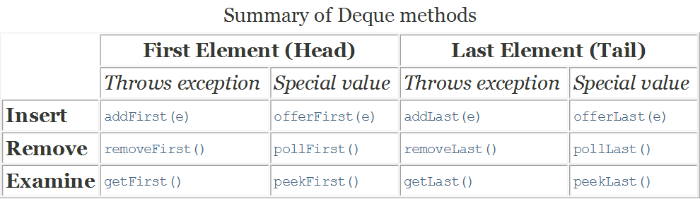
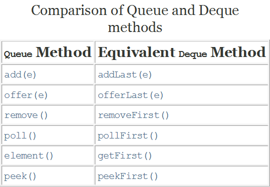
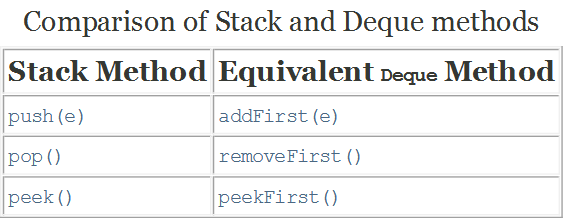

# Interface Queue \<E>

> 参考——[java队列——queue详细分析 - 低调人生 - 博客园](https://www.cnblogs.com/lemon-flm/p/7877898.html)

|                 | *Throws exception* | *Returns special value* |
| --------------- | ------------------ | ----------------------- |
| **Insert**      | `add(e)`           | `offer(e)`              |
| **Remove**      | `remove()`         | `poll()`                |
| **Examine**检查 | `element()`        | `peek()`                |

**Queue： 基本上，一个队列就是一个先入先出（FIFO）的数据结构**

**Queue接口与List、Set同一级别，都是继承了Collection接口。LinkedList实现了Deque接 口。**

 **Queue的实现：** 

| 方法名        |                          |                                                    |
| ------------- | ------------------------ | -------------------------------------------------- |
| boolean add   | 增加一个元素             | 如果队列已满，则抛出一个IIIegaISlabEepeplian异常   |
| E remove      | 移除并返回队列头部的元素 | 如果队列为空，则抛出一个NoSuchElementException异常 |
| E element     | 返回队列头部的元素       | 如果队列为空，则抛出一个NoSuchElementException异常 |
| boolean offer | 添加一个元素并返回true   | 如果队列已满，则返回false                          |
| E poll        | 移除并返问队列头部的元素 | 如果队列为空，则返回null                           |
| E peek        | 返回队列头部的元素       | 如果队列为空，则返回null                           |
| put           | 添加一个元素             | 如果队列满，则阻塞                                 |
| take          | 移除并返回队列头部的元素 | 如果队列为空，则阻塞                               |

# Deque

当一个deque容器作为一个队列，FIFO（先进先出）的行为的结果。元素添加在deque的结束和开始拆除。该方法继承了`Queue`接口相当于`Deque`方法如下表所示：

双端队列也可以用作LIFO（后进先出）栈。这个接口应该优先用于遗留[`Stack`](../../java/util/Stack.html)类。当一个deque作为栈元素推出该容器的开始。堆栈的方法相当于`Deque`方法如表所示：

