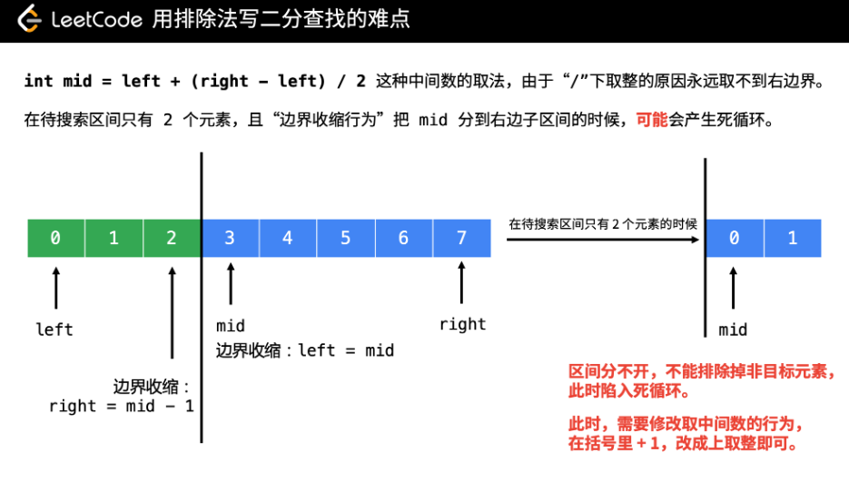
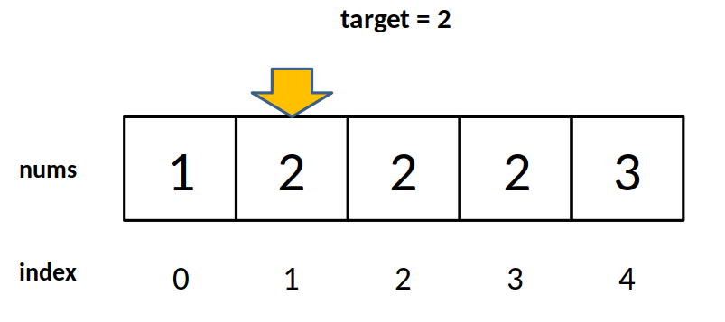
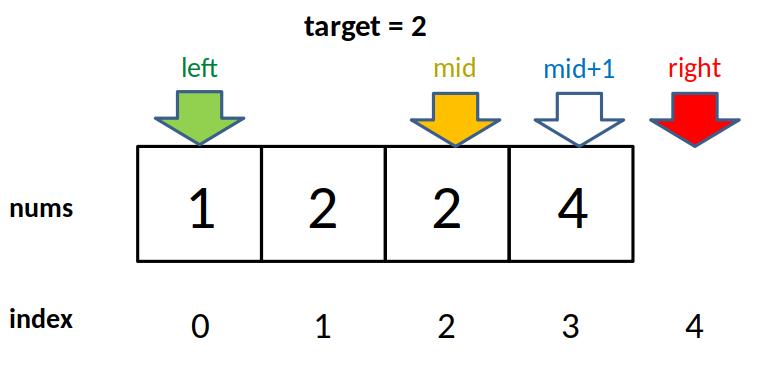

# [35. 搜索插入位置 - 力扣（LeetCode）](https://leetcode-cn.com/problems/search-insert-position/)

给定一个排序数组和一个目标值，在数组中找到目标值，并返回其索引。如果目标值不存在于数组中，返回它将会被按顺序插入的位置。

你可以假设数组中无重复元素。

**示例 1:**

> **输入:** \[1,3,5,6\], 5
> **输出:** 2

**示例 2:**

> **输入:** \[1,3,5,6\], 2
> **输出:** 1

[用“排除法”（减治思想）写二分查找问题、与其它二分查找模板的比较 - 搜索插入位置 - 力扣（LeetCode）](https://leetcode-cn.com/problems/search-insert-position/solution/te-bie-hao-yong-de-er-fen-cha-fa-fa-mo-ban-python-/)

## 解法一：暴力法

```java
class Solution {
  public int searchInsert(int[] nums, int target) {
    int len = nums.length;
    if (len == 0) {
      return 0;
    }
    if (nums[len - 1] < target) {
      return len;
    }
    for (int i = 0; i < len; i++) {
      if (target <= nums[i]) {
        return i;
      }
    }
    return 0;
  }
}
```

## 解法二：二分查找

 这篇题解提供的思路是“排除法”，即在循环的过程中，不断排除不需要的解，最后剩下的那个元素就一定是我们想要的。 

*   首先，插入位置有可能在数组的末尾（题目中的示例 3），需要单独判断；
*   其次，如果待插入元素比最后一个元素严格小，并且在这个数组中有和插入元素一样的元素，返回任意一个位置即可；
*   否则，插入的位置应该是严格大于 `target` 的第 1 个元素的位置。

因此，**严格小于 `target` 的元素一定不是解**，根据这个思路，可以写出如下代码。

```java
public class Solution {

  public int searchInsert(int[] nums, int target) {
    int len = nums.length;
    if (len == 0) {
      return 0;
    }

    // 特判
    if (nums[len - 1] < target) {
      return len;
    }
    int left = 0;
    int right = len - 1;
    while (left < right) {
      int mid = (left + right) >>> 1;//无符号右移
      // 严格小于 target 的元素一定不是解
      if (nums[mid] < target) {
        // 下一轮搜索区间是 [mid + 1, right]
        left = mid + 1;
      } else {
        right = mid;
      }
    }
    return left;
  }
}
```

**复杂度分析：**

*   时间复杂度：`O(log⁡N)`，这里 N 是数组的长度，每一次都将问题的规模缩减为原来的一半，因此时间复杂度是对数级别的；
*   空间复杂度：`O(1)` 。


## 用“排除法”写的二分查找算法

具体做法：

 1、先把循环可以继续的条件写成 `while (left < right)`。 

在循环的过程中 `left` 不断右移，`right` 不断左移。从形式上看，退出循环的时候一定有 `left == right` 成立。此时要注意：**`left` （`right`） 这个位置的值可能程序还没有读取到，因此“有可能”需要再对 `left`（`right`） 这个位置的值是否是目标元素的值做一次判断**。

2、写 `if` 和 `else` 语句的时候，思考当 `nums[mid]` 满足什么性质的时候，`mid` 不是解，进而接着判断 `mid` 的左边有没有可能是解，`mid` 的右边有没有可能是解。

说明：（1）做题的经验告诉我，“思考什么时候不是解”比较好想。生活中其实也是这样，我往往说不大清楚我想要什么，但是我很确定我不想要什么。

（2）此时 `mid` 作为待查找数组就分为两个区间，一个部分可能存在目标元素，一个部分一定不存在目标元素，`mid` 作为这两个区间的分界点。

**根据 `mid` 被分到左边区间还是右边区间，代码写出来只有以下 2 种（重难点）**：

**边界收缩行为 1**： `mid` 被分到左边。即区间被分成 `[left, mid]` 与 `[mid + 1, right]`，这里用“闭区间”表示区间端点可以取到，下同；

代码写出来是这样的：

```java
if (check(mid)) {
    // 下一轮搜索区间是 [left, mid]，因此把右边界设置到 mid 位置
    right = mid;
} else {
    // 上面对了以后，不加思考，剩下的区间一定是 [mid + 1, right]，因此左边界向右收缩到 mid + 1
    left = mid + 1;
}
```

**边界收缩行为 2**： `mid` 被分到右边。即区间被分成 `[left, mid - 1]` 与 `[mid, right]`；

同上，代码写出来是这样的（由于注释是对称的，这里省略，留给读者填充）：

```java
if (check(mid)) {
    right = mid - 1;
} else {
    left = mid;
}
```

3、**根据“边界收缩行为”修改取中间数的行为（重难点）**。

先说一下中间数的取法。一般是这样的：`int mid = (left + right) / 2;`

这种写法在绝大多数情况下没问题，但是在 `left` 和 `right` 特别大的场景中，`left + right` 会发生整形溢出，得到一个负数，`mid` 的值随之也是负数。改进的写法是：`int mid = left + (right - left) / 2;`


这里有一个细节，`/` 是整除，它的行为是“向下取整”，造成了 **`int mid = (left + right) / 2` 这种写法 `mid` 永远取不到带搜索区间里最右边的位置**（读者可以举一个只有 `2` 个元素的子数组，理解这句话）。


面对上面的“**边界收缩行为 2**”（`mid` 被分到右边），在待搜索区间收缩到只剩下 2 个元素的时候，**就有可能**（请读者在练习的过程中体会这里我的描述为什么是“有可能”而不是“一定”）造成死循环。



有了上面的分析，我们把上面“边界收缩行为”对应的中间数取法补上：

**边界收缩行为 1**： `mid` 被分到左边。即区间被分成 `[left, mid]` 与 `[mid + 1, right]`，此时取中间数的时候下取整。

```
int mid = left + (right - left) / 2;
if (check(mid)) {
    // 下一轮搜索区间是 [left, mid]
    right = mid;
} else {
    left = mid + 1;
}
```

**边界收缩行为 2**： `mid` 被分到右边。即区间被分成 `[left, mid - 1]` 与 `[mid, right]`，此时取中间数的时候**上取整**。

```
int mid = left + (right - left + 1) / 2;
if (check(mid)) {
    // 下一轮搜索区间是 [left, mid - 1]
    right = mid - 1;
} else {
    left = mid;
}
```

这里我可能没有说得很清楚。如果读者不太明白，也没有关系，读者在练习的过程中，如果遇到死循环，可以在 `while` 循环里把 `left`、`right`、`mid` 变量的值打印出来看，就看得很清楚了。

**遇到几次死循环，调试正确以后**，就能很清楚地记住：

> **在 `if` `else` 语句里面只要出现 `left = mid` 的时候，把去中间数行为改成上取整即可。**

这里有一个比较细节的地方：在 Java 中，有一种特殊的语法，叫无符号右移 `>>>`。我在使用 Java 语言答题的时候，取中间数都写成 `int mid = (left + right) >>> 1` 和 `int mid = (left + right + 1) >>> 1` ，这是因为无符号右移 `>>>` 在对操作数右移以后，不论这个数是正数还是负数，高位一律补 `0`。使用无符号右移的好处是：**即使在 `left + right` 整形溢出以后，得到的结果依然正确**，并且位运算比除法运算更直接，因此更快。这一点是从 jdk 的源码中借鉴来的（`Arrays.binarySearch()` 方法）。

在 Python 中虽然没有无符号右移，但是也可以使用 `>>`，因为 Python 在 `left + right` 整型越界的时候，直接转为长整型，因此不会得到负数。

## 使用“排除法”写对二分查找问题的一般步骤

  


1. 确定搜索区间初始化时候的左右边界，有时需要关注一下边界值。 

2.  无条件写上 `while (left < right)` ，表示退出循环的条件是 `left == right`，对于返回左右边界就不用思考了，因此此时它们的值相等； 
3.  先写下取整的中间数取法，然后**从如何把 `mid` 排除掉的角度思考 `if` 和 `else` 语句应该怎样写**。 

    > 一般而言，我都会**把“什么时候不是目标元素”作为注释写在代码中，提醒自己要判断正确**，这一步判断非常关键，直接影响到后面的代码逻辑。
    > 然后接着思考 `mid` 不是解的情况下，`mid` 的左右两边可能存在解，**把下一轮搜索的区间范围作为注释写进代码里**，进而在确定下一轮搜索区间边界的收缩行为时，不容易出错。
    
    `if` 有把握写对的情况下，`else` 就是 `if` 的反面，可以不用思考，直接写出来。
    
    **说明：这种思考方式，就正正好把待搜索区间从逻辑上分成两个区间，一个区间不可能存在目标元素，进而在另一个区间里继续搜索，更符合“二分”的语义。**

4. 根据 `if` `else` 里面写的情况，看看是否需要修改中间数下取整的行为。

   上面已经说了，只有看到 `left = mid` 的时候，才需要调整成为上取整，记住这一点即可，我因为刚开始不理解这种写法，遇到很多次死循环，现在已经牢记在心了。

5. 退出循环的时候，一定有 `left == right` 成立。有些时候可以直接返回 `left` （或者 `right`，由于它们相等，后面都省略括弧）或者与 `left` 相关的数值，有些时候还须要再做一次判断，判断 `left` 与 `right` 是否是我们需要查找的元素，这一步叫“后处理”。

### [搜索插入位置](https://leetcode-cn.com/problems/search-insert-position/)

```java
public class Solution {

    public int searchInsert(int[] nums, int target) {
        int len = nums.length;
        if (len == 0) {
            return 0;
        }
        
        int left = 0;
        // 因为有可能数组的最后一个元素的位置的下一个是我们要找的，故右边界是 len
        int right = len;
        
        while (left < right) {
            int mid = (left + right) >>> 1;
            // 小于 target 的元素一定不是解
            if (nums[mid] < target) { //在右边
                // 下一轮搜索的区间是 [mid + 1, right]
                left = mid + 1;
            } else { //在左边
                right = mid;
            }
        }
        return left;
    }
}

```

```java
public class Solution {

    public int searchInsert(int[] nums, int target) {
        int len = nums.length;
        if (len == 0) {
            return 0;
        }

        int left = 0;
        int right = len;

        while (left < right) {
            int mid = (left + right) >>> 1;
            if (nums[mid] < target) { //在右边
                // 下一轮搜索区间是 [mid + 1, right]
                left = mid + 1;
            } else if (nums[mid] == target) { //中间刚好是的
                // 根据本题特殊性，看到等于 target 的元素，返回任意一个即可
                return mid;
            } else { //在左边
                right = mid;
            }
        }
        return left;
    }
}

```

### 直接套用的模板一

```java
class Solution {
    public int searchInsert(int[] nums, int target) {
        int left = 0, right = nums.length - 1; // 注意
        while(left <= right) { // 注意
            int mid = (left + right) / 2; // 注意
            if(nums[mid] == target) { // 注意
                // 相关逻辑
            } else if(nums[mid] < target) {
                left = mid + 1; // 注意
            } else {
                right = mid - 1; // 注意
            }
        }
        // 相关返回值
        return 0;
    }
}
```

### 直接套用的模板二(重点)

```java
class Solution {
    public int searchInsert(int[] nums, int target) {
        int left = 0, right = nums.length; // 注意
        while(left < right) { // 注意
            int mid = (left + right) / 2; // 注意
            if(nums[mid] == target) {
                // 相关逻辑
            } else if(nums[mid] < target) {
                left = mid + 1; // 注意
            } else {
                right = mid; // 注意
            }
        }
        // 相关返回值
        return 0;
    }
}
```


### 与其它二分查找模板的比较

它们的区别主要在于 `while` ，这是几个模板之间最主要的差别。

1、 `while (left <= right)` 事实上是把待搜索区间“三分”，`if` `else` 有三个分支，它直接面对目标元素，在目标元素在待搜索数组中有只有 1 个的时候，可能提前结束查找。但是如果目标元素没有在待搜索数组中存在，则不能节约搜索次数；

2、`while (left < right)` 是**本题解推荐使用的思考方法**，没有写成模板是因为不建议记模板，建议的方法是多做题，掌握“排除法”，更学术的说法是使用“减治法”编写二分查找算法的方法。

优点是：更符合二分语义，不用去思考返回 `left` 还是 `right`，在退出循环的时候，有的时候，根据语境不正确的数都排除掉，最后剩下的那个数就一定是目标值，不需要再做一次判断。

缺点是：理解当分支逻辑出现 `left = mid` 的时候，要修改取中间数的行为，使其上取整。

3、`while (left + 1 < right)` 这种写法其实很多人都在用，如果你理解了本题解介绍的方法，理解它就很容易了。使用它在退出循环的时候，有 `left + 1 = right` 成立，即 `left` 和 `right`夹成的区间里一定有 2 个元素，此时需要分别判断 `left` 和 `right` 位置的元素是不是目标元素，有时需要注意判断的先后顺序。

优点：不用去理解和处理第 2 点说的那种上取整的行为，因为不会出现死循环。
缺点：一定需要后处理，在后处理这个问题上增加了思考的负担。另外 `while (left + 1 < right)` 这种写法我个人认为不那么自然。


## [二分查找算法细节详解](https://leetcode-cn.com/problems/find-first-and-last-position-of-element-in-sorted-array/solution/er-fen-cha-zhao-suan-fa-xi-jie-xiang-jie-by-labula/)

```java
int binarySearch(int[] nums, int target) {
    int left = 0; 
    int right = nums.length - 1; // 注意

    while(left <= right) {
        int mid = (right + left) / 2;
        if(nums[mid] == target)
            return mid; 
        else if (nums[mid] < target)
            left = mid + 1; // 注意
        else if (nums[mid] > target)
            right = mid - 1; // 注意
        }
    return -1;
}

```

1. 为什么 while 循环的条件中是 <=，而不是 < ？

答：因为初始化 `right` 的赋值是 `nums.length-1`，即最后一个元素的索引，而不是 `nums.length`。

这二者可能出现在不同功能的二分查找中，区别是：前者相当于两端都闭区间 `[left, right]`，后者相当于左闭右开区间 `[left, right)`，因为索引大小为 `nums.length` 是越界的。

我们这个算法中使用的是前者 `[left, right]` 两端都闭的区间。**这个区间其实就是每次进行搜索的区间，我们不妨称为「搜索区间」**。

2.  什么时候应该停止搜索呢？当然，找到了目标值的时候可以终止： 

   ```
    if(nums[mid] == target)
           return mid; 
   ```

如果没有找到，就需要终止while循环，然后返回-1。 那 `while` 循环什么时候应该终止？**搜索区间为空的时候应该终止**，意味着你没得找了，就等于没找到嘛。 

- `while(left <= right)` 的终止条件是 `left == right + 1`，写成区间的形式就是 `[right + 1, right]`，或者带个具体的数字进去 `[3, 2]`，可见**这时候搜索区间为空**，因为没有数字既大于等于 3又小于等于  2 的吧。所以这时候 `while` 循环终止是正确的，直接返回 `-1` 即可。

- `while(left < right)` 的终止条件是 `left == right`，写成区间的形式就是 `[left, right]`，或者带个具体的数字进去 `[2, 2]`，**这时候搜索区间非空**，还有一个数 2 ，但此时 `while` 循环终止了。也就是说这区间 `[2, 2]` 被漏掉了，索引 2没有被搜索，如果这时候直接返回 `-1` 就是错误的。
  当然，如果你非要用 `while(left < right) `也可以，我们已经知道了出错的原因，就打个补丁好了： 

  ```java
  while(left < right) {
  }
  return nums[left] == target ? left : -1;
  或者是
  if(nums[left]==target){
  	return left;
  }
  return -1;
  ```

3.  为什么 `left = mid + 1`，`right = mid - 1`？ 

   我看有的代码是 `right = mid `或者 `left = mid`，没有这些加加减减，到底怎么回事，怎么判断？ 刚才明确了「搜索区间」这个概念，而且本算法的搜索区间是两端都闭的，即 [left, right]。那么当我们发现索引 mid 不是要找的 target 时，如何确定下一步的搜索区间呢？

   当然是 [left, mid - 1] 或者 [mid + 1, right] 对不对？因为 mid 已经搜索过，应该从搜索区间中去除。

### 寻找左侧边界的二分搜索

```java
int left_bound(int[] nums, int target) {
    if (nums.length == 0) return -1;
    int left = 0;
    int right = nums.length; // 注意
    
    while (left < right) { // 注意
        int mid = (left + right) / 2;
        if (nums[mid] == target) {
            right = mid;
        } else if (nums[mid] < target) {
            left = mid + 1;
        } else if (nums[mid] > target) {
            right = mid; // 注意
        }
    }
    return left;
}
```

1. 为什么 `while(left < right)` 而不是 `<= ?`

答：用相同的方法分析，因为 `right = nums`.`length` 而不是 `nums`.`length - 1` 。因此每次循环的「搜索区间」是 `[left, right)` 左闭右开。

`while(left < right)` 终止的条件是 `left == right`，此时搜索区间 `[left, left)` 为空，所以可以正确终止。

2. 为什么没有返回 `-1` 的操作？如果 `nums` 中不存在 `target` 这个值，怎么办？

   答：因为要一步一步来，先理解一下这个「左侧边界」有什么特殊含义：

     

   对于这个数组，算法会返回 1 。这个  1 的含义可以这样解读：`nums` 中小于 2 的元素有 1个。

   比如对于有序数组 `nums = [2,3,5,7]`, `target = 1`，算法会返回 0 ，含义是：`nums` 中小于 1 的元素有 0 个。

   再比如说 `nums` 不变，`target = 8`，算法会返回 4，含义是：`nums` 中小于 8 的元素有 4个。

   综上可以看出，函数的返回值（即 `left` 变量的值）取值区间是闭区间 `[0, nums.length]`，所以我们简单添加两行代码就能在正确的时候 `return -1`：

   ```java
   while (left < right) {
       //...
   }
   // target 比所有数都大
   if (left == nums.length) return -1;
   // 类似之前算法的处理方式
   // 最左边的如果不等于target，那么返回-1，说明比所有数小
   return nums[left] == target ? left : -1;
   ```

3. 为什么 `left = mid + 1`，`right = mid ？`和之前的算法不一样？

   答：这个很好解释，因为我们的「搜索区间」是 `[left, right)` 左闭右开，所以当 `nums[mid]` 被检测之后，下一步的搜索区间应该去掉 `mid` 分割成两个区间，即 `[left, mid)` 或 `[mid + 1, right)`。

4. 为什么算法可以搜索左侧边界？
    关键在于对于 `nums[mid]` == `target` 这种情况的处理： 

   ```java
       if (nums[mid] == target)
           right = mid;
   ```

   **可见，找到 target 时不要立即返回，而是缩小「搜索区间」的上界 right**，在区间 $ [left, mid)$  中继续搜索，即不断向左收缩，达到锁定左侧边界的目的。

5. 为什么返回 `left` 而不是 `right`？

   答：都是一样的，因为 `while` 终止的条件是 `left == right`。
   while (left < right) 

   

### 寻找右侧边界的二分查找

```java
int right_bound(int[] nums, int target) {
    if (nums.length == 0) return -1;
    int left = 0, right = nums.length;
    
    while (left < right) {
        int mid = (left + right) / 2;
        if (nums[mid] == target) {
            left = mid + 1; // 注意
        } else if (nums[mid] < target) {
            left = mid + 1;
        } else if (nums[mid] > target) {
            right = mid;
        }
    }
    return left - 1; // 注意
}

```

1.  为什么这个算法能够找到右侧边界？ 

   ```
   if (nums[mid] == target) {
       left = mid + 1;
   ```

    当 `nums[mid] == target` 时，不要立即返回，而是增大「搜索区间」的下界 `left`，使得区间不断向右收缩，达到锁定右侧边界的目的。 

2.  为什么最后返回 `left - 1` 而不像左侧边界的函数，返回 `left`？而且我觉得这里既然是搜索右侧边界，应该返回 `right` 才对。 

   答：首先，`while` 循环的终止条件是 `left == right`，所以 `left` 和 `right` 是一样的，你非要体现右侧的特点，返回 `right - 1` 好了。

   至于为什么要减一，这是搜索右侧边界的一个特殊点，关键在这个条件判断：

   ```java
   if (nums[mid] == target) {
       left = mid + 1;
       // 这样想: mid = left - 1
   ```

     

   因为我们对 `left` 的更新必须是 `left = mid + 1`，就是说 `while` 循环结束时，`nums[left]` 一定不等于 `target` 了，而 `nums[left-1]` 可能是 `target`。

    至于为什么 `left` 的更新必须是 `left = mid + 1`，同左侧边界搜索，就不再赘述。 

3.  为什么没有返回 -1−1 的操作？如果 `nums` 中不存在 `target` 这个值，怎么办？ 

   答：类似之前的左侧边界搜索，因为 `while` 的终止条件是 `left == right`，就是说 `left` 的取值范围是 `[0, nums.length]`，所以可以添加两行代码，正确地返回 -1 ：

   ```
   1. while (left < right) {
          // ...
      }
      if (left == 0) return -1;
      return nums[left-1] == target ? (left-1) : -1;`
   ```


###  **最后总结**(重点) 

第一个，最基本的二分查找算法： 

> 因为我们初始化 right = nums.length - 1
> 所以决定了我们的「搜索区间」是 [left, right]
> 所以决定了 while (left <= right)
> 同时也决定了 left = mid+1 和 right = mid-1
>
> 因为我们只需找到一个 target 的索引即可
> 所以当 nums[mid] == target 时可以立即返回

第二个，寻找左侧边界的二分查找：

>因为我们初始化 right = nums.length
>所以决定了我们的「搜索区间」是 [left, right)
>所以决定了 while (left < right)
>同时也决定了 left = mid + 1 和 right = mid
>
>因为我们需找到 target 的最左侧索引
>所以当 nums[mid] == target 时不要立即返回
>而要收紧右侧边界以锁定左侧边界

 第三个，寻找右侧边界的二分查找： 

> 因为我们初始化 right = nums.length
> 所以决定了我们的「搜索区间」是 [left, right)
> 所以决定了 while (left < right)
> 同时也决定了 left = mid + 1 和 right = mid
>
> 因为我们需找到 target 的最右侧索引
> 所以当 nums[mid] == target 时不要立即返回
> 而要收紧左侧边界以锁定右侧边界
>
> 又因为收紧左侧边界时必须 left = mid + 1
> 所以最后无论返回 left 还是 right，必须减一


通过本文，你学会了：

1.  分析二分查找代码时，不要出现 `else`，全部展开成 `else if` 方便理解。

2.  注意「搜索区间」和 `while` 的终止条件，如果存在漏掉的元素，记得在最后检查。

3.  如需要搜索左右边界，只要在 `nums[mid] == target` 时做修改即可。搜索右侧时需要减一。


## 练习题

### 一、在数组中查找符合条件的元素的索引

一般而言这个数组是有序的，也可能是半有序的，但不大可能是无序的。

| 题目                                                         | 提示与题解                                                   |
| ------------------------------------------------------------ | ------------------------------------------------------------ |
| [704\. 二分查找](https://leetcode-cn.com/problems/binary-search/) | 二分查找的模板问题，使用本题解介绍的方法就要注意，需要“后处理”。<a href="#704">本地题解</a> |
| [34\. 在排序数组中查找元素的第一个和最后一个位置](https://leetcode-cn.com/problems/find-first-and-last-position-of-element-in-sorted-array/) | 查找边界问题，[题解（有视频讲解）](https://leetcode-cn.com/problems/find-first-and-last-position-of-element-in-sorted-array/solution/si-lu-hen-jian-dan-xi-jie-fei-mo-gui-de-er-fen-cha/)。 |
| [33\. 搜索旋转排序数组](https://leetcode-cn.com/problems/search-in-rotated-sorted-array/) | [题解](https://leetcode-cn.com/problems/search-in-rotated-sorted-array/solution/er-fen-fa-python-dai-ma-java-dai-ma-by-liweiwei141/) |
| [81\. 搜索旋转排序数组 II](https://leetcode-cn.com/problems/search-in-rotated-sorted-array-ii/) | [题解](https://leetcode-cn.com/problems/search-in-rotated-sorted-array-ii/solution/er-fen-cha-zhao-by-liweiwei1419/) |
| [153\. 寻找旋转排序数组中的最小值](https://leetcode-cn.com/problems/find-minimum-in-rotated-sorted-array/) | [题解](https://leetcode-cn.com/problems/find-minimum-in-rotated-sorted-array/solution/er-fen-fa-fen-zhi-fa-python-dai-ma-java-dai-ma-by-/) |
| [154\. 寻找旋转排序数组中的最小值 II](https://leetcode-cn.com/problems/find-minimum-in-rotated-sorted-array-ii/) | [题解](https://leetcode-cn.com/problems/find-minimum-in-rotated-sorted-array-ii/solution/er-fen-fa-fen-zhi-fa-python-dai-ma-by-liweiwei1419/) |
| [300\. 最长上升子序列](https://leetcode-cn.com/problems/longest-increasing-subsequence/) | 二分查找的思路需要理解，代码很像第 35 题，[题解](https://leetcode-cn.com/problems/longest-increasing-subsequence/solution/dong-tai-gui-hua-er-fen-cha-zhao-tan-xin-suan-fa-p/)。 |
| [275\. H指数 II](https://leetcode-cn.com/problems/h-index-ii/) | [题解](https://leetcode-cn.com/problems/h-index-ii/solution/jian-er-zhi-zhi-er-fen-cha-zhao-by-liweiwei1419-2/) |
| [1095\. 山脉数组中查找目标值](https://leetcode-cn.com/problems/find-in-mountain-array/) | [题解](https://leetcode-cn.com/problems/find-in-mountain-array/solution/shi-yong-chao-hao-yong-de-er-fen-fa-mo-ban-python-/) |
| [4\. 寻找两个有序数组的中位数](https://leetcode-cn.com/problems/median-of-two-sorted-arrays/) | 二分搜索中最难的问题之一，建议先弄清楚解题思路，[题解](https://leetcode-cn.com/problems/median-of-two-sorted-arrays/solution/he-bing-yi-hou-zhao-gui-bing-guo-cheng-zhong-zhao-/)。 |

### 二、在一个有上下界的区间里搜索一个整数


| 题目                                                         | 提示与题解                                                   |
| ------------------------------------------------------------ | ------------------------------------------------------------ |
| [69\. 平方根](https://leetcode-cn.com/problems/sqrtx/)       | 在一个整数范围里查找一个整数，也是二分查找法的应用场景，[题解](https://leetcode-cn.com/problems/sqrtx/solution/er-fen-cha-zhao-niu-dun-fa-python-dai-ma-by-liweiw/)。 |
| [287\. 寻找重复数](https://leetcode-cn.com/problems/find-the-duplicate-number/) | [题解](https://leetcode-cn.com/problems/find-the-duplicate-number/solution/er-fen-fa-si-lu-ji-dai-ma-python-by-liweiwei1419/)。在一个整数范围里查找一个整数。 |
| [374\. 猜数字大小](https://leetcode-cn.com/problems/guess-number-higher-or-lower/) | [题解](https://leetcode-cn.com/problems/guess-number-higher-or-lower/solution/shi-fen-hao-yong-de-er-fen-cha-zhao-fa-mo-ban-pyth/) |

### 三、判别条件是一个函数

| 题目                                                         | 提示与题解                                                   |
| ------------------------------------------------------------ | ------------------------------------------------------------ |
| [278\. 第一个错误的版本](https://leetcode-cn.com/problems/first-bad-version/) |                                                              |
| [410\. 分割数组的最大值](https://leetcode-cn.com/problems/split-array-largest-sum/) |                                                              |
| [658\. 找到 K 个最接近的元素](https://leetcode-cn.com/problems/find-k-closest-elements/) | [题解](https://leetcode-cn.com/problems/find-k-closest-elements/solution/pai-chu-fa-shuang-zhi-zhen-er-fen-fa-python-dai-ma/) |
| [875\. 爱吃香蕉的珂珂](https://leetcode-cn.com/problems/koko-eating-bananas/) | [题解](https://leetcode-cn.com/problems/koko-eating-bananas/solution/er-fen-cha-zhao-ding-wei-su-du-by-liweiwei1419/) |
| [1300\. 转变数组后最接近目标值的数组和](https://leetcode-cn.com/problems/sum-of-mutated-array-closest-to-target/) | [题解](https://leetcode-cn.com/problems/sum-of-mutated-array-closest-to-target/solution/er-fen-cha-zhao-by-liweiwei1419-2/) |

## 本地题解

### <a name="704"> [704. 二分查找 - 力扣（LeetCode）](https://leetcode-cn.com/problems/binary-search/)</a>

```
输入: nums = [-1,0,3,5,9,12], target = 9
输出: 4
解释: 9 出现在 nums 中并且下标为 4
输入: nums = [-1,0,3,5,9,12], target = 2
输出: -1
解释: 2 不存在 nums 中因此返回 -1
```

```java
class Solution {
    public int search(int[] nums, int target) {
        int n = nums.length;
        if (n == 0) {
            return -1;
        }
        int left = 0, right = n;
        while (left < right) { //要严格left < right
            int mid = (left + right) / 2;
            if (nums[mid] < target) {//在右边
                left = mid + 1;
            } else if (nums[mid] == target) {
                return mid;
            } else {//在左边
                right = mid;
            }
        }
        return -1;
    }
}
```

**复杂度分析**

*   时间复杂度：$O(log⁡N)$。
*   空间复杂度：$O(1)$ 。


### [34. 在排序数组中查找元素的第一个和最后一个位置](https://leetcode-cn.com/problems/find-first-and-last-position-of-element-in-sorted-array/submissions/)

给定一个按照**升序排列的整数数组** `nums`，和一个目标值 `target`。找出给定目标值在数组中的开始位置和结束位置。

你的算法时间**复杂度必须是 *O*(log *n*) 级别**。

如果数组中不存在目标值，返回 `[-1, -1]`。

**示例 1:**

**输入:** nums = \[`5,7,7,8,8,10]`, target = 8
**输出:** \[3,4\]

**示例 2:**

**输入:** nums = \[`5,7,7,8,8,10]`, target = 6
**输出:** \[\-1,\-1]

```java
class Solution {
    public  int[] searchRange(int[] nums, int target) {
        int len = nums.length;
        if (len == 0) {
            return new int[]{-1, -1};
        }
        int pre = searchLeft(nums, target);
        if (pre == -1) return new int[]{-1, -1};
        int last = searchRight(nums, target);
        return new int[]{pre, last};
    }
     private  int searchLeft(int[] nums, int target) {
        int left = 0;
        int right = nums.length-1;
        while (left < right) {
            int mid = (left + right) >>> 1;
            if (nums[mid] < target) {//在右边
                left = mid + 1;
            } else {//在左边
                right = mid;
            }
        }
        if(nums[left]==target)
            return left;
        return -1;
    }

    private  int searchRight(int[] nums, int target) {
        int left = 0;
        int right = nums.length-1;
        while (left < right) {
            int mid = (left + right+1) >>> 1;
            if (nums[mid] > target) {//在左边
                right = mid - 1;
            } else {//在右边
                left = mid;
            }
        }
        return left;
    }

   
}
```

### [33. 搜索旋转排序数组 - 力扣（LeetCode）](https://leetcode-cn.com/problems/search-in-rotated-sorted-array/)

假设按照升序排序的数组在预先未知的某个点上进行了旋转。

( 例如，数组 `[0,1,2,4,5,6,7]` 可能变为 `[4,5,6,7,0,1,2]` )。

搜索一个给定的目标值，如果数组中存在这个目标值，则返回它的索引，否则返回 `-1` 。

你可以假设数组中不存在重复的元素。

你的算法时间复杂度必须是 *O*(log *n*) 级别。

**示例 1:**

**输入:** nums = \[`4,5,6,7,0,1,2]`, target = 0
**输出:** 4

**示例 2:**

**输入:** nums = \[`4,5,6,7,0,1,2]`, target = 3
**输出:** \-1


```java
class Solution {
    public int search(int[] nums, int target) {
        int n = nums.length;
        if (n == 0) {
            return -1;
        }
        int left = 0;
        int right = n - 1;

        while (left <= right) {
            int mid = left + (right - left) / 2;

            if (nums[left] <= nums[mid]) {
                if (target < nums[mid] && target >= nums[left]) {
                    right = mid - 1;
                } else if (target == nums[mid]) {
                    return mid;
                } else {
                    left = mid + 1;
                }
            } else {
                if (target > nums[mid] && target <= nums[right]) {
                    left = mid + 1;
                } else if (target == nums[mid]) {
                    return mid;
                } else {
                    right = mid - 1;
                }

            }
        }
        return -1;
    }
}
```


### [81. 搜索旋转排序数组 II - 力扣（LeetCode）](https://leetcode-cn.com/problems/search-in-rotated-sorted-array-ii/)

假设按照升序排序的数组在预先未知的某个点上进行了旋转。

( 例如，数组 `[0,0,1,2,2,5,6]` 可能变为 `[2,5,6,0,0,1,2]` )。

编写一个函数来判断给定的目标值是否存在于数组中。若存在返回 `true`，否则返回 `false`。

**示例 1:**

**输入:** nums = \[2`,5,6,0,0,1,2]`, target = 0
**输出:** true

**示例 2:**

**输入:** nums = \[2`,5,6,0,0,1,2]`, target = 3
**输出:** false

**进阶:**

*   这是 [搜索旋转排序数组](https://leetcode-cn.com/problems/search-in-rotated-sorted-array/description/) 的延伸题目，本题中的 `nums`  可能包含重复元素。
*   这会影响到程序的时间复杂度吗？会有怎样的影响，为什么？
*   

```java
class Solution {
    public boolean search(int[] nums, int target) {
        int n = nums.length;
        if (n == 0) {
            return false;
        }
        int left = 0;
        int right = n - 1;

        while (left <= right) {
            int mid = left + (right - left) / 2;
            if (nums[mid] == target) {
                return true;
            }
            if (nums[left] == nums[mid]) {
                left++;
                continue;
            }

            if (nums[left] <= nums[mid]) {
                if (target < nums[mid] && target >= nums[left]) {
                    right = mid - 1;
                } else if (target == nums[mid]) {
                    return true;
                } else {
                    left = mid + 1;
                }
            } else {
                if (target > nums[mid] && target <= nums[right]) {
                    left = mid + 1;
                } else if (target == nums[mid]) {
                    return true;
                } else {
                    right = mid - 1;
                }

            }
        }
        return false;
    }
}
```

