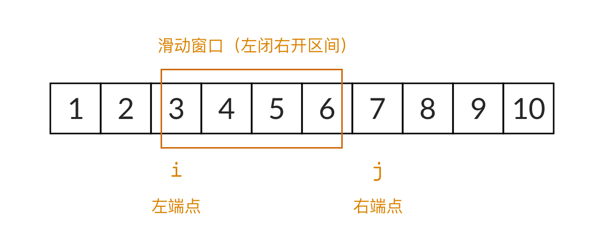

参考——[什么是滑动窗口，以及如何用滑动窗口解这道题（C++/Java/Python） - 和为s的连续正数序列 - 力扣（LeetCode）](https://leetcode-cn.com/problems/he-wei-sde-lian-xu-zheng-shu-xu-lie-lcof/solution/shi-yao-shi-hua-dong-chuang-kou-yi-ji-ru-he-yong-h/)



输入一个正整数 target ，输出所有和为 target 的连续正整数序列（至少含有两个数）。

序列内的数字由小到大排列，不同序列按照首个数字从小到大排列。

 

示例 1：

> 输入：target = 9
> 输出：[[2,3,4],[4,5]]

示例 2：

> 输入：target = 15
> 输出：[[1,2,3,4,5],[4,5,6],[7,8]]


限制：

> 1 <= target <= 10^5

来源：力扣（LeetCode）
链接：https://leetcode-cn.com/problems/he-wei-sde-lian-xu-zheng-shu-xu-lie-lcof
著作权归领扣网络所有。商业转载请联系官方授权，非商业转载请注明出处。


```java
package leetcode.每日一题;

import java.util.ArrayList;
import java.util.List;

/**
 * Created with IntelliJ IDEA.
 * User: 76147
 * Date: 2020-03-11
 * Time: 15:15
 * Description:
 */
public class 和为s的连续正数序列2 {
    /**
     * 方法二 滑动窗口
     */
    class Solution {
        List<int[]> res = new ArrayList<>();
        int i = 1; // 滑动窗口的左边界
        int j = 1; // 滑动窗口的右边界
        int sum = 0; // 滑动窗口中数字的和

        public int[][] findContinuousSequence(int target) {
            while (i <= target / 2) {//比如target=10,5+6>10
                if (sum < target) {
                    sum += j;
                    j++;
                } else if (sum > target) {
                    sum -= i;
                    i++;
                } else {
                    int arr[] = new int[j - i];
                    for (int k = i; k < j; k++) {
                        arr[k - i] = k;
                    }
                    res.add(arr);
                    sum -= i;
                    i++;
                }
            }
            return res.toArray(new int[res.size()][]);
        }
    }

    /**
     * 方法一 暴力枚举
     */
    /*class Solution {
        int a[][];

        public int[][] findContinuousSequence(int target) {
            List<List> lists = new ArrayList<>();
            for (int i = 1; i < target; i++) {
                List<Integer> list = new ArrayList<>();
                int ans = 0;
                for (int j = i; j < target; j++) {
                    ans += j;
                    if (ans <= target) {
                        list.add(j);
                    }
                    if (ans > target) {
                        break;
                    }
                    if (ans == target) {
                        lists.add(list);
                        break;
                    }
                }
            }
            int size = lists.size();
            a = new int[size][];
            for (int i = 0; i < size; i++) {
                List<Integer> list = lists.get(i);
                a[i] = new int[list.size()];
                for (int j = 0; j < list.size(); j++) {
                    a[i][j] = list.get(j);
                }
            }
            return a;
        }
    }*/
}

```

