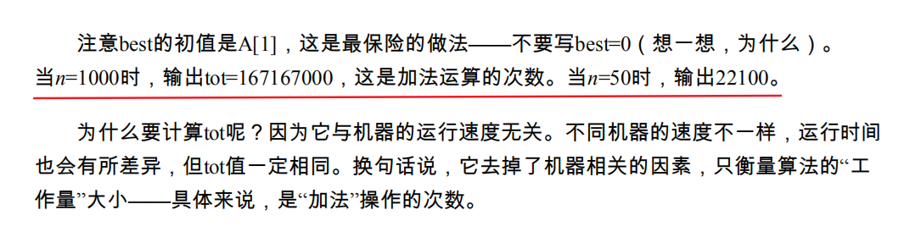
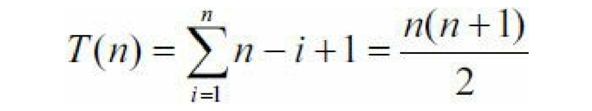
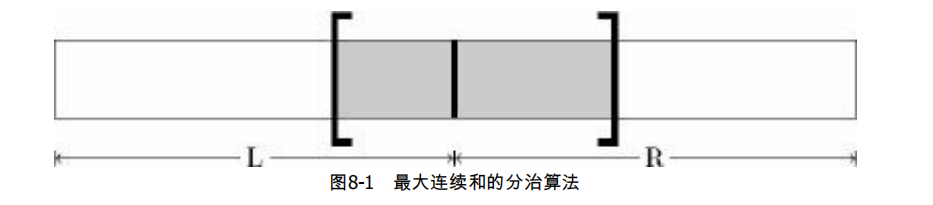

#### [面试题42. 连续子数组的最大和](https://leetcode-cn.com/problems/lian-xu-zi-shu-zu-de-zui-da-he-lcof/)

难度简单19 收藏 分享 切换为英文 关注 反馈

输入一个整型数组，数组里有正数也有负数。数组中的一个或连续多个整数组成一个子数组。求所有子数组的和的最大值。

要求时间复杂度为O(n)。

**示例1:**

**输入:** nums = \[\-2,1,\-3,4,\-1,2,1,\-5,4\]
**输出:** 6
**解释:** 连续子数组 \[4,\-1,2,1\] 的和最大，为 6。

**提示：**

*   `1 <= arr.length <= 10^5`
*   `-100 <= arr[i] <= 100`


# 暴力枚举（超时）

```java
class Solution {
    public int maxSubArray(int[] nums) {

        int tot = 0;
        int best = nums[0]; //初始最大值
        for(int i = 0; i < nums.length; i++){
            for(int j = i; j < nums.length; j++){
                //检查连续子序列A[i],..., A[j]
                int sum = 0;
                for(int k = i; k <= j; k++) {
                    sum += nums[k];
                    tot++;
                } //累加元素和
                if(sum > best)
                    best = sum; //更新最大值
            }
        }
        return best;
    }
}
```



**复杂度接近$n^3$**

# 利用公式初步优化

设：$S_i = A_1+A_2+A_3...+A_i,S_j=A_1+A_2+...+A_i+...+A_j$

$则A_i+A_{i+1}+...+A_j = S_j-S_{i-1}$

该式子的用途相 当广泛，其直观含义是“连续子序列之和等于两个前缀和之差”。有了这个结论，最内层的循 

环就可以省略了


| **201 / 202** 个通过测试用例 | 状态：超出时间限制 |
| ---------------------------- | ------------------ |
|                              |                    |


```java
int S[] = new int[nums.length];
        S[0] = nums[0];
        for (int i = 1; i < nums.length; i++) {
            S[i] = S[i - 1] + nums[i];
        }
        int best = 0;
        for (int i = 0; i < nums.length; i++) {
            for (int j = i; j < nums.length; j++) {
                best = Math.max(best, S[j] - S[i - 1]);
            }
        }
        return best;
```

注意上面的程序用到了递推的思想：从小到大依次计算S[1], S[2], S[3],…，每个只需要 在前一个的基础上加上一个元素。



# 分治法

​	分治算法一般分为如下3个步骤：

1. 划分问题：把问题的实例划分成子问题。 

2. 递归求解：递归解决子问题。 

	3.  合并问题：合并子问题的解得到原问题的解。 


**在本例中，“划分”就是把序列分成元素个数尽量相等的两半；“递归求解”就是分别求出 完全位于左半或者完全位于右半的最佳序列；“合并”就是求出起点位于左半、终点位于右半 的最大连续和序列，并和子问题的最优解比较。** 

**前两部分没有什么特别之处，关键在于“合并”步骤。既然起点位于左半，终点位于右 半，则可以人为地把这样的序列分成两部分，然后独立求解：先寻找最佳起点，然后再寻找 最佳终点。** 




> 执行用时 :7 ms, 在所有 Java 提交中击败了7.44%的用户
>
> 内存消耗 :46.5 MB, 在所有 Java 提交中击败了100.00%的用户


```java
public class Solution {
    public int maxSubArray(int[] nums) {
        int ans = maxsum(nums, 0, nums.length);//左闭右开
        return ans;
    }

    private int maxsum(int[] nums, int x, int y) { //返回数组在左闭右开区间[x,y)中的最大连续和
        if (y - x == 1)
            return nums[x]; //只有一个元素，直接返回
        int m = x + (y - x) / 2; //分治第一步：划分成[x, m)和[m, y)
        int max = Math.max(maxsum(nums, x, m), maxsum(nums, m, y)); //分治第二步：递归求解
        int v = 0, l = nums[m - 1], r; 
        for (int i = m - 1; i >= x; i--) {//分治第三步：合并(1)——从分界点开始往左的最大连续和L
            l = Math.max(l, v += nums[i]);
        }
        v = 0;
        r = nums[m];
        for (int i = m; i < y; i++) {//分治第三步：合并(2)——从分界点开始往右的最大连续和R
            r = Math.max(r, v += nums[i]);

        }
        return Math.max(max, l + r);

    }
}
```


$T(n)=2T(n/2)+n=>T(n)=θ(nlogn)$

其中 2*T*(*n*/2)是两次长度为*n*/2的递归调用，而最后的*n*是合并的时间（整个序列恰好扫描一遍）。 

注意这个方程是近似的，因为当*n*为奇数时两次递归的序列长度分别为(*n*－1)/2和(*n*+1)/2，而 

不是*n*/2。幸运的是，这样的近似对于最终结果影响很小，在分析算法时总是可以忽略它。 


# 动态规划思想

```java
public class Solution {
    public static int maxSubArray(int[] nums) {
        int max = nums[0];
        for (int i = 1; i < nums.length; i++) {
            if (nums[i - 1] > 0)
                nums[i] += nums[i - 1];
            if (nums[i] > max)
                max = nums[i];
        }

        return max;
    }

}
```

