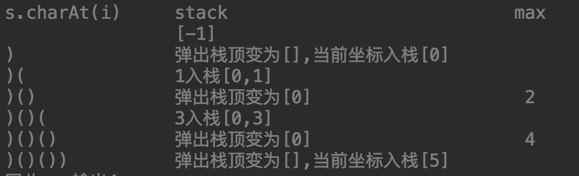
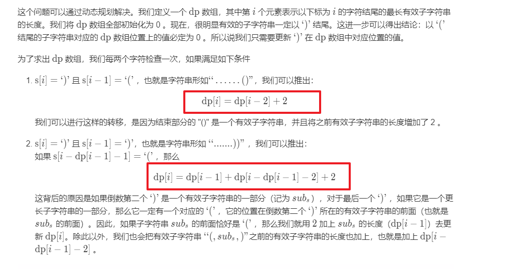
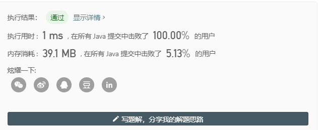

[32\. 最长有效括号](https://leetcode-cn.com/problems/longest-valid-parentheses/)

给定一个只包含 `'('` 和 `')'` 的字符串，找出最长的包含有效括号的子串的长度。

**示例 1:**

> **输入:** "(()"
> **输出:** 2
> **解释:** 最长有效括号子串为 `"()"`

**示例 2:**

> **输入:** "`)()())`"
> **输出:** 4
> **解释:** 最长有效括号子串为 `"()()"`


# 题解

暴力栈

用栈来保存括号的索引



```java
class Solution {
    public int longestValidParentheses(String s) {
        Stack<Integer> stack = new Stack();
        int n = s.length();
        int max = 0;
        stack.push(-1);
        for (int i = 0; i < n; i++) {
            if (s.charAt(i) == '(') {
                stack.push(i);
            } else {
                stack.pop();
                if (!stack.isEmpty()) {
                    max = max > (i - stack.peek()) ? max : i - stack.peek();
                } else {
                    stack.push(i);
                }
            }
        }

        return max;
    }
}
```

动态规划



```java
class Solution {
    public int longestValidParentheses(String s) {

        int n = s.length();
        if(n<2)return 0;
        int dp[] = new int[n];
        int max = 0;
        for(int i=1;i<n;i++){
            if(s.charAt(i)==')'){
                if(s.charAt(i-1)=='('){
                   dp[i] = (i>=2?dp[i-2]:0)+2;
                }else if(i-dp[i-1]>0&&s.charAt(i-dp[i-1]-1)=='('){
                    dp[i] = dp[i-1]+((i-dp[i-1])>=2?dp[i-dp[i-1]-2]:0)+2;
                }
                max = max>dp[i]?max:dp[i];
            }
        }
        return max;
    }
}
```

