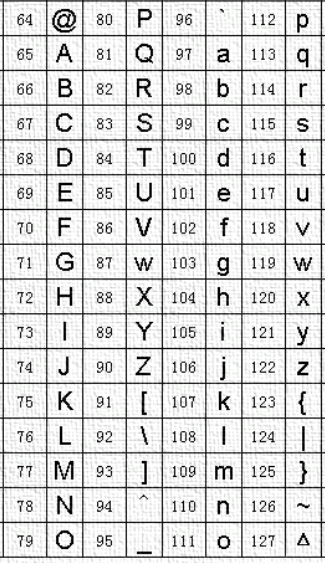

# [409. 最长回文串 - 力扣（LeetCode）](https://leetcode-cn.com/problems/longest-palindrome/)

给定一个包含大写字母和小写字母的字符串，找到通过这些字母构造成的最长的回文串。

在构造过程中，请注意区分大小写。比如 `"Aa"` 不能当做一个回文字符串。

**注意:**
假设字符串的长度不会超过 1010。

**示例 1:**

```
输入:
"abccccdd"

输出:
7

解释:
我们可以构造的最长的回文串是"dccaccd", 它的长度是 7。
```

# 解题思路
题目说了可以组合回文串（找到通过这些字母构造成的最长的回文串），辣么，如果每个字符都有偶数个一定可以构成回文串，还有就是如果有多余的字符，加上它就可以构成最长的回文字符串了。

# 哈希表
挺简单的，就是速度有点慢

```java
 class Solution {
        public int longestPalindrome(String s) {
            if(s.length()==0){
                return 0;
            }
            Set<Character> set = new HashSet<>();
            int count = 0;
            for (int i = 0; i < s.length(); i++) {
                if (!set.add(s.charAt(i))) {//如果添加不成功，说明有一个重复的字符串了，那么count+=2，表示有两个
                    count += 2;
                    set.remove(s.charAt(i));//移除那个重复的字符串，因为刚才已经加2了
                }
            }
            if (s.length() == count) {//如果长度等于s的长度，说明每个字符都有重复值，一定可以组成回文串
                return count;
            } else {
                return count + 1;
            }

        }
    }
```

# 贪心法

1. 利用数组，以字符的ASCII值为索引，存储字符出现的次数。

2. `ans += v / 2 * 2;`意思是如果有奇数个则，减去一个；如果有偶数个，辣么还加上原来的偶数个。比如$3/2*2=2,4/2*2=4$
3. 下面是A-Za-z的ASCII值


代码直接拿的官方的：
```java
class Solution {
    public int longestPalindrome(String s) {
        int[] count = new int[128];

        for (char c: s.toCharArray())
            count[c]++;

        int ans = 0;
        for (int v: count) {
            ans += v / 2 * 2;
            if (v % 2 == 1 && ans % 2 == 0)//为了保证最长回文字符串
                ans++;
        }
        return ans;
    }
}
```


|      |      |      |      |      |      |      |      |      |      |
| ---- | ---- | ---- | ---- | ---- | ---- | ---- | ---- | ---- | ---- |
|      |      |      |      |      |      |      |      |      |      |

