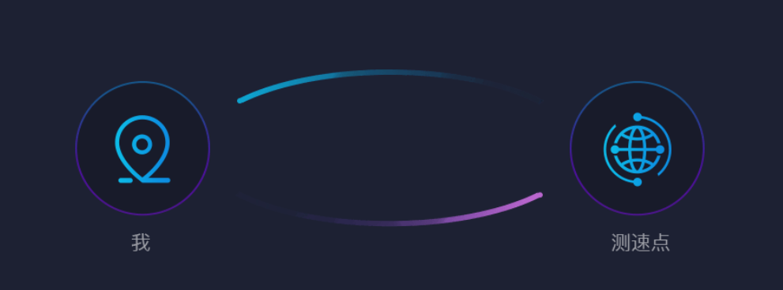

## 理解本次测速结果

## 下载速度：46.8Mbps 

## 上传速度：20.39Mbps 

## 当前的网速相当于50M宽带，观看超高清4K视频没问题~

## 一、下载、上传

网络数据传输分为发送数据和接收数据两部分。上传就是向外部发送数据，下载为从外部接收数据。通俗一点说，下载速度是指你把网络上的内容下载到手机或者电脑上时的速度，比如下载软件、看电影、浏览网页之类的速度；上传的话是把手机或电脑里面的内容传到网络上去，比如你传照片给好友和空间，或者领取购物券。

例如，在您双十一抢购或者是平时抢红包的时候，下载网速影响您打开网页的速度；而抢购和抢红包是否成功，则是上传速度影响较大。

上传速度以及下载速度都受网络带宽和设备性能制约。 用户申请的宽带业务速率指技术上所能达到的最大理论速率值，用户上网时还受到用户电脑软硬件的配置、所浏览网站的位置、网站带宽等情况的影响，故用户上网时的速率通常低于理论速率值。 在日常网络传输中大致1Mbps=1024/8Kb/s=128Kb/s(1/8)。例如上行的网络带宽为100Mbps,那么最大上传速度就是12800Kb/s，也就是12.5Mb/s。

理论上：2M（即2Mb/s）宽带理论速率是：256KB/s（即2048Kb/s），实际速率大约为103--200KB/s；4M（即4Mb/s）的宽带理论速率是：512KB/s，实际速率大约为200---440KB/s。以此类推。

## 二、PING

PING指一个数据包从用户的设备发送到测速点，然后再立即从测速点返回用户设备的来回时间。

一般以毫秒（ms）计算

一般PING在0~100ms都是正常的速度，不会有较为明显的卡顿。

## 三、抖动

网络中的延迟是指信息从发送到接收经过的延迟时间；而抖动是指最大延迟与最小延迟的时间差，如最大延迟是20毫秒，最小延迟为5毫秒，那么网络抖动就是15毫秒，它主要标识一个网络的稳定性。

## 四、丢包

丢包是指一个或多个数据包的数据无法通过网络到达目的地。可能原因是多方面的，或是网络中多路径衰落造成信号衰减；或是通道阻塞造成丢包；或是损坏的数据包被拒绝通过；或是有缺陷的网上硬件有缺陷，网上驱动程序有故障。

## 五、测速点：

测速点一般是一个服务器或者一个路由器，一个可以提供数据上传和下载的地方。您在测速前可以选择不同测速点，距离您越近的测速点，测出来的网速越精准。

## 六、IP地址

IP地址被用来给联网的电脑一个编号。大家日常见到的情况是每台联网的电脑上都需要有IP地址，才能正常通信。我们可以把“个人电脑”比作“一台电话”，那么“IP地址”就相当于“电话号码”。

## 七、网速测试建议

\1. 建议您在测速的时候，关闭其它正在运行中的网络应用程序，不要同时加载其它网页和软件。

\2. 建议尝试在不同时段进行测速，最好是在非繁忙时间来作多次测试得出结果,取平均值,会比较准确。

\3. 另外由于宽带测速受包括您电脑的配置、CPU频率及系统内存的容量、是否安装了网络防火墙、计算机是否有病毒、上网终端设备的性能、测速服务器是否处于忙时等因素的影响，在一定程度上会影响测速的结果。