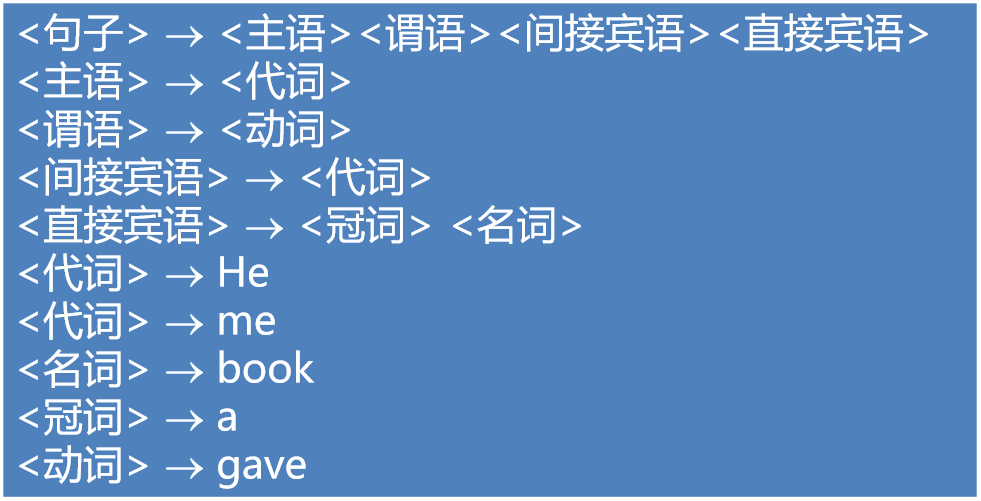
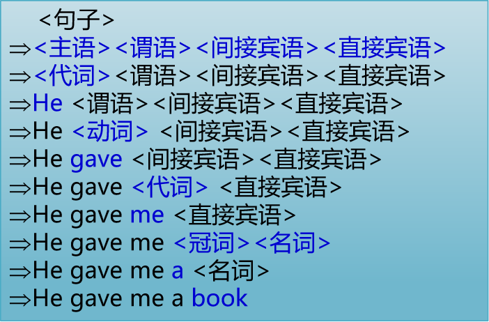
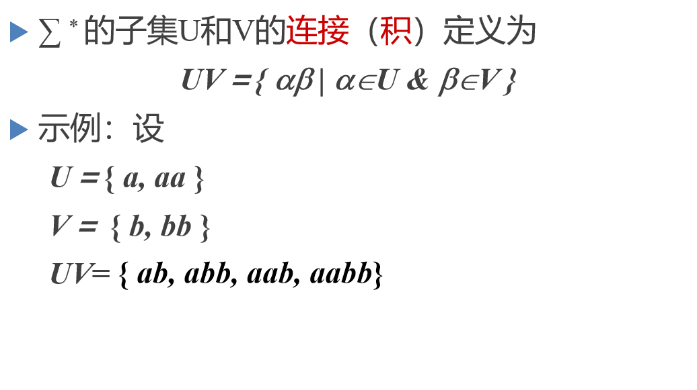
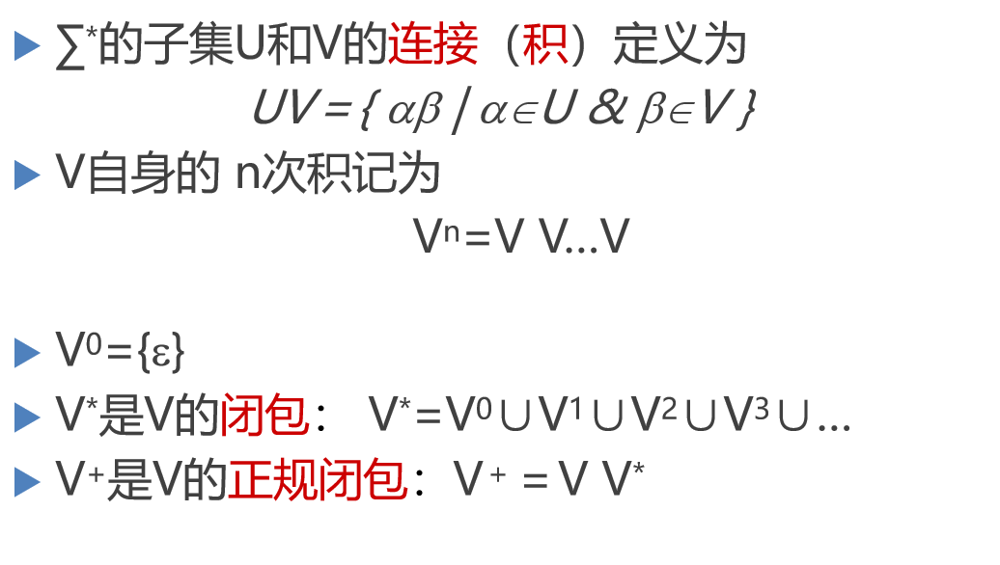
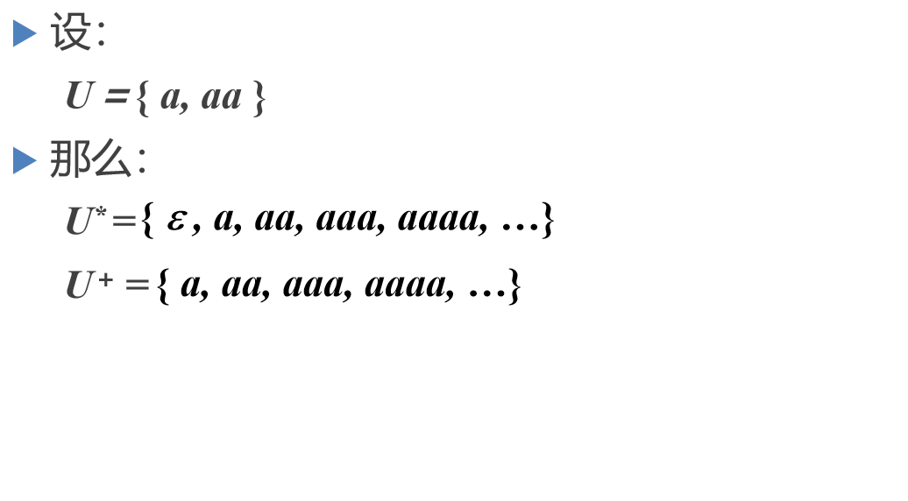
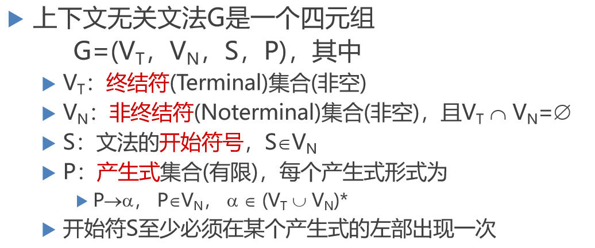
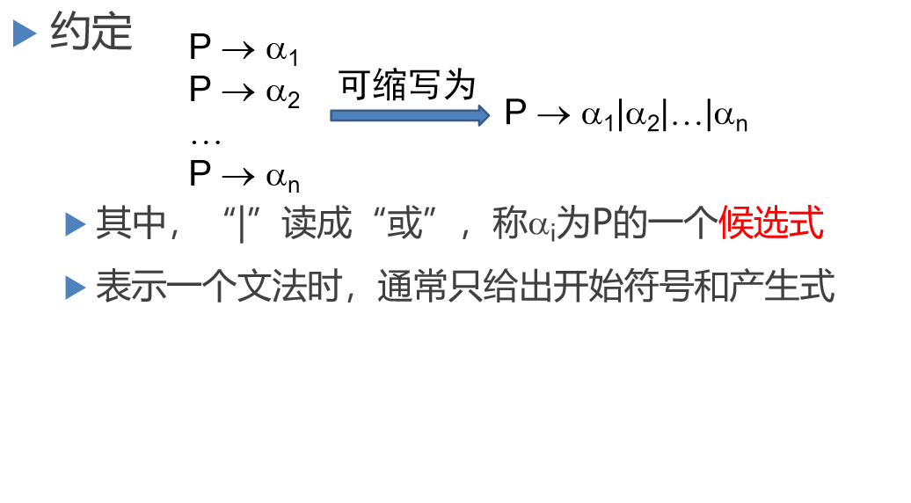

[TOC]

> 标识符是语法，名字是语义
>
> 程序语言的定义
> 语法
> 语义
> 程序语言的功能

# 3.1 上下文无关文法

**文法：** 描述语言的语法结构的形式规则
He gave me a book.

##  语法描述的几个基本概念

**字母表：**一个有穷字符集，记为∑
字母表中每个元素称为字符
$∑$上的字(也叫字符串)  是指由$∑$中的字符所构成一个有穷序列
不包含任何字符的序列称为空字，记为$ε$
用$∑*$表示$∑$上的所有字的全体，包含空字$ε$
例如: 设$∑={a, b}$，则 

$∑*={ε,a,b,aa,ab,ba,bb,aaa,...}$

终结符 he me 是不能再分解的
非终结符是可以再分解的
产生式的→ 读成（定义为）

> 例，定义只含+，*的算术表达式的文法*
>
> G=< {i，+，*，(，)}，{E}，E， P >， 其中，P由下列产生式组成：*
>
> ​	E → i
> ​	E → E+E
> ​	E → E*E
> ​	E → (E)

约定&规约

> 文法G=<{i，+，\*，(，)}，{E}，E， P>， P定义如下：
> 	E→i
> 	E→E+E
> 	E→E\*E
> 	E→(E)
>
> 约定->  `G(E)： E -> i | E+E | E*E | (E)`

# 3.2 文法与语言