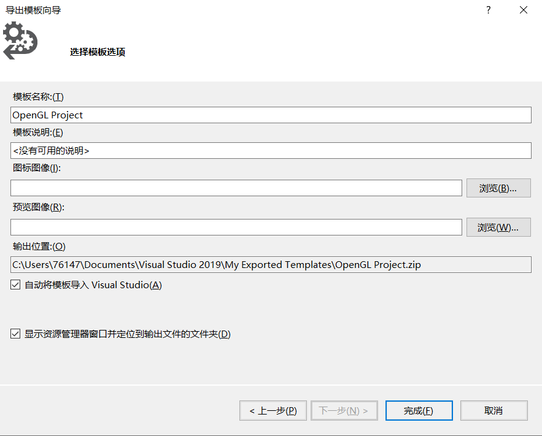

> 参考博文：
>
> [OpenGL+VS2017 环境配置(亲测好使)<附带必要知识点>_C/C++_AvatarForTest的博客-CSDN博客](https://blog.csdn.net/AvatarForTest/article/details/79199807?depth_1-utm_source=distribute.pc_relevant.none-task&utm_source=distribute.pc_relevant.none-task)
>
> [一步一步教你在VS 2017中配置OpenGL - smile_zyk - 博客园](https://www.cnblogs.com/z-y-k/p/11637456.html)
>
> [构建GLFW - LearnOpenGL CN](https://learnopengl-cn.github.io/01%20Getting%20started/02%20Creating%20a%20window/)

> 涉及的文件
>
> 链接：https://pan.baidu.com/s/1cYG9chJ2_xYCjEn2s9i9ZA 
> 提取码：1m4s

# 第一步

 第一步进行GLFW库的配置, 可以现在源码，然后使用CMake进行编译；还可以选择直接在网站上下载【64-bit Windows预编译的二进制文件】 	


# 第二步

第二步进行GLAD的配置，去GLAD在线服务页面，进入后针对相应的选项进行选择，我的如图所示


# 第三步

包含目录

I:\Opengl\glfw-3.3.2.bin.WIN32\include
I:\Opengl\glad4.5\include

库目录

I:\Opengl\glfw-3.3.2.bin.WIN32\lib-vc2019

附加依赖项

glfw3.lib


# 测试代码

```c++
#include <glad/glad.h>
#include <GLFW/glfw3.h>
#include <iostream>
using namespace std;
 
void framebuffer_size_callback(GLFWwindow* window, int width, int height);
 
int main() {
	glfwInit();
	//glfwWindowHint(GLFW_CONTEXT_VERSION_MAJOR, 3);
	//glfwWindowHint(GLFW_CONTEXT_VERSION_MINOR, 1);
	//glfwWindowHint(GLFW_OPENGL_PROFILE, GLFW_OPENGL_CORE_PROFILE);
 
	GLFWwindow* window = glfwCreateWindow(800, 600, "LearnOpenGL", NULL, NULL);
	if (window == NULL) {
		cout << "Failed to create GLFW window" << endl;
		glfwTerminate();
		return -1;
	}
	glfwMakeContextCurrent(window);
 
	if (!gladLoadGLLoader((GLADloadproc)glfwGetProcAddress)) {
		std::cout << "Failed to initialize GLAD" << std::endl;
		return -1;
	}
 
	glViewport(0, 0, 800, 600);
 
	glfwSetFramebufferSizeCallback(window, framebuffer_size_callback);
 
	while (!glfwWindowShouldClose(window)) {
		glfwSwapBuffers(window);
		glfwPollEvents();
	}
 
	glfwTerminate();
	return 0;
}
 
void framebuffer_size_callback(GLFWwindow* window, int width, int height) {
	glViewport(0, 0, width, height);
}
```


# 导出项目模板

为了日后使用OpenGL时不用再重复上面繁琐的步骤，我们导出项目模板。

首先，在VS上方导航栏中选中项目->导出模板。 

选中项目模板，点击下一步。

为模板命名，这里我命名为OpenGL Project。 



点击完成。这样一个OpenGL的项目模板就做好了。
重新打开VS，点击新建项目，可以看到我们的项目模板已经成功导入了，这样我们在下次创建OpenGL项目时就可以直接使用了~ 


