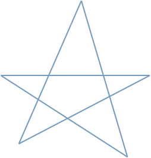
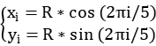

# 实验一 创建C++控制台应用程序

## 一、实验目的

1. 练习C++程序的基础知识。

2. 熟悉VC++控制台应用程序开发流程。

3. 了解OpenGL开发环境。

## 二、实验内容

1.编写一个类或结构体，表示平面上的一条线段。并据此计算并输出线段的长度。

 

## 三、预备知识

在VS中新建项目的步骤参见：“新建C++控制台项目.docx”

## 四、实验步骤

1、定义结构体Point，包含x,y坐标(float x; float y)。

2、定义结构体或类，以两个Point作为线段的两个端点。

3、在主函数中输入两个端点的坐标，利用两点之间的距离公式计算长度并输出。

4、开根号的函数：double sqrt(double x); 要包含头文件math.h

##  五、实验报告


# 实验二 熟悉GLUT创建绘图窗口
## 一、实验目的
1.熟悉OpenGL图形渲染的基础流程。
2.掌握在GLUT窗口中绘制图形的基本方法。
3.
## 二、实验内容

1.利用OpenGL线段画出五角星图案，如下图所示。



## 三、预备知识
五角星五个顶点的计算方法：
五个顶点均匀分布在圆周上，可以用如下公式计算：

 

, i=0,1,2,3,4

代码框架参考`OpenglDemo.cpp`
## 四、实验步骤
1、按上述公式计算5个顶点坐标，记为ABCDE；
2、画线段：AC、CE、EB、BD、DA。
3、设置合适的线段宽度、颜色。
4、将图形移动到屏幕中央: `glTranslatef(dx, dy)`

## 五、实验报告
按要求填写实验报告，连同项目源文件添加到压缩文件。压缩文件命名为学号+姓名的格式（例如“20147750101张三.rar”）


# DDADemo.cpp

```c++
#include <GL/glut.h>      // OPenGL实用工具库

#include <math.h>
int dx=0, dy=0; // 平移变量
float angle=0;  // 旋转角度
int mouseX=0,mouseY=0; //鼠标位置
const int XL=100,XR=300,YB=100,YT=300;

void swap(int &a, int &b) {
	int t = a; a = b; b = t;
}

void DDALine(int x0, int y0, int x1, int y1) {
	if (x0==x1) //斜率无穷大
	{
		if (y0>y1)
		{
			swap(x0, x1);
			swap(y0, y1);
		}
		int y = y0;
		for (int y = y0; y <= y1; y++)
		{
			glVertex2i(x0, y);
		}

	}
	else { // k存在
		float k = float(y1 - y0) / (x1 - x0);
		if (fabs(k)<1)// |k|<1
		{
			if (x0>x1)
			{
				swap(x0, x1);
				swap(y0, y1);
			}
			float y = y0;
			for (int x = x0; x <= x1; x++)
			{
				glVertex2i(x, int(y + 0.5));
				y += k;
			}

		}
		else { // |k|>=1
			k = 1 / k;
			if (y0>y1)
			{
				swap(x0, x1);
				swap(y0, y1);
			}
			float x = x0;
			for (int y = y0; y <=y1; y++)
			{
				glVertex2i(int(x + 0.5), y);
				x += k;
			}
		
		}
	}
}

void init(void)
{
    glClearColor(1.0, 1.0, 1.0, 0.0);  // 设置背景颜色

    glMatrixMode(GL_PROJECTION);       // 设置投影参数
    gluOrtho2D(0.0, 600.0, 0.0, 450.0); // 设置场景的大小
}
//按上下左右键移动图形
void move(int key,int x,int y) 
{
	switch (key)
	{
	case GLUT_KEY_LEFT:dx -= 10;break;
	case GLUT_KEY_RIGHT:dx += 10;break;
	case GLUT_KEY_UP:dy += 10;break;
	case GLUT_KEY_DOWN:dy -= 10;break;
	}			
	glutPostRedisplay();
}
// 按下鼠标左键记下当前位置
void mouseButtonDown(int key,int action,int x,int y)
{
	if(key==GLUT_LEFT_BUTTON && action==GLUT_DOWN)
	{
		mouseX=x;
		mouseY=y;
	}
}
// 移动鼠标确定旋转角度
void mouseMotion(int x,int y) 
{
	angle+=360*(mouseY-y)/1600;
	mouseX=x;
	mouseY=y;
	glutPostRedisplay();
}

void drawPixel(int x, int y) {
	glBegin(GL_POINT);
	glVertex2i(x, y);
	glEnd();
}

void draw(void)
{
    glClear(GL_COLOR_BUFFER_BIT);  

	int x0 = 120, y0 = 300, x1 = 220, y1 = 100;
	
    glColor3f(1.0, 0.0, 0.0);      // 设置画图颜色
    glLineWidth(3);                // 设置边框宽度
	glPointSize(3);
	glPushMatrix();    
	glTranslatef(dx,dy,0); //图形变换操作须放在绘制之前
	glRotatef(angle,0,0,1);
	/*glBegin(GL_LINE_LOOP);
		glVertex2i(XL,YT);
		glVertex2i(XL,YB);
        glVertex2i(XR,YB);
		glVertex2i(XR,YT);
    glEnd( );*/

	glBegin(GL_POINTS);
	DDALine(x0, y0, x1, y1);
	glEnd();

	/*glBegin(GL_POINTS);
	for (size_t i = 0; i < length; i++)
	{
		glVertex2i(x, y);
	}
	glEnd();*/

	/*for (size_t i = 0; i < length; i++)
	{
		drawPixel(XI, YI); //不推荐

	}*/ 
	
	glPopMatrix();
    glFlush( );     // 处理绘图pipeLine
	//glutSwapBuffers(); //GLUT_DOUBLE
}

void main(int argc, char** argv)
{
    glutInit(&argc, argv);  // 初始化GLUT环境
    glutInitDisplayMode(GLUT_SINGLE | GLUT_RGB);   // GLUT显示模式：单缓冲区、RGB颜色模型
    //glutInitWindowPosition(50, 100);   // 窗口左上角的位置
    glutInitWindowSize(800, 600);      // 显示窗口的大小
    glutCreateWindow("An Example of OpenGL"); // 创建显示窗口，加上标题

    init( );                            
    glutDisplayFunc(draw);           // 调用绘图函数
	glutSpecialFunc(move);			 // 功能键响应
	glutMouseFunc(mouseButtonDown);  // 鼠标按键响应
	glutMotionFunc(mouseMotion);     // 鼠标移动响应
    glutMainLoop( );				 // 进入事件处理循环
}

```


# OpenglDemo.cpp

```c++
#include <GL/glut.h>      // OPenGL实用工具库

//#include <math.h>
int dx=0, dy=0; // 平移变量
float angle=0;  // 旋转角度
int mouseX=0,mouseY=0; //鼠标位置
const int XL=100,XR=300,YB=100,YT=300;

void init(void)
{
    glClearColor(1.0, 1.0, 1.0, 0.0);  // 设置背景颜色

    glMatrixMode(GL_PROJECTION);       // 设置投影参数
    gluOrtho2D(0.0, 600.0, 0.0, 450.0); // 设置场景的大小
}
//按上下左右键移动图形
void move(int key,int x,int y) 
{
	switch (key)
	{
	case GLUT_KEY_LEFT:dx -= 10;break;
	case GLUT_KEY_RIGHT:dx += 10;break;
	case GLUT_KEY_UP:dy += 10;break;
	case GLUT_KEY_DOWN:dy -= 10;break;
	}			
	glutPostRedisplay();
}
// 按下鼠标左键记下当前位置
void mouseButtonDown(int key,int action,int x,int y)
{
	if(key==GLUT_LEFT_BUTTON && action==GLUT_DOWN)
	{
		mouseX=x;
		mouseY=y;
	}
}
// 移动鼠标确定旋转角度
void mouseMotion(int x,int y) 
{
	angle+=360*(mouseY-y)/1600;
	mouseX=x;
	mouseY=y;
	glutPostRedisplay();
}

void draw(void)
{
    glClear(GL_COLOR_BUFFER_BIT);  

	int x0 = 220, y0 = 400, x1 = 320, y1 = 200;
	
    glColor3f(1.0, 0.0, 0.0);      // 设置画图颜色
    glLineWidth(3);                // 设置边框宽度
	glPointSize(3);
	glPushMatrix();    
	glTranslatef(dx,dy,0); //图形变换操作须放在绘制之前
	glRotatef(angle,0,0,1);
	glBegin(GL_LINE_LOOP);
		glVertex2i(XL,YT);
		glVertex2i(XL,YB);
        glVertex2i(XR,YB);
		glVertex2i(XR,YT);
    glEnd( );	
	
	glPopMatrix();
    glFlush( );     // 处理绘图pipeLine
	//glutSwapBuffers(); //GLUT_DOUBLE
}

void main(int argc, char** argv)
{
    glutInit(&argc, argv);  // 初始化GLUT环境
    glutInitDisplayMode(GLUT_SINGLE | GLUT_RGB);   // GLUT显示模式：单缓冲区、RGB颜色模型
    //glutInitWindowPosition(50, 100);   // 窗口左上角的位置
    glutInitWindowSize(800, 600);      // 显示窗口的大小
    glutCreateWindow("An Example of OpenGL"); // 创建显示窗口，加上标题

    init( );                            
    glutDisplayFunc(draw);           // 调用绘图函数
	glutSpecialFunc(move);			 // 功能键响应
	glutMouseFunc(mouseButtonDown);  // 鼠标按键响应
	glutMotionFunc(mouseMotion);     // 鼠标移动响应
    glutMainLoop( );				 // 进入事件处理循环
}

```

