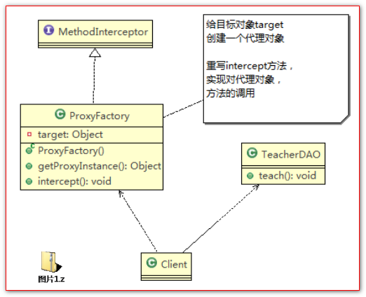
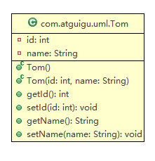
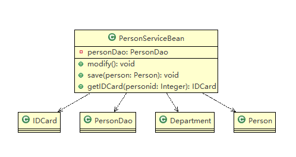
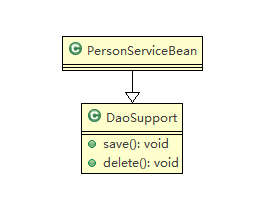
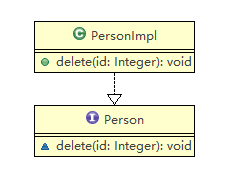
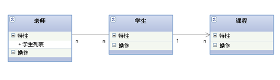
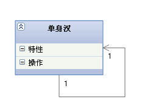
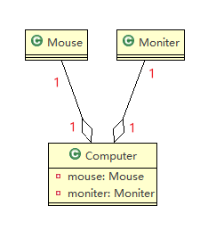
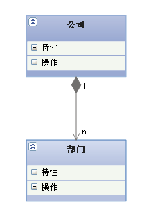
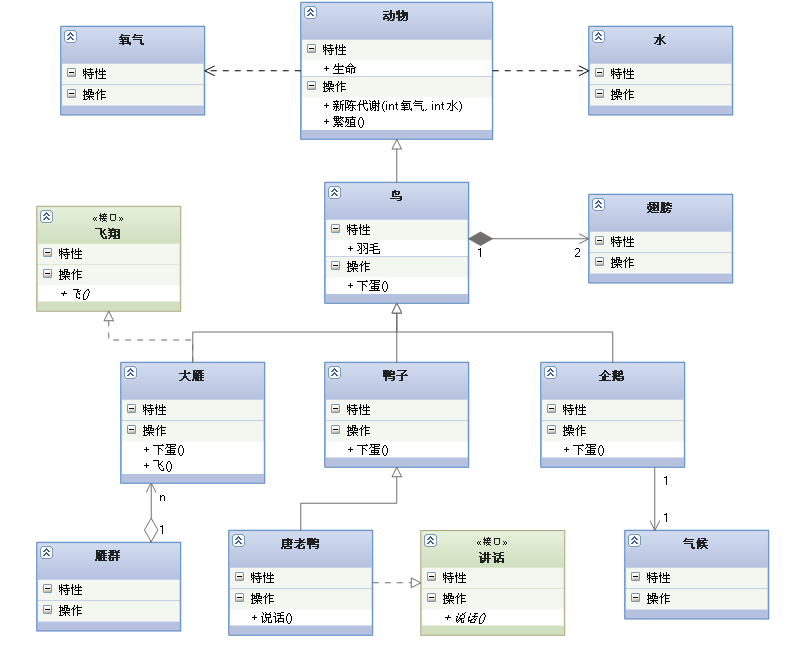

# UML类图

## 目录

*   [UML基本介绍](#uml基本介绍)

*   [UML图分类](#uml图分类)

*   [类图Class Diagram](#类图class-diagram)

    *   [类图——依赖关系（Dependence）](#类图依赖关系dependence)

    *   [类图——泛化关系（generalization）](#类图泛化关系generalization)

    *   [类图——实现关系（Implementation）](#类图实现关系implementation)

    *   [类图——关联关系（Association）](#类图关联关系association)

    *   [类图——聚合关系（Aggregation）](#类图聚合关系aggregation)

    *   [类图——组合关系（Composition）](#类图组合关系composition)

    *   [小结](#小结)

## UML基本介绍

1、UML——Unified modeling language UML(统一建模语言)，是一种用于软件系统分析和设计的语言工具，它用于帮助软件开发人员进行思考和记录思路的结果

2、UML本身是一套符号的规定，就像数学符号和化学符号一样，这些符号用于描述软件模型中的各个元素和他们之间的关系，比如类、接口、实现、泛化、依赖、组合、聚合等，如右图:

3、使用UML来建模，常用的工具有 Rational Rose , 也可以使用一些插件来建模



## UML图分类

*   用例图

*   静态结构图

    *   类图、对象图、包图、组件图、部署图

*   动态行为图

    *   交互图（时序图和协作图）、状态图、活动图

类图是描述类与类之间的关系的，是UML图中最核心的

## 类图Class Diagram

1.  用于描述系统中的类(对象)本身的组成和类(对象)之间的各种静态关系。

2.  类之间的关系：**依赖、泛化（继承）、实现、关联、聚合与组合**



### 类图——依赖关系（Dependence）

【依赖关系】：只要是在**类中用到了对方**，那么他们之间就存在依赖关系。

【箭头指向】：带虚线的箭头，指向被使用者



### 类图——泛化关系（generalization）

【泛化关系】：泛化关系实际上就是继承关系，他是依赖关系的特例。

【箭头指向】：带三角箭头的实线，箭头指向父类

```java
public class PersonServiceBean extends DaoSupport {

}

public abstract class DaoSupport {
  public void save(Object entity) {
  }
  public void delete(Object id) {
  }
}

```



### 类图——实现关系（Implementation）

【实现关系】：实现关系实际上就是A类实现B接口，是依赖关系的特例。

【箭头指向】：带三角箭头的虚线，箭头指向接口



### 类图——关联关系（Association）

【关联关系】：实际上就是类与类之间的联系，他是依赖关系的特例。是一种拥有的关系, 它使一个类知道另一个类的属性和方法。

关联具有**导航性**：即双向关系或单向关系

关系具有**多重性**：

*   “1”（表示有且仅有一个）

*   “0...”（表示0个或者多个）

*   “0，1”（表示0个或者一个）

*   “n...m”(表示n到 m个都可以)

*   “m... \*”（表示至少m个）

【箭头指向】：带普通箭头的实心线，指向被拥护者
可以使用单箭头表示单向关联，使用双箭头或者不使用箭头表示双向关联，不建议使用双向关联，关联有两个端点，每个端点可以有一个基数，表示这个关联的类可以有几个实例。



> 上图中，老师与学生是双向关联，老师有多名学生，学生也可能有多名老师。但学生与某课程间的关系为单向关联，一名学生可能要上多门课程，课程是个抽象的东西，所以它不拥有学生。



【自身关联】：........................

[UML六种依赖关系\_朝闻道\_的博客-CSDN博客\_uml 依赖](https://blog.csdn.net/u011402896/article/details/79315769 "UML六种依赖关系_朝闻道_的博客-CSDN博客_uml 依赖")

[UML中常见关系详解（泛化、实现、依赖、关联、组合、聚合） - 纪玉奇 - 博客园](https://www.cnblogs.com/jiyuqi/p/4571543.html "UML中常见关系详解（泛化、实现、依赖、关联、组合、聚合） - 纪玉奇 - 博客园")

### 类图——聚合关系（Aggregation）

【聚合关系】：Aggregation表示的是整体和部分的关系，整体与部分可以分开。聚合关系是关联关系的   特例，所以他具有关联的导航性与多重性。聚合关系是关联关系的一种，是强的关联关系；关联和聚合在  语法上无法区分，必须考察具体的逻辑关系。

【箭头指向】：带空心菱形的实心线，菱形指向整体

如：我们认为鼠标和显示器是可以从电脑上分离出来的，我们就可以使用带空心菱形的实线来表示“鼠标聚合到电脑，显示器聚合到电脑”



### 类图——组合关系（Composition）

如果我们认为Mouse,Monitor和Computer是不可分离的，则升级为组合关系

【组合关系】：是整体与部分的关系, 但部分不能离开整体而单独存在。如公司和部门是整体和部分的关系，没有公司就不存在部门。组合关系是关联关系的一种，是比聚合关系还要强的关系，它要求普通的聚合关系中代表整体的对象负责代表部分的对象的生命周期

【箭头指向】：带实心菱形的实线，菱形指向整体

案例：在程序中我们定义实体：Person、IDCard和Head，那么 Head 和Person 就是 组合，IDCard 和 Person 就是聚合。但是如果在程序中Person实体中定义了对IDCard进行级联删除，即删除Person时连同IDCard一起删除，那么IDCard 和 Person 就是组合了.



### 小结

参考：[UML类图几种关系的总结\_PlayBoy's 部落格-CSDN博客\_uml类图](https://blog.csdn.net/tianhai110/article/details/6339565 "UML类图几种关系的总结_PlayBoy's 部落格-CSDN博客_uml类图")

各种关系的强弱顺序：
**泛化 = 实现 > 组合 > 聚合 > 关联 > 依赖**

下面这张UML图，比较形象地展示了各种类图关系：


