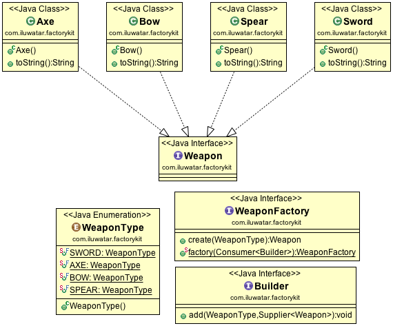

# factory-kit

## 目录

*   [用途](#用途)

*   [代码示例](#代码示例)

    *   [Weapon](#weapon)

    *   [WeaponFactory](#weaponfactory)

    *   [Builder](#builder)

    *   [App](#app)

*   [类图](#类图)

*   [适用性](#适用性)

## 用途

定义具有分离构建器和工厂接口的不可变内容的工厂。

## 代码示例

### Weapon

```java
public interface Weapon {
}
public enum WeaponType {
  SWORD, // 剑
  AXE, // 斧头
  BOW, // 弓
  SPEAR // 矛
}
public class Axe implements Weapon {
  @Override
  public String toString() {
    return "Axe";
  }
}
public class Bow implements Weapon {
  @Override
  public String toString() {
    return "Bow";
  }
}
public class Spear implements Weapon {
  @Override
  public String toString() {
    return "Spear";
  }
}
public class Sword implements Weapon {
  @Override
  public String toString() {
    return "Sword";
  }
}

```

### WeaponFactory

```java
/**
 * Functional interface, an example of the factory-kit design pattern.
 * <br>Instance created locally gives an opportunity to strictly define
 * which objects types the instance of a factory will be able to create.
 * <br>Factory is a placeholder for {@link Builder}s
 * with {@link WeaponFactory#create(WeaponType)} method to initialize new objects.
 */
public interface WeaponFactory {

  /**
   * Creates an instance of the given type.
   *
   * @param name representing enum of an object type to be created.
   * @return new instance of a requested class implementing {@link Weapon} interface.
   */
  Weapon create(WeaponType name);

  /**
   * Creates factory - placeholder for specified {@link Builder}s.
   *
   * @param consumer for the new builder to the factory.
   * @return factory with specified {@link Builder}s
   */
  static WeaponFactory factory(Consumer<Builder> consumer) {
    var map = new HashMap<WeaponType, Supplier<Weapon>>();
    consumer.accept(map::put);
    return name -> map.get(name).get();
  }
}
```

### Builder

```java
public interface Builder {
  void add(WeaponType name, Supplier<Weapon> supplier);
}
```

### App

```java
/**
  factory-kit是一种创建模式，它用分离的构建器和工厂接口定义了一个包含不可变内容的工厂，以处理在factory-kit实例中直接指定对象的创建问题。

  在给定的例子中，{@link WeaponFactory}表示工厂-kit，它包含四个{@link Builder}，用于创建实现{@link Weapon}接口的类的新对象。

  它们中的每一个都可以用{@link WeaponType #create(WeaponType)}方法调用，输入表示一个{@link WeaponType}的实例，
  该实例需要在工厂实例中显式地映射所需的类类型。
 */
@Slf4j
public class App {

  /**
   * Program entry point.
   *
   * @param args command line args
   */
  public static void main(String[] args) {
    var factory = WeaponFactory.factory(builder -> {
      builder.add(WeaponType.SWORD, Sword::new);
      builder.add(WeaponType.AXE, Axe::new);
      builder.add(WeaponType.SPEAR, Spear::new);
      builder.add(WeaponType.BOW, Bow::new);
    });
    var axe = factory.create(WeaponType.AXE);
    LOGGER.info(axe.toString());
  }
}
```

## 类图



## 适用性

1.  类不能预知它必须创建的对象的类

2.  您只需要一个自定义构建器的新实例，而不是全局实例

3.  你明确地想要定义对象的类型，这个工厂可以构建

4.  您需要一个分离的构建器和创建器接口
