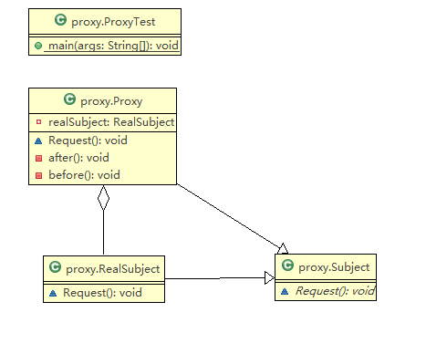
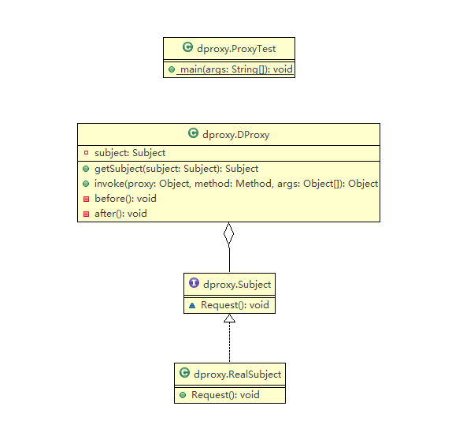

# 代理模式

# 问题引入

我们每天使用支付宝微信支付转账，支付宝这个中介就是代理对象。

购买火车票不一定要去火车站买，可以通过 12306 网站或者去火车票代售点买。

# 定义与特点

代理模式的定义：由于某些原因需要给某对象提供一个代理以控制对该对象的访问。这时，访问对象不适合或者不能直接引用目标对象，代理对象作为访问对象和目标对象之间的中介。

代理模式的主要优点有：

*   代理模式在客户端与目标对象之间起到一个中介作用和保护目标对象的作用；

*   代理对象可以扩展目标对象的功能；

*   代理模式能将客户端与目标对象分离，在一定程度上降低了系统的耦合度，增加了程序的可扩展性

# 如何使用

代理模式的结构比较简单，主要是通过定义一个继承抽象主题的代理来包含真实主题，从而实现对真实主题的访问。

【角色】：

1.  抽象主题类（subject）：通过接口或抽象类声明**真实主题和代理对象**   实现的 业务方法。

2.  真是主题类（real subject）：实现了抽象主题中的具体业务，是代理对象所代表的真实对象，是最终要引用的对象。

3.  代理类（Proxy）：提供了与真实主题相同的接口，其内部含有对真实主题的引用，它可以访问、控制或扩展真实主题的功能。

# 代码

静态代理

# 代理模式的扩展

在前面介绍的代理模式中，代理类中包含了对真实主题的引用，这种方式存在两个缺点。

1.  真实主题与代理主题一一对应，增加真实主题也要增加代理。
    （因为代理主题直接实现了真实主题的方法，所以一个代理对应一个主题）

2.  设计代理以前真实主题必须事先存在，不太灵活。采用动态代理模式可以解决以上问题。

动态代理

