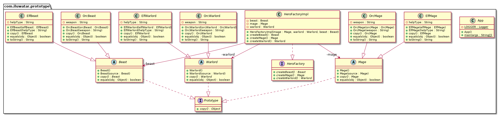

# 原型模式（Prototype）

## 目录

*   [目的](#目的)

*   [解释](#解释)

*   [代码分析](#代码分析)

*   [类图](#类图)

*   [使用场景](#使用场景)

    *   [Known uses](#known-uses)

# 目的

指定要使用原型实例创建的对象类型，并通过复制此原型创建新对象。

# 解释

原型模式并不是用来获得性能优势的。它仅用于从原型实例创建新对象。

通过克隆基于现有对象创建对象。

维基百科说：

*   原型模式是软件开发中的一种创造性设计模式。当要创建的对象类型由原型实例确定时，将使用该实例，原型实例将被克隆以生成新对象。

简而言之，它允许您创建现有对象的副本并根据需要对其进行修改，而无需从头创建对象并进行设置。

# 代码分析

在Java中，建议按如下方式实现原型模式。首先，使用克隆对象的方法创建一个接口。在本例中，Prototype接口通过其复制方法实现了这一点。

```java
public interface Prototype {
  Object copy();
}
```

我们的例子包含了不同生物的层次结构。例如，让我们看看Beast和OrcBeast类。

```java
@EqualsAndHashCode
@NoArgsConstructor
public abstract class Beast implements Prototype {

  public Beast(Beast source) {
  }

  @Override
  public abstract Beast copy();
}

@EqualsAndHashCode(callSuper = false)
@RequiredArgsConstructor
public class OrcBeast extends Beast {

  private final String weapon;

  public OrcBeast(OrcBeast orcBeast) {
    super(orcBeast);
    this.weapon = orcBeast.weapon;
  }

  @Override
  public OrcBeast copy() {
    return new OrcBeast(this);
  }

  @Override
  public String toString() {
    return "Orcish wolf attacks with " + weapon;
  }
}
```

我们不想深入太多细节，但是完整的例子中也包含了基础类Mage和Warlord，并且除了半兽人之外还有一些针对精灵的特殊实现。

为了充分利用原型模式，我们创建了HeroFactory和HeroFactoryImpl类来从原型中生成不同种类的生物。

```java
public interface HeroFactory {
  
  Mage createMage();
  Warlord createWarlord();
  Beast createBeast();
}

@RequiredArgsConstructor
public class HeroFactoryImpl implements HeroFactory {

  private final Mage mage;
  private final Warlord warlord;
  private final Beast beast;

  public Mage createMage() {
    return mage.copy();
  }

  public Warlord createWarlord() {
    return warlord.copy();
  }

  public Beast createBeast() {
    return beast.copy();
  }
}
```

现在，我们可以通过克隆现有的实例来展示生产新生物的完整原型模式。

```java
    var factory = new HeroFactoryImpl(
        new ElfMage("cooking"),
        new ElfWarlord("cleaning"),
        new ElfBeast("protecting")
    );
    var mage = factory.createMage();
    var warlord = factory.createWarlord();
    var beast = factory.createBeast();
    LOGGER.info(mage.toString());
    LOGGER.info(warlord.toString());
    LOGGER.info(beast.toString());

    factory = new HeroFactoryImpl(
        new OrcMage("axe"),
        new OrcWarlord("sword"),
        new OrcBeast("laser")
    );
    mage = factory.createMage();
    warlord = factory.createWarlord();
    beast = factory.createBeast();
    LOGGER.info(mage.toString());
    LOGGER.info(warlord.toString());
    LOGGER.info(beast.toString());
```

Here's the console output from running the example.

```纯文本
Elven mage helps in cooking
Elven warlord helps in cleaning
Elven eagle helps in protecting
Orcish mage attacks with axe
Orcish warlord attacks with sword
Orcish wolf attacks with laser
```

# 类图



# 使用场景

*   当系统应该独立于产品的创建、组合、表示和表达方式时，使用原型模式

*   当要实例化的类在运行时指定时，例如通过动态加载。

*   当一个类的实例只能有几个不同的状态组合中的一个时。安装相应数量的原型并克隆它们可能比手动实例化类更方便，每次都使用适当的状态。

*   与克隆相比，创建对象的开销更大。

## Known uses

*   java.lang.Object#clone()
