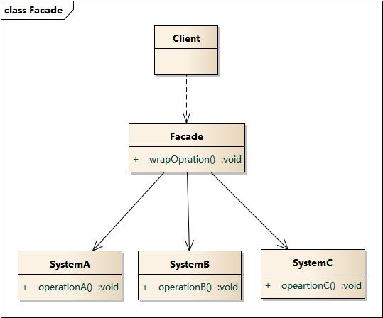
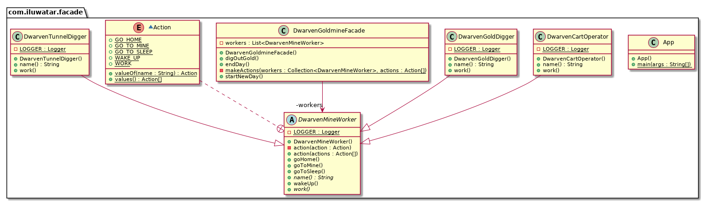

# 外观模式

## 目录

*   [目的](#目的)

*   [定义](#定义)

*   [模式结构](#模式结构)

*   [UML](#uml)

# 目的

一组接口提供一个统一的接口

# 定义

外观模式(Facade Pattern)：外部与一个子系统的通信必须通过一个统一的外观对象进行，为子系统中的一组接口提供一个一致的界面，外观模式定义了一个高层接口，这个接口使得这一子系统更加容易使用。外观模式又称为门面模式，它是一种对象结构型模式。

# 模式结构

外观模式包含如下角色：

*   Facade: 外观角色

*   SubSystem:子系统角色

# UML

