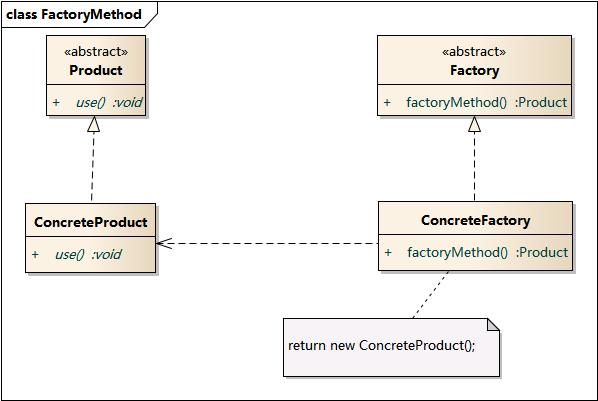
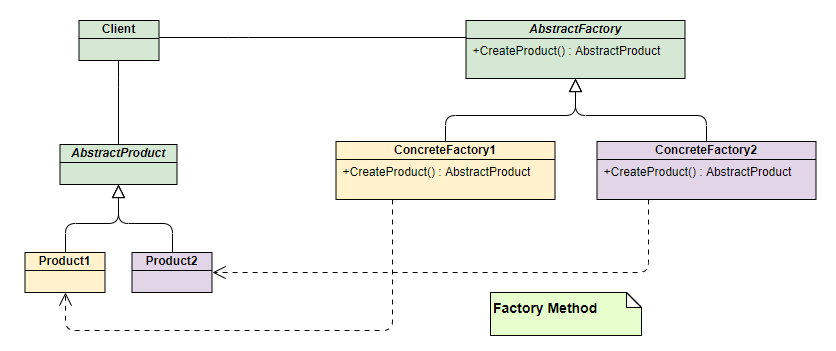
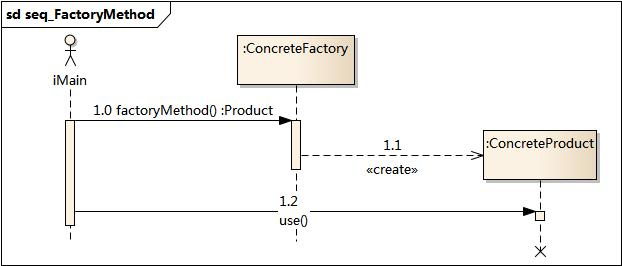
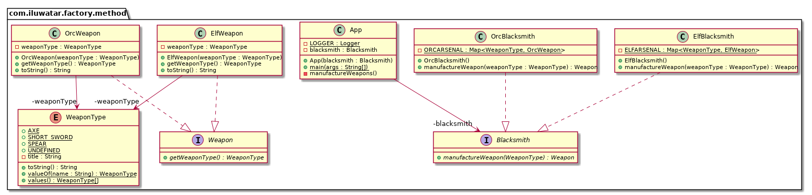

# 工厂方法模式（Factory Method）

## 目录

*   [介绍](#介绍)

    *   [模式动机](#模式动机)

    *   [模式定义](#模式定义)

    *   [模式结构](#模式结构)

    *   [时序图](#时序图)

    *   [代码分析](#代码分析)

    *   [优点](#优点)

    *   [缺点](#缺点)

    *   [模式分析](#模式分析)

    *   [实例](#实例)

    *   [适用环境](#适用环境)

    *   [模式应用](#模式应用)

    *   [模式扩展](#模式扩展)

    *   [总结](#总结)

*   [意义](#意义)

*   [解释](#解释)

*   [代码示例](#代码示例)

    *   [App](#app)

    *   [Blacksmith 铁匠](#blacksmith-铁匠)

    *   [ElfBlacksmith 精灵铁匠](#elfblacksmith-精灵铁匠)

    *   [OrcBlacksmith 兽人铁匠](#orcblacksmith-兽人铁匠)

    *   [WeaponType](#weapontype)

    *   [Weapon 武器](#weapon-武器)

    *   [ElfWeapon](#elfweapon)

    *   [OrcWeapon](#orcweapon)

*   [类图](#类图)

*   [适用性](#适用性)

*   [Known uses](#known-uses)

## 介绍

也被称为虚拟构造器

### 模式动机

不再设计一个按钮工厂类来统一负责所有产品的创建，而是将具体按钮的创建过程交给专门的工厂子类去完成，我们先定义一个抽象的按钮工厂类，再定义具体的工厂类来生成圆形按钮、矩形按钮、菱形按钮等，它们实现在抽象按钮工厂类中定义的方法。这种抽象化的结果使这种结构可以在不修改具体工厂类的情况下引进新的产品，如果出现新的按钮类型，只需要为这种新类型的按钮创建一个具体的工厂类就可以获得该新按钮的实例，这一特点无疑使得工厂方法模式具有超越简单工厂模式的优越性，更加符合“开闭原则”。

### 模式定义

工厂方法模式(Factory Method Pattern)又称为工厂模式，也叫虚拟构造器(Virtual Constructor)模式或者多态工厂(Polymorphic Factory)模式，它属于类创建型模式。在工厂方法模式中，工厂父类负责定义创建产品对象的公共接口，而工厂子类则负责生成具体的产品对象，这样做的目的是将产品类的实例化操作延迟到工厂子类中完成，即**通过工厂子类来确定究竟应该实例化哪一个具体产品类。**

### 模式结构

工厂方法模式包含如下角色：

*   Product：抽象产品

*   ConcreteProduct：具体产品

*   Factory：抽象工厂

*   ConcreteFactory：具体工厂





也就是定义一个抽象工厂，其定义了产品的生产接口，但不负责具体的产品，将生产任务交给不同的派生类工厂。这样不用通过指定类型来创建对象了。

### 时序图



### 代码分析

**AbstractFactory类**：生产不同产品的工厂的抽象类

```java
public interface AbstractFactory {
  Phone makePhone();
}
```

**XiaoMiFactory类**：生产小米手机的工厂（ConcreteFactory1）

```java
public class XiaoMiFactory implements AbstractFactory{
  @Override 
  public Phone makePhone() { 
    return new MiPhone();
  }
}
```

**AppleFactory类**：生产苹果手机的工厂（ConcreteFactory2）

```java
public class AppleFactory implements AbstractFactory {
  @Override public Phone makePhone(){
     return new IPhone();
  }
}
```

**演示：**

```java
public class Demo {
    public static void main(String[] arg) {
        AbstractFactory miFactory = new XiaoMiFactory();
        AbstractFactory appleFactory = new AppleFactory();
        miFactory.makePhone();            // make xiaomi phone!
        appleFactory.makePhone();        // make iphone!
    }
}
```

### 优点

*   在工厂方法模式中，工厂方法用来创建客户所需要的产品，同时还向客户隐藏了哪种具体产品类将被实例化这一细节，用户只需要关心所需产品对应的工厂，无须关心创建细节，甚至无须知道具体产品类的类名。

*   基于工厂角色和产品角色的多态性设计是工厂方法模式的关键。它能够使工厂可以自主确定创建何种产品对象，而如何创建这个对象的细节则完全封装在具体工厂内部。工厂方法模式之所以又被称为多态工厂模式，是因为所有的具体工厂类都具有同一抽象父类。

*   使用工厂方法模式的另一个优点是在系统中加入新产品时，无须修改抽象工厂和抽象产品提供的接口，无须修改客户端，也无须修改其他的具体工厂和具体产品，而只要添加一个具体工厂和具体产品就可以了。这样，系统的可扩展性也就变得非常好，完全符合“开闭原则”。

### 缺点

*   在添加新产品时，需要编写新的具体产品类，而且还要提供与之对应的具体工厂类，系统中类的个数将成对增加，在一定程度上增加了系统的复杂度，有更多的类需要编译和运行，会给系统带来一些额外的开销。

*   由于考虑到系统的可扩展性，需要引入抽象层，在客户端代码中均使用抽象层进行定义，增加了系统的抽象性和理解难度，且在实现时可能需要用到DOM、反射等技术，增加了系统的实现难度。

### 模式分析

工厂方法模式是简单工厂模式的进一步抽象和推广。由于使用了面向对象的多态性，工厂方法模式保持了简单工厂模式的优点，而且克服了它的缺点。

**在工厂方法模式中，核心的工厂类不再负责所有产品的创建，而是将具体创建工作交给子类去做。** 这个核心类仅仅负责给出具体工厂必须实现的接口，而不负责哪一个产品类被实例化这种细节，这使得工厂方法模式可以允许系统在不修改工厂角色的情况下引进新产品。

### 实例

日志记录器

某系统日志记录器要求支持多种日志记录方式，如文件记录、数据库记录等，且用户可以根据要求动态选择日志记录方式， 现使用工厂方法模式设计该系统。

结构图：


时序图：


### 适用环境

*   一个类不知道它所需要的对象的类：在工厂方法模式中，客户端不需要知道具体产品类的类名，只需要知道所对应的工厂即可，具体的产品对象由具体工厂类创建；客户端需要知道创建具体产品的工厂类。

*   一个类通过其子类来指定创建哪个对象：在工厂方法模式中，对于抽象工厂类只需要提供一个创建产品的接口，而由其子类来确定具体要创建的对象，利用面向对象的多态性和里氏代换原则，在程序运行时，子类对象将覆盖父类对象，从而使得系统更容易扩展。

*   将创建对象的任务委托给多个工厂子类中的某一个，客户端在使用时可以无须关心是哪一个工厂子类创建产品子类，需要时再动态指定，可将具体工厂类的类名存储在配置文件或数据库中。

### 模式应用

JDBC中的工厂方法:

```java
Connection conn=DriverManager.getConnection("jdbc:microsoft:sqlserver://localhost:1433;DatabaseName=DB;user=sa;password=");
Statement statement=conn.createStatement();
ResultSet rs=statement.executeQuery("select * from UserInfo");
```

### 模式扩展

*   使用多个工厂方法：在抽象工厂角色中可以定义多个工厂方法，从而使具体工厂角色实现这些不同的工厂方法，这些方法可以包含不同的业务逻辑，以满足对不同的产品对象的需求。

*   产品对象的重复使用：工厂对象将已经创建过的产品保存到一个集合（如数组、List等）中，然后根据客户对产品的请求，对集合进行查询。如果有满足要求的产品对象，就直接将该产品返回客户端；如果集合中没有这样的产品对象，那么就创建一个新的满足要求的产品对象，然后将这个对象在增加到集合中，再返回给客户端。

*   多态性的丧失和模式的退化：如果工厂仅仅返回一个具体产品对象，便违背了工厂方法的用意，发生退化，此时就不再是工厂方法模式了。一般来说，工厂对象应当有一个抽象的父类型，如果工厂等级结构中只有一个具体工厂类的话，抽象工厂就可以省略，也将发生了退化。当只有一个具体工厂，在具体工厂中可以创建所有的产品对象，并且工厂方法设计为静态方法时，工厂方法模式就退化成简单工厂模式。

### 总结

*   工厂方法模式又称为工厂模式，它属于类创建型模式。在工厂方法模式中，工厂父类负责定义创建产品对象的公共接口，而工厂子类则负责生成具体的产品对象，这样做的目的是将产品类的实例化操作延迟到工厂子类中完成，即通过工厂子类来确定究竟应该实例化哪一个具体产品类。

*   工厂方法模式包含四个角色：抽象产品是定义产品的接口，是工厂方法模式所创建对象的超类型，即产品对象的共同父类或接口；具体产品实现了抽象产品接口，某种类型的具体产品由专门的具体工厂创建，它们之间往往一一对应；抽象工厂中声明了工厂方法，用于返回一个产品，它是工厂方法模式的核心，任何在模式中创建对象的工厂类都必须实现该接口；具体工厂是抽象工厂类的子类，实现了抽象工厂中定义的工厂方法，并可由客户调用，返回一个具体产品类的实例。

*   工厂方法模式是简单工厂模式的进一步抽象和推广。由于使用了面向对象的多态性，工厂方法模式保持了简单工厂模式的优点，而且克服了它的缺点。在工厂方法模式中，核心的工厂类不再负责所有产品的创建，而是将具体创建工作交给子类去做。这个核心类仅仅负责给出具体工厂必须实现的接口，而不负责产品类被实例化这种细节，这使得工厂方法模式可以允许系统在不修改工厂角色的情况下引进新产品。

*   工厂方法模式的主要优点是增加新的产品类时无须修改现有系统，并封装了产品对象的创建细节，系统具有良好的灵活性和可扩展性；其缺点在于增加新产品的同时需要增加新的工厂，导致系统类的个数成对增加，在一定程度上增加了系统的复杂性。

*   工厂方法模式适用情况包括：一个类不知道它所需要的对象的类；一个类通过其子类来指定创建哪个对象；将创建对象的任务委托给多个工厂子类中的某一个，客户端在使用时可以无须关心是哪一个工厂子类创建产品子类，需要时再动态指定。

## 意义

定义用于创建对象的接口，但让子类决定实例化哪个类。工厂方法允许类将实例化延迟到子类。

## 解释

Real-world example

> 铁匠制造武器。精灵需要精灵武器，兽人需要兽人武器。根据手头的客户，会召唤合适类型的铁匠。

In plain words

> 它提供了一种将实例化逻辑委托给子类的方法。

Wikipedia says

> 在基于类的编程中，工厂方法模式是一种创造性模式，它使用工厂方法来处理创建对象的问题，而不必指定要创建的对象的确切类。这是通过调用工厂方法来创建对象来完成的——要么在接口中指定并由子类实现，要么在基类中实现并可选地由派生类重写，而不是通过调用构造函数。

## 代码示例

### App

```java
import lombok.extern.slf4j.Slf4j;

/**
    工厂方法是一种创造性的设计模式，它使用工厂方法来处理创建对象的问题，而不需要指定要创建的对象的确切类。

    这是通过调用在接口中指定并由子类实现的工厂方法，或在基类中实现并可选地被派生类覆盖的工厂方法来创建对象，而不是通过调用构造函数。
    在这个Factory Method的例子中，我们有一个接口({@link Blacksmith})和一个用于创建对象({@link Blacksmith#manufactureWeapon})的方法。
    具体的子类({@link OrcBlacksmith}， {@link ElfBlacksmith})然后重写该方法来生成它们喜欢的对象。
 *
 */
@Slf4j
public class App {

  private static final String MANUFACTURED = "{} manufactured {}";

  /**
   * Program entry point.
   * @param args command line args
   */
  public static void main(String[] args) {

    Blacksmith blacksmith = new OrcBlacksmith();
    Weapon weapon = blacksmith.manufactureWeapon(WeaponType.SPEAR);
    LOGGER.info(MANUFACTURED, blacksmith, weapon);
    weapon = blacksmith.manufactureWeapon(WeaponType.AXE);
    LOGGER.info(MANUFACTURED, blacksmith, weapon);

    blacksmith = new ElfBlacksmith();
    weapon = blacksmith.manufactureWeapon(WeaponType.SPEAR);
    LOGGER.info(MANUFACTURED, blacksmith, weapon);
    weapon = blacksmith.manufactureWeapon(WeaponType.AXE);
    LOGGER.info(MANUFACTURED, blacksmith, weapon);
  }
}
```

Program output:

```text
The orc blacksmith manufactured an orcish spear

The orc blacksmith manufactured an orcish axe

The elf blacksmith manufactured an elven spear

The elf blacksmith manufactured an elven axe
```

### Blacksmith 铁匠

```java
/**
 * The interface containing method for producing objects.
 */
public interface Blacksmith {

  Weapon manufactureWeapon(WeaponType weaponType);

}
```

### ElfBlacksmith 精灵铁匠

```java
import java.util.Arrays;
import java.util.EnumMap;
import java.util.Map;

/**
 * Concrete subclass for creating new objects.
 */
public class ElfBlacksmith implements Blacksmith {

  private static final Map<WeaponType, ElfWeapon> ELFARSENAL;

  static {
    ELFARSENAL = new EnumMap<>(WeaponType.class);
    Arrays.stream(WeaponType.values()).forEach(type -> ELFARSENAL.put(type, new ElfWeapon(type)));
  }

  @Override
  public Weapon manufactureWeapon(WeaponType weaponType) {
    return ELFARSENAL.get(weaponType);
  }

  @Override
  public String toString() {
    return "The elf blacksmith";
  }
}
```

### OrcBlacksmith 兽人铁匠

```java
import java.util.Arrays;
import java.util.EnumMap;
import java.util.Map;

/**
 * Concrete subclass for creating new objects.
 */
public class OrcBlacksmith implements Blacksmith {

  private static final Map<WeaponType, OrcWeapon> ORCARSENAL;

  static {
    ORCARSENAL = new EnumMap<>(WeaponType.class);
    Arrays.stream(WeaponType.values()).forEach(type -> ORCARSENAL.put(type, new OrcWeapon(type)));
  }

  @Override
  public Weapon manufactureWeapon(WeaponType weaponType) {
    return ORCARSENAL.get(weaponType);
  }

  @Override
  public String toString() {
    return "The orc blacksmith";
  }
}
```

### WeaponType

```java
import lombok.RequiredArgsConstructor;

/**
 * WeaponType enumeration.
 */
@RequiredArgsConstructor
public enum WeaponType {

  SHORT_SWORD("short sword"),
  SPEAR("spear"),
  AXE("axe"),
  UNDEFINED("");

  private final String title;

  @Override
  public String toString() {
    return title;
  }
}

```

### Weapon 武器

```java
/**
 * Weapon interface.
 */
public interface Weapon {

  WeaponType getWeaponType();

}

```

### ElfWeapon

```java
import lombok.Getter;
import lombok.RequiredArgsConstructor;

/**
 * ElfWeapon.
 */
@RequiredArgsConstructor
@Getter
public class ElfWeapon implements Weapon {

  private final WeaponType weaponType;

  @Override
  public String toString() {
    return "an elven " + weaponType;
  }
}
```

### OrcWeapon

```java
import lombok.Getter;
import lombok.RequiredArgsConstructor;

/**
 * OrcWeapon.
 */
@RequiredArgsConstructor
@Getter
public class OrcWeapon implements Weapon {

  private final WeaponType weaponType;

  @Override
  public String toString() {
    return "an orcish " + weaponType;
  }
}
```

## 类图



## 适用性

在以下情况下使用Factory方法模式：

*   类无法预测它必须创建的对象类。

*   类希望其子类指定它创建的对象。

*   类将职责委托给几个助手子类中的一个，并且您希望本地化哪个助手子类是委托的知识。

## Known uses

*   [java.util.Calendar](http://docs.oracle.com/javase/8/docs/api/java/util/Calendar.html#getInstance-- "java.util.Calendar")

*   [java.util.ResourceBundle](http://docs.oracle.com/javase/8/docs/api/java/util/ResourceBundle.html#getBundle-java.lang.String- "java.util.ResourceBundle")

*   [java.text.NumberFormat](http://docs.oracle.com/javase/8/docs/api/java/text/NumberFormat.html#getInstance-- "java.text.NumberFormat")

*   [java.nio.charset.Charset](http://docs.oracle.com/javase/8/docs/api/java/nio/charset/Charset.html#forName-java.lang.String- "java.nio.charset.Charset")

*   [java.net.URLStreamHandlerFactory](http://docs.oracle.com/javase/8/docs/api/java/net/URLStreamHandlerFactory.html#createURLStreamHandler-java.lang.String- "java.net.URLStreamHandlerFactory")

*   [java.util.EnumSet](https://docs.oracle.com/javase/8/docs/api/java/util/EnumSet.html#of-E- "java.util.EnumSet")

*   [javax.xml.bind.JAXBContext](https://docs.oracle.com/javase/8/docs/api/javax/xml/bind/JAXBContext.html#createMarshaller-- "javax.xml.bind.JAXBContext")
