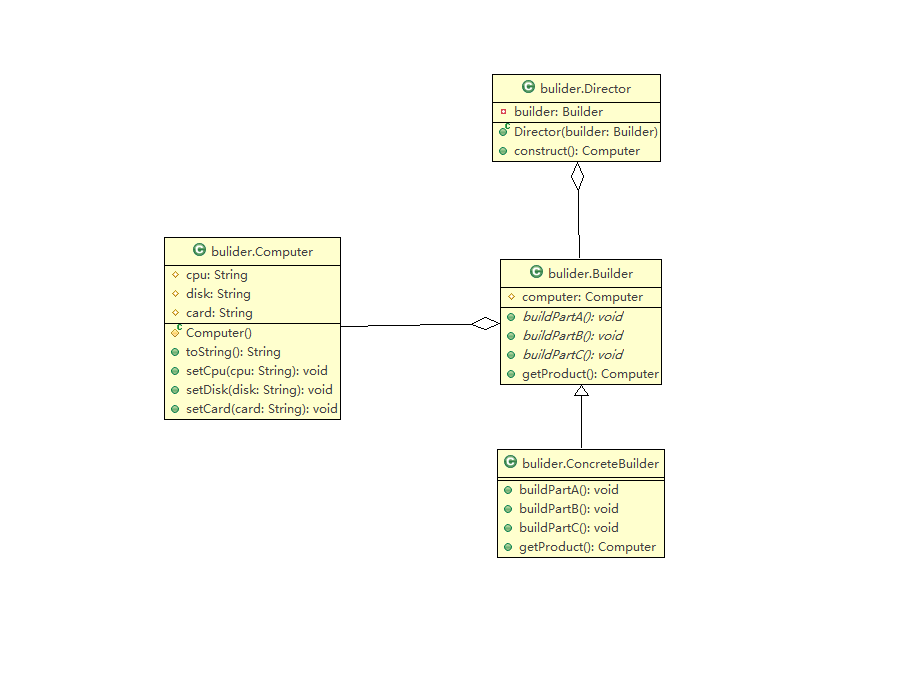

# 建造者模式

# 定义

将一个复杂对象的构建与它的表示分离，使同样的构建过程可以创建不同的表示。

它是将一个复杂的对象分解为多个简单的对象，然后一步一步具体的步骤构建而成。

# 问题引入

在软件开发过程中有时需要创建一个复杂的对象，这个复杂对象通常由多个子部件按一定的步骤组合而成。例如，计算机是由 CPU、主板、硬盘、显卡等部件组装而成的，采购员不可能自己去组装计算机，而是将计算机的配置要求告诉计算机销售公司，计算机销售公司安排技术人员去组装计算机，然后再交给要买计算机的采购员。

# 怎么使用创建者模式

【角色】：

1.  产品（Product）：要购买的电脑

2.  抽象建造者（Builder）：包含创建电脑产品各个子部件的抽象方法的接口，通常还包含一个返回复杂产品的方法 getResult()。

3.  具体建造者(Concrete Builder）：实现 Builder 接口，完成复杂产品的各个部件的具体创建方法。

4.  指挥者（Director）：它调用建造者对象中的部件构造与装配方法完成复杂对象的创建，在指挥者中不涉及具体产品的信息。



# 模式的应用场景

建造者模式唯一区别于工厂模式的是针对复杂对象的创建。也就是说，如果创建简单对象，通常都是使用工厂模式进行创建，而如果创建复杂对象，就可以考虑使用建造者模式。 &#x20;

当需要创建的产品具备复杂创建过程时，可以抽取出共性创建过程，然后交由具体实现类自定义创建流程，使得同样的创建行为可以生产出不同的产品，分离了创建与表示，使创建产品的灵活性大大增加。 &#x20;

建造者模式主要适用于以下应用场景： &#x20;

*   相同的方法，不同的执行顺序，产生不同的结果。

*   多个部件或零件，都可以装配到一个对象中，但是产生的结果又不相同。

*   产品类非常复杂，或者产品类中不同的调用顺序产生不同的作用。

*   初始化一个对象特别复杂，参数多，而且很多参数都具有默认值。

## 建造者模式和工厂模式的区别

通过前面的学习，我们已经了解了建造者模式，那么它和工厂模式有什么区别呢？

*   建造者模式更加注重方法的调用顺序，工厂模式注重创建对象。

*   创建对象的力度不同，建造者模式创建复杂的对象，由各种复杂的部件组成，工厂模式创建出来的对象都一样

*   关注重点不一样，工厂模式只需要把对象创建出来就可以了，而建造者模式不仅要创建出对象，还要知道对象由哪些部件组成。

*   建造者模式根据建造过程中的顺序不一样，最终对象部件组成也不一样。

# 模式的扩展

建造者（Builder）模式在应用过程中可以根据需要改变，如果创建的产品种类只有一种，只需要一个具体建造者，这时可以省略掉抽象建造者，甚至可以省略掉指挥者角色。

《建造者模式实现链式赋值》

```java
public class Course {
    private String name;    // 课程名称
    private String means;    // 教程资料
    private String note;   // 学习笔记
    private String homework;    // 课后作业
    // setter
    // getter
    @Override
    public String toString() {
        return "CourseBuilder{" + "name='" + name + '\'' + ",means='" + means + '\'' + ",note='" + note + '\'' + ",homework='" + homework + '\'' + '}';
    }
}
```

```java
public class CourseBuilder {
    private Course course = new Course();
    
    public CourseBuilder addName(String name){
        course.setName(name);
        return this;
    }
    public CourseBuilder addMeans(String means){
        course.setMeans(means);
        return this;
    }
    public CourseBuilder addNote(String note){
        course.setNote(note);
        return this;
    }
    public CourseBuilder addHomework(String homework){
        course.setHomework(homework);
        return this;
    }
    public Course build(){
        return course;
    }
}
```

```java
public static void main(String[] args) {
    CourseBuilder builder = new CourseBuilder()
                          .addName("设计模式")
                          .addMeans("教程资料")
                          .addNote("课堂笔记")
                          .addHomework("课后作业");
    System.out.println(builder.build());
}
```

静态内部类

```java
public class Phone {

    private String cpu;
    private String screen;
    private String memory;
    private String mainboard;

    //私有构造方法
    private Phone(Builder builder) {
        this.cpu = builder.cpu;
        this.screen = builder.screen;
        this.memory = builder.memory;
        this.mainboard = builder.mainboard;
    }

    @Override
    public String toString() {
        return "Phone{" +
                "cpu='" + cpu + '\'' +
                ", screen='" + screen + '\'' +
                ", memory='" + memory + '\'' +
                ", mainboard='" + mainboard + '\'' +
                '}';
    }

    public static final class Builder {
        private String cpu;
        private String screen;
        private String memory;
        private String mainboard;

        public Builder cpu(String cpu) {
            this.cpu = cpu;
            return this;
        }

        public Builder screen(String screen) {
            this.screen = screen;
            return this;
        }
        public Builder memory(String memory) {
            this.memory = memory;
            return this;
        }
        public Builder mainboard(String mainboard) {
            this.mainboard = mainboard;
            return this;
        }

        //使用构建者创建Phone对象
        public Phone build() {
            return new Phone(this);
        }
    }
}
```

```java
public class Client {
    public static void main(String[] args) {
        //创建手机对象   通过构建者对象获取手机对象
        Phone phone = new Phone.Builder()
                .cpu("intel")
                .screen("三星屏幕")
                .memory("金士顿内存条")
                .mainboard("华硕主板")
                .build();
 
        System.out.println(phone);
    }
}
```
