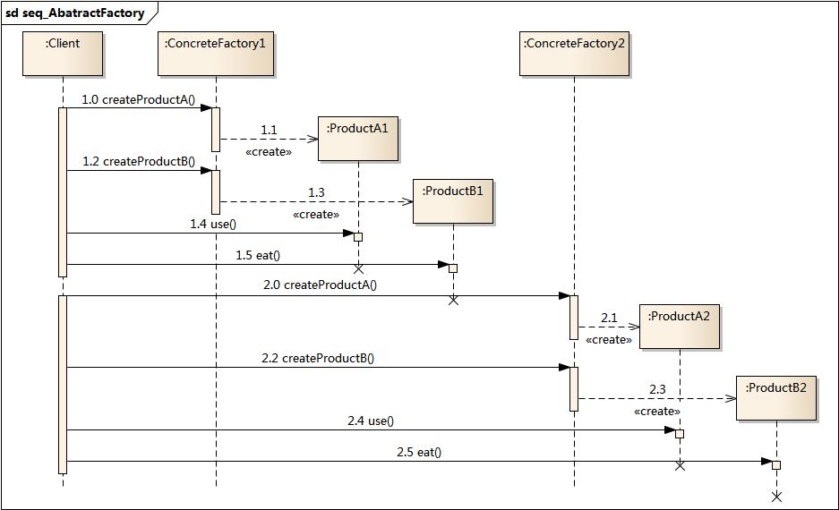
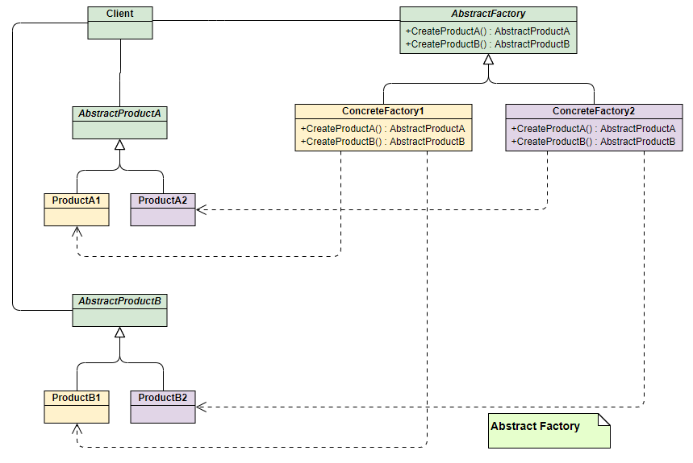
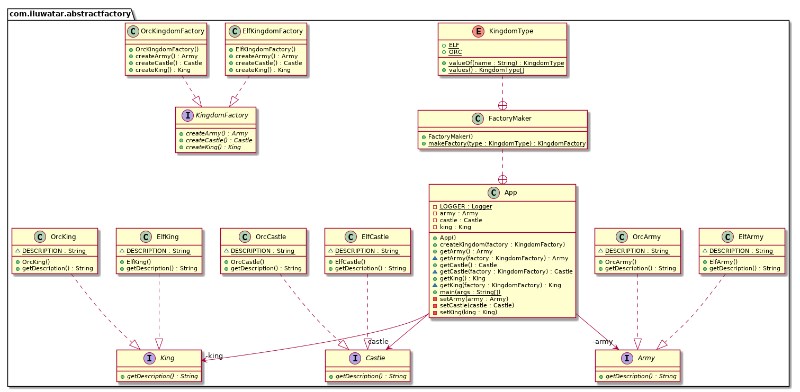

# 抽象工厂模式（Abstract Factory）

## 目录

*   [介绍](#介绍)

    *   [模式动机](#模式动机)

    *   [模式定义](#模式定义)

    *   [模式结构](#模式结构)

    *   [时序图](#时序图)

    *   [代码实现](#代码实现)

    *   [优点](#优点)

    *   [缺点](#缺点)

    *   [适用环境](#适用环境)

    *   [模式应用](#模式应用)

    *   [总结](#总结)

*   [意义](#意义)

*   [解释](#解释)

*   [代码实现](#代码实现-1)

*   [Class diagram](#class-diagram)

*   [Applicability](#applicability)

    *   [使用场景：](#使用场景)

*   [结果](#结果)

*   [Tutorials](#tutorials)

*   [Known uses](#known-uses)

## 介绍

也被称为 Kit 工具包 配套元件

### 模式动机

*   在工厂方法模式中具体工厂负责生产具体的产品，每一个具体工厂对应一种具体产品，工厂方法也具有唯一性，一般情况下，一个具体工厂中只有一个工厂方法或者一组重载的工厂方法。但是有时候我们需要一个工厂可以提供多个产品对象，而不是单一的产品对象。

    > 为了更清晰地理解工厂方法模式，需要先引入两个概念：
    >
    > \*   **产品等级结构** ：产品等级结构即产品的继承结构，如一个抽象类是电视机，其子类有海尔电视机、海信电视机、TCL电视机，则抽象电视机与具体品牌的电视机之间构成了一个产品等级结构，抽象电视机是父类，而具体品牌的电视机是其子类。
    > \*   **产品族** ：在抽象工厂模式中，产品族是指由同一个工厂生产的，位于不同产品等级结构中的一组产品，如海尔电器工厂生产的海尔电视机、海尔电冰箱，海尔电视机位于电视机产品等级结构中，海尔电冰箱位于电冰箱产品等级结构中。

*   当系统所提供的工厂所需生产的具体产品并不是一个简单的对象，而是多个位于不同产品等级结构中属于不同类型的具体产品时需要使用抽象工厂模式。

*   抽象工厂模式是所有形式的工厂模式中最为抽象和最具一般性的一种形态。

*   抽象工厂模式与工厂方法模式最大的区别在于，工厂方法模式针对的是一个产品等级结构，而抽象工厂模式则需要面对多个产品等级结构，一个工厂等级结构可以负责多个不同产品等级结构中的产品对象的创建 。当一个工厂等级结构可以创建出分属于不同产品等级结构的一个产品族中的所有对象时，抽象工厂模式比工厂方法模式更为简单、有效率。

### 模式定义

抽象工厂模式(Abstract Factory Pattern)：提供一个创建一系列相关或相互依赖对象的接口，而无须指定它们具体的类。抽象工厂模式又称为Kit模式，属于对象创建型模式。

### 模式结构

抽象工厂模式包含如下角色：

*   AbstractFactory：抽象工厂

*   ConcreteFactory：具体工厂

*   AbstractProduct：抽象产品

*   Product：具体产品


### 时序图



### 代码实现

上面两种模式不管工厂怎么拆分抽象，都只是针对一类产品**Phone**（AbstractProduct），如果要生成另一种产品PC，应该怎么表示呢？

最简单的方式是把2中（工厂方法）介绍的工厂方法模式完全复制一份，不过这次生产的是PC。但同时也就意味着我们要完全复制和修改Phone生产管理的所有代码，显然这是一个笨办法，并不利于扩展和维护。

抽象工厂模式通过在AbstarctFactory中增加创建产品的接口，并在具体子工厂中实现新加产品的创建，当然前提是子工厂支持生产该产品。否则继承的这个接口可以什么也不干。

其UML类图如下：



从上面类图结构中可以清楚的看到如何在工厂方法模式中通过增加新产品接口来实现产品的增加的。

接下来我们继续通过小米和苹果产品生产的例子来解释该模式。

为了弄清楚上面的结构，我们使用具体的产品和工厂来表示上面的UML类图，能更加清晰的看出模式是如何演变的：


产品对象：

```java
public interface PC {
    void make();
}

public class MiPC implements PC {
    public MiPC() {
        this.make();
    }
    @Override
    public void make() {
        // TODO Auto-generated method stub
        System.out.println("make xiaomi PC!");
    }
}

public class MAC implements PC {
    public MAC() {
        this.make();
    }
    @Override
    public void make() {
        // TODO Auto-generated method stub
        System.out.println("make MAC!");
    }
}

```

工厂：

```java
// 抽象工厂
public interface AbstractFactory {
    Phone makePhone();
    PC makePC();
}
// 小米工厂
public class XiaoMiFactory implements AbstractFactory{
    @Override
    public Phone makePhone() {
        return new MiPhone();
    }
    @Override
    public PC makePC() {
        return new MiPC();
    }
}
// 苹果工厂
public class AppleFactory implements AbstractFactory {
    @Override
    public Phone makePhone() {
        return new IPhone();
    }
    @Override
    public PC makePC() {
        return new MAC();
    }
}

```

程序入口：

```java
public class Demo {
    public static void main(String[] arg) {
        AbstractFactory miFactory = new XiaoMiFactory();
        AbstractFactory appleFactory = new AppleFactory();
        miFactory.makePhone();            // make xiaomi phone!
        miFactory.makePC();                // make xiaomi PC!
        appleFactory.makePhone();        // make iphone!
        appleFactory.makePC();            // make MAC!
    }
}
```

### 优点

*   抽象工厂模式隔离了具体类的生成，使得客户并不需要知道什么被创建。由于这种隔离，更换一个具体工厂就变得相对容易。所有的具体工厂都实现了抽象工厂中定义的那些公共接口，因此只需改变具体工厂的实例，就可以在某种程度上改变整个软件系统的行为。另外，应用抽象工厂模式可以实现高内聚低耦合的设计目的，因此抽象工厂模式得到了广泛的应用。

*   当一个产品族中的多个对象被设计成一起工作时，它能够保证客户端始终只使用同一个产品族中的对象。这对一些需要根据当前环境来决定其行为的软件系统来说，是一种非常实用的设计模式。

*   增加新的具体工厂和产品族很方便，无须修改已有系统，符合“开闭原则”。

### 缺点

*   在添加新的产品对象时，难以扩展抽象工厂来生产新种类的产品，这是因为在抽象工厂角色中规定了所有可能被创建的产品集合，要支持新种类的产品就意味着要对该接口进行扩展，而这将涉及到对抽象工厂角色及其所有子类的修改，显然会带来较大的不便。

*   开闭原则的倾斜性（增加新的工厂和产品族容易，增加新的产品等级结构麻烦）。

### 适用环境

在以下情况下可以使用抽象工厂模式：

*   一个系统不应当依赖于产品类实例如何被创建、组合和表达的细节，这对于所有类型的工厂模式都是重要的。

*   系统中有多于一个的产品族，而每次只使用其中某一产品族。

*   属于同一个产品族的产品将在一起使用，这一约束必须在系统的设计中体现出来。

*   系统提供一个产品类的库，所有的产品以同样的接口出现，从而使客户端不依赖于具体实现。

### 模式应用

在很多软件系统中需要更换界面主题，要求界面中的按钮、文本框、背景色等一起发生改变时，可以使用抽象工厂模式进行设计。

### 总结

*   抽象工厂模式提供一个创建一系列相关或相互依赖对象的接口，而无须指定它们具体的类。抽象工厂模式又称为Kit模式，属于对象创建型模式。

*   抽象工厂模式包含四个角色：抽象工厂用于声明生成抽象产品的方法；具体工厂实现了抽象工厂声明的生成抽象产品的方法，生成一组具体产品，这些产品构成了一个产品族，每一个产品都位于某个产品等级结构中；抽象产品为每种产品声明接口，在抽象产品中定义了产品的抽象业务方法；具体产品定义具体工厂生产的具体产品对象，实现抽象产品接口中定义的业务方法。

*   抽象工厂模式是所有形式的工厂模式中最为抽象和最具一般性的一种形态。抽象工厂模式与工厂方法模式最大的区别在于，工厂方法模式针对的是一个产品等级结构，而抽象工厂模式则需要面对多个产品等级结构。

*   抽象工厂模式的主要优点是隔离了具体类的生成，使得客户并不需要知道什么被创建，而且每次可以通过具体工厂类创建一个产品族中的多个对象，增加或者替换产品族比较方便，增加新的具体工厂和产品族很方便；主要缺点在于增加新的产品等级结构很复杂，需要修改抽象工厂和所有的具体工厂类，对“开闭原则”的支持呈现倾斜性。

*   抽象工厂模式适用情况包括：一个系统不应当依赖于产品类实例如何被创建、组合和表达的细节；系统中有多于一个的产品族，而每次只使用其中某一产品族；属于同一个产品族的产品将在一起使用；系统提供一个产品类的库，所有的产品以同样的接口出现，从而使客户端不依赖于具体实现。

## 意义

提供一个接口来创建一系列相关或依赖的对象，而无需指定它们的具体类。

## 解释

现实的例子：

> 要创建一个王国，我们需要具有共同主题的对象。精灵王国需要精灵国王、精灵城堡和精灵军队，而兽人王国需要兽人国王、兽人城堡和兽人军队。王国中的对象之间存在依赖关系。

简单的说：

> 工厂的工厂;一种工厂，将单个但相关/依赖的工厂分组在一起，而不指定它们的具体类。

维基百科：

> 抽象工厂模式提供了一种方法来封装一组具有共同主题的独立工厂，而无需指定它们的具体类

## 代码实现

翻译上面的例子。首先，我们为王国中的对象提供了一些接口和实现。

```java
public interface Castle {
  String getDescription();
}

public interface King {
  String getDescription();
}

public interface Army {
  String getDescription();
}

// Elven implementations ->
public class ElfCastle implements Castle {
  static final String DESCRIPTION = "This is the elven castle!";
  @Override
  public String getDescription() {
    return DESCRIPTION;
  }
}
public class ElfKing implements King {
  static final String DESCRIPTION = "This is the elven king!";
  @Override
  public String getDescription() {
    return DESCRIPTION;
  }
}
public class ElfArmy implements Army {
  static final String DESCRIPTION = "This is the elven Army!";
  @Override
  public String getDescription() {
    return DESCRIPTION;
  }
}

// Orcish implementations similarly -> ...

```

然后我们有了王国工厂的抽象和实现。

```java
public interface KingdomFactory {
  Castle createCastle();
  King createKing();
  Army createArmy();
}

public class ElfKingdomFactory implements KingdomFactory {

  @Override
  public Castle createCastle() {
    return new ElfCastle();
  }

  @Override
  public King createKing() {
    return new ElfKing();
  }

  @Override
  public Army createArmy() {
    return new ElfArmy();
  }
}

public class OrcKingdomFactory implements KingdomFactory {

  @Override
  public Castle createCastle() {
    return new OrcCastle();
  }

  @Override
  public King createKing() {
    return new OrcKing();
  }
  
  @Override
  public Army createArmy() {
    return new OrcArmy();
  }
}
```

现在我们有了抽象工厂，可以让我们制作一个相关对象家族，例如精灵王国工厂可以创建精灵城堡、国王和军队等。

```java
public class App implements Runnable {

  private final Kingdom kingdom = new Kingdom();

  public Kingdom getKingdom() {
    return kingdom;
  }

  /**
   * Program entry point.
   *
   * @param args command line args
   */
  public static void main(String[] args) {
    var app = new App();
    app.run();
  }

  @Override
  public void run() {
    LOGGER.info("elf kingdom");
    createKingdom(Kingdom.FactoryMaker.KingdomType.ELF);
    LOGGER.info(kingdom.getArmy().getDescription());
    LOGGER.info(kingdom.getCastle().getDescription());
    LOGGER.info(kingdom.getKing().getDescription());

    LOGGER.info("orc kingdom");
    createKingdom(Kingdom.FactoryMaker.KingdomType.ORC);
    LOGGER.info(kingdom.getArmy().getDescription());
    LOGGER.info(kingdom.getCastle().getDescription());
    LOGGER.info(kingdom.getKing().getDescription());
  }

  /**
   * Creates kingdom.
   * @param kingdomType type of Kingdom
   */
  public void createKingdom(final Kingdom.FactoryMaker.KingdomType kingdomType) {
    final KingdomFactory kingdomFactory = Kingdom.FactoryMaker.makeFactory(kingdomType);
    kingdom.setKing(kingdomFactory.createKing());
    kingdom.setCastle(kingdomFactory.createCastle());
    kingdom.setArmy(kingdomFactory.createArmy());
  }
}

```

Program output:

```text
This is the elven castle!
This is the elven king!
This is the elven Army!
```

现在，我们可以为我们不同王国的工厂设计一个工厂。在这个例子中，我们创建了FactoryMaker，负责返回ElfKingdomFactory或OrcKingdomFactory的实例。

客户可以使用FactoryMaker创建所需的具体工厂，反过来，它将生产不同的具体对象(来自军队，国王，城堡)。

在这个示例中，我们还使用了一个enum来参数化客户端将请求的王国工厂的类型。

```java
import lombok.Getter;
import lombok.Setter;

@Getter
@Setter
public class Kingdom {

  private King king;
  private Castle castle;
  private Army army;

  /**
   * The factory of kingdom factories.
   */
  public static class FactoryMaker {

    /**
     * Enumeration for the different types of Kingdoms.
     */
    public enum KingdomType {
      ELF, ORC
    }

    /**
     * The factory method to create KingdomFactory concrete objects.
     */
    public static KingdomFactory makeFactory(KingdomType type) {
      switch (type) {
        case ELF:
          return new ElfKingdomFactory();
        case ORC:
          return new OrcKingdomFactory();
        default:
          throw new IllegalArgumentException("KingdomType not supported.");
      }
    }
  }
}
```

## Class diagram



## Applicability

### 使用场景：

*   **系统应该独立于产品的创建、组合和表示方式**

*   **系统应该配置多个系列产品中的一个**

*   相关产品对象系列被设计为一起使用，您需要强制执行此约束

*   您希望提供产品的类库，并且只希望显示它们的接口，而不是它们的实现

*   依赖的生命周期在概念上比使用者的生命周期短。

*   您需要一个运行时值来构造特定的依赖项

*   **您需要决定在运行时从一个系列中调用哪个产品。**

*   在解析依赖项之前，您需要提供一个或多个只有在运行时才知道的参数。

*   当你需要产品之间的一致性

*   **在向程序添加新产品或产品系列时，您不希望更改现有的代码。**

示例用例：

*   选择在运行时调用FileSystemAcmeService或DatabaseAcmeService或NetworkAcmeService的适当实现。

*   单元测试用例的编写变得更加容易

*   针对不同操作系统的UI工具

## 结果

*   java中的依赖注入隐藏了可能导致运行时错误的服务类依赖，而这些错误可能会在编译时被捕获。

*   虽然模式在创建预定义对象时很好用，但添加新对象可能很有挑战性。

*   由于随着模式引入了许多新的接口和类，代码变得比应该的更复杂。

## Tutorials

*   [Abstract Factory Pattern Tutorial](https://www.journaldev.com/1418/abstract-factory-design-pattern-in-java "Abstract Factory Pattern Tutorial")

## Known uses

*   [javax.xml.parsers.DocumentBuilderFactory](http://docs.oracle.com/javase/8/docs/api/javax/xml/parsers/DocumentBuilderFactory.html "javax.xml.parsers.DocumentBuilderFactory")

*   [javax.xml.transform.TransformerFactory](http://docs.oracle.com/javase/8/docs/api/javax/xml/transform/TransformerFactory.html#newInstance-- "javax.xml.transform.TransformerFactory")

*   [javax.xml.xpath.XPathFactory](http://docs.oracle.com/javase/8/docs/api/javax/xml/xpath/XPathFactory.html#newInstance-- "javax.xml.xpath.XPathFactory")
