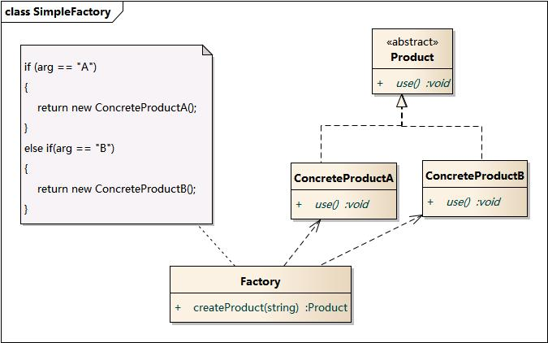
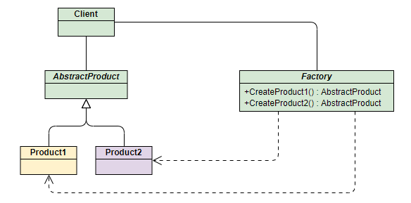
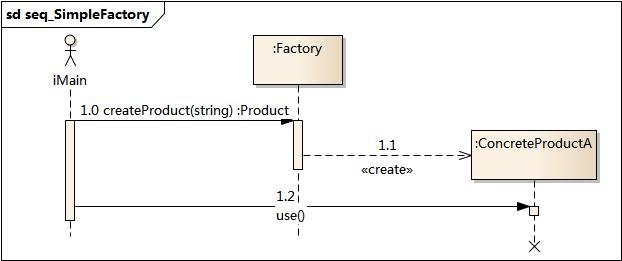
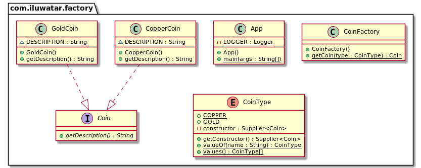

# 简单工厂模式（Simple Factory）

## 目录

*   [介绍](#介绍)

    *   [模式动机](#模式动机)

    *   [模式定义](#模式定义)

    *   [模式结构](#模式结构)

    *   [时序图](#时序图)

    *   [代码分析](#代码分析)

    *   [模式分析](#模式分析)

    *   [实例](#实例)

    *   [优点](#优点)

    *   [缺点](#缺点)

    *   [适用环境](#适用环境)

    *   [模式应用](#模式应用)

    *   [总结](#总结)

*   [意义](#意义)

*   [解释](#解释)

    *   [代码示例](#代码示例)

        *   [App.java](#appjava)

        *   [Coin](#coin)

        *   [CoinFactory](#coinfactory)

        *   [CoinType](#cointype)

        *   [CopperCoin 铜币](#coppercoin-铜币)

        *   [GoldCoin 金币](#goldcoin-金币)

    *   [类图](#类图)

    *   [适用性](#适用性)

    *   [已知用途](#已知用途)

    *   [Related patterns](#related-patterns)

# 介绍

工厂设计模式也称为：简单工厂、静态工厂方法

## 模式动机

考虑一个简单的软件应用场景，一个软件系统可以提供多个外观不同的按钮（如**圆形按钮、矩形按钮、菱形按钮**等）， 这些按钮都源自同一个基类，不过在继承基类后不同的子类修改了部分属性从而使得它们可以呈现不同的外观，如果我们希望在使用这些按钮时，不需要知道这些具体按钮类的名字，只需要知道表示该按钮类的一个参数，并提供一个调用方便的方法，把该参数传入方法即可返回一个相应的按钮对象，此时，就可以使用简单工厂模式。

## 模式定义

简单工厂模式(Simple Factory Pattern)：又称为静态工厂方法(Static Factory Method)模式，它属于类创建型模式。在简单工厂模式中，可以根据参数的不同返回不同类的实例。简单工厂模式专门定义一个类来负责创建其他类的实例，被创建的实例通常都具有共同的父类。

## 模式结构

简单工厂模式包含如下角色：

*   Factory：工厂角色

    工厂角色负责实现创建所有实例的内部逻辑

*   Product：抽象产品角色

    抽象产品角色是所创建的所有对象的父类，负责描述所有实例所共有的公共接口

*   ConcreteProduct：具体产品角色

    具体产品角色是创建目标，所有创建的对象都充当这个角色的某个具体类的实例。





## 时序图



## 代码分析

```java
// Phone类
public interface Phone {
    void make();
}
// 小米手机
public class MiPhone implements Phone {
    public MiPhone() {
        this.make();
    }
    @Override
    public void make() {
        // TODO Auto-generated method stub
        System.out.println("make xiaomi phone!");
    }
}
// 苹果手机
public class IPhone implements Phone {
    public IPhone() {
        this.make();
    }
    @Override
    public void make() {
        // TODO Auto-generated method stub
        System.out.println("make iphone!");
    }
}
// 手机工厂
public class PhoneFactory {
    public Phone makePhone(String phoneType) {
        if(phoneType.equalsIgnoreCase("MiPhone")){
            return new MiPhone();
        }
        else if(phoneType.equalsIgnoreCase("iPhone")) {
            return new IPhone();
        }
        return null;
    }
}

```

程序入口

```java
public class Demo {
    public static void main(String[] arg) {
        PhoneFactory factory = new PhoneFactory();
        Phone miPhone = factory.makePhone("MiPhone");            // make xiaomi phone!
        IPhone iPhone = (IPhone)factory.makePhone("iPhone");    // make iphone!
    }
}
```

## 模式分析

*   将对象的创建和对象本身业务处理分离可以降低系统的耦合度，使得两者修改起来都相对容易。

*   **在调用工厂类的工厂方法时，由于工厂方法是静态方法，使用起来很方便，可通过类名直接调用，而且只需要传入一个简单的参数即可，在实际开发中，还可以在调用时将所传入的参数保存在XML等格式的配置文件中，修改参数时无须修改任何源代码。**

*   简单工厂模式最大的问题在于工厂类的职责相对过重，增加新的产品需要修改工厂类的判断逻辑，这一点与开闭原则是相违背的。

*   简单工厂模式的要点在于：当你需要什么，只需要传入一个正确的参数，就可以获取你所需要的对象，而无须知道其创建细节。

## 实例

## 优点

*   工厂类含有必要的判断逻辑，可以决定在什么时候创建哪一个产品类的实例，客户端可以免除直接创建产品对象的责任，而仅仅“消费”产品；简单工厂模式通过这种做法实现了对责任的分割，它提供了专门的工厂类用于创建对象。

*   客户端无须知道所创建的具体产品类的类名，只需要知道具体产品类所对应的参数即可，对于一些复杂的类名，通过简单工厂模式可以减少使用者的记忆量。

*   通过引入配置文件，可以在不修改任何客户端代码的情况下更换和增加新的具体产品类，在一定程度上提高了系统的灵活性。

## 缺点

*   由于工厂类集中了所有产品创建逻辑，一旦不能正常工作，整个系统都要受到影响。

*   使用简单工厂模式将会增加系统中类的个数，在一定程序上增加了系统的复杂度和理解难度。

*   系统扩展困难，一旦添加新产品就不得不修改工厂逻辑，在产品类型较多时，有可能造成工厂逻辑过于复杂，不利于系统的扩展和维护。

*   简单工厂模式由于使用了静态工厂方法，造成工厂角色无法形成基于继承的等级结构。

## 适用环境

在以下情况下可以使用简单工厂模式：

*   工厂类负责创建的对象比较少：由于创建的对象较少，不会造成工厂方法中的业务逻辑太过复杂。

*   客户端只知道传入工厂类的参数，对于如何创建对象不关心：客户端既不需要关心创建细节，甚至连类名都不需要记住，只需要知道类型所对应的参数。

## 模式应用

*   JDBC 获取数据库连接

*   Logback 中的 LoggerFactory 获取 Logger 对象

```java
public interface ILoggerFactory {
    Logger getLogger(String var1);
}

public static Logger getLogger(String name) {
    ILoggerFactory iLoggerFactory = getILoggerFactory();
    return iLoggerFactory.getLogger(name);
}

public static Logger getLogger(Class clazz) {
    return getLogger(clazz.getName());
}
```

工厂角色为 `iLoggerFactory` 接口的子类如 `LoggerContext`，抽象产品角色为 `Logger`，具体产品角色为 `Logger` 的子类，主要是 `NOPLogger` 和 `Logger` 类

## 总结

*   创建型模式对类的实例化过程进行了抽象，能够将对象的创建与对象的使用过程分离。

*   简单工厂模式又称为静态工厂方法模式，它属于类创建型模式。在简单工厂模式中，可以根据参数的不同返回不同类的实例。简单工厂模式专门定义一个类来负责创建其他类的实例，被创建的实例通常都具有共同的父类。

*   简单工厂模式包含三个角色：工厂角色负责实现创建所有实例的内部逻辑；抽象产品角色是所创建的所有对象的父类，负责描述所有实例所共有的公共接口；具体产品角色是创建目标，所有创建的对象都充当这个角色的某个具体类的实例。

*   简单工厂模式的要点在于：当你需要什么，只需要传入一个正确的参数，就可以获取你所需要的对象，而无须知道其创建细节。

*   简单工厂模式最大的优点在于实现对象的创建和对象的使用分离，将对象的创建交给专门的工厂类负责，但是其最大的缺点在于工厂类不够灵活，增加新的具体产品需要修改工厂类的判断逻辑代码，而且产品较多时，工厂方法代码将会非常复杂。

*   简单工厂模式适用情况包括：工厂类负责创建的对象比较少；客户端只知道传入工厂类的参数，对于如何创建对象不关心。

# 意义

提供封装在称为工厂的类中的静态方法，以隐藏实现逻辑并使客户端代码专注于使用而不是初始化新对象。

# 解释

现实世界的例子

> 想象一下，一位炼金术士将要制造硬币。炼金术士必须能够同时制造金币和铜币，并且在不修改现有源代码的情况下可以在金币和铜币之间进行切换。factory模式提供了一种静态构造方法，可以使用相关参数调用该方法。

维基百科说

> Factory是一个用于创建其他对象的对象——形式上，Factory是一个返回不同原型或类的对象的函数或方法。

## 代码示例

### App.java

```java
package com.iluwatar.factory;

import lombok.extern.slf4j.Slf4j;

/**
 Factory是一个用于创建其他对象的对象。它提供了一种静态方法
  创建和返回不同类的对象，以隐藏实现逻辑
  并使客户端代码侧重于使用而不是对象初始化和管理。
  
  <p>在这个例子中，炼金术士制造硬币。CoinFactory是工厂类，它
  提供一个静态方法来创建不同类型的硬币。
 */

@Slf4j
public class App {

  /**
   * Program main entry point.
   */
  public static void main(String[] args) {
    LOGGER.info("The alchemist begins his work.");
    var coin1 = CoinFactory.getCoin(CoinType.COPPER);
    var coin2 = CoinFactory.getCoin(CoinType.GOLD);
    LOGGER.info(coin1.getDescription());
    LOGGER.info(coin2.getDescription());
  }
}
```

### Coin

```java
package com.iluwatar.factory;

/**
 * Coin interface.
 */
public interface Coin {

  String getDescription();

}
```

### CoinFactory

```java
package com.iluwatar.factory;

/**
 * Factory of coins.
 */
public class CoinFactory {

  /**
   * Factory method takes as a parameter the coin type and calls the appropriate class.
   */
  public static Coin getCoin(CoinType type) {
    return type.getConstructor().get();
  }
}
```

### CoinType

```java
package com.iluwatar.factory;

import java.util.function.Supplier;
import lombok.Getter;
import lombok.RequiredArgsConstructor;

/**
 * Enumeration for different types of coins.
 */
@RequiredArgsConstructor
@Getter
public enum CoinType {

  COPPER(CopperCoin::new),
  GOLD(GoldCoin::new);

  private final Supplier<Coin> constructor;
}
```

### CopperCoin 铜币

```java
package com.iluwatar.factory;

/**
 * CopperCoin implementation.
 */
public class CopperCoin implements Coin {

  static final String DESCRIPTION = "This is a copper coin.";

  @Override
  public String getDescription() {
    return DESCRIPTION;
  }
}
```

### GoldCoin 金币

```java
package com.iluwatar.factory;

/**
 * GoldCoin implementation.
 */
public class GoldCoin implements Coin {

  static final String DESCRIPTION = "This is a gold coin.";

  @Override
  public String getDescription() {
    return DESCRIPTION;
  }
}
```

## 类图



## 适用性

当您只关心对象的创建，而不关心如何创建和管理对象时，请使用工厂模式。

优点

允许将所有对象创建在一个地方，避免在代码库中传播“new”关键字。

允许编写松散耦合的代码。它的一些主要优势包括更好的可测试性、易于理解的代码、可交换的组件、可伸缩性和隔离的特性。

缺点

代码变得比它应该的更复杂。

## 已知用途

*   [java.util.Calendar#getInstance()](https://docs.oracle.com/javase/8/docs/api/java/util/Calendar.html#getInstance-- "java.util.Calendar#getInstance()")

*   [java.util.ResourceBundle#getBundle()](https://docs.oracle.com/javase/8/docs/api/java/util/ResourceBundle.html#getBundle-java.lang.String- "java.util.ResourceBundle#getBundle()")

*   [java.text.NumberFormat#getInstance()](https://docs.oracle.com/javase/8/docs/api/java/text/NumberFormat.html#getInstance-- "java.text.NumberFormat#getInstance()")

*   [java.nio.charset.Charset#forName()](https://docs.oracle.com/javase/8/docs/api/java/nio/charset/Charset.html#forName-java.lang.String- "java.nio.charset.Charset#forName()")

*   [java.net.URLStreamHandlerFactory#createURLStreamHandler(String)](https://docs.oracle.com/javase/8/docs/api/java/net/URLStreamHandlerFactory.html "java.net.URLStreamHandlerFactory#createURLStreamHandler(String)") (returns different singleton objects, depending on a protocol)

*   [java.util.EnumSet#of()](https://docs.oracle.com/javase/8/docs/api/java/util/EnumSet.html#of\(E\) "java.util.EnumSet#of()")

*   [javax.xml.bind.JAXBContext#createMarshaller()](https://docs.oracle.com/javase/8/docs/api/javax/xml/bind/JAXBContext.html#createMarshaller-- "javax.xml.bind.JAXBContext#createMarshaller()") and other similar methods.

## Related patterns

*   [Factory Method](https://java-design-patterns.com/patterns/factory-method/ "Factory Method")

*   [Factory Kit](https://java-design-patterns.com/patterns/factory-kit/ "Factory Kit")

*   [Abstract Factory](https://java-design-patterns.com/patterns/abstract-factory/ "Abstract Factory")
